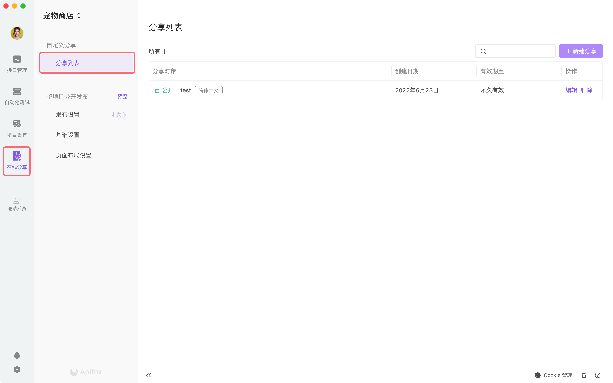
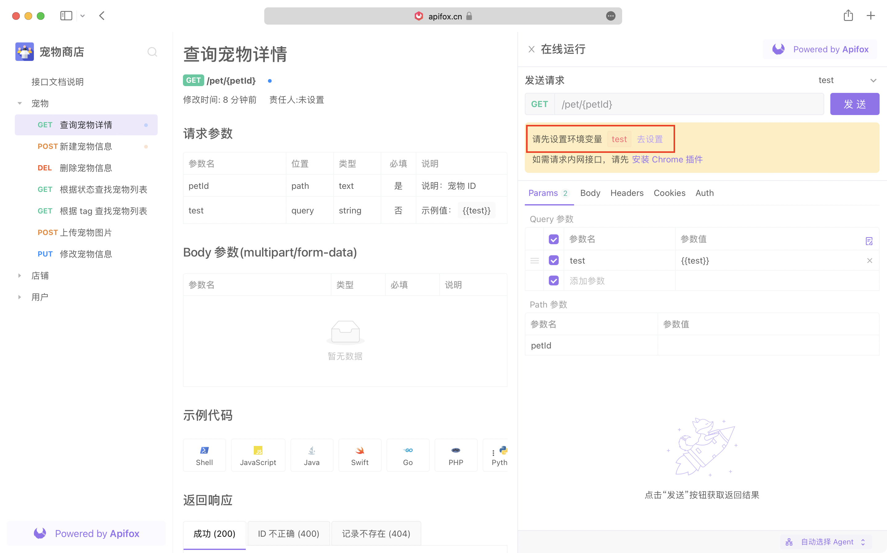

# 在线分享

在 API 开发、沟通、协作中，逻辑上是以 API 文档为标准的，但实际操作中，存在以 Word、PDF 格式的文件传来传去的问题。为此我们提倡以 `在线文档` 的形式，提高团队之间的沟通效率

## 分享在线文档

在软件界面左侧，就可以设置当前项目的`在线文档`





点击新建分享，就可以根据需要，设置分享的信息内容：

- 文档语言
- 访问密码
- 分享在线文档的日期
- 分享范围：可以选择项目全部，也可以选择部分接口，也可以根据标签维度导入
- 运行环境：可以选择运行的环境，和显示对应的前置 URL。选择后，分享出去的在线接口文档支持运行调试
- 可以显示接口文档对应的责任人、修改时间、前置 URL

:::tip 整目录分享

在线文档支持`整目录分享功能`，选择对应的分组打开整目录分享，则该分组在修改后会自动同步到在线文档。当然如果您不希望在线文档实时同步您的修改，可以选择不开启。


:::

设置完成后，复制链接，就可以分享给团队成员了


## 查看在线文档

`在线文档`查看过程中，支持复制接口 URL、数据接口字段、返回示例字段


## 在线接口文档支持运行调试

前提条件：当设置 `在线分享` 时，需要设置环境（推荐选择 `云端 Mock` ）


不仅在线文档支持在线运行调试，`API Hub` 中众多开放文档也支持，方便大家进行调试并使用，开发与对接效率再上一层。


### 在线文档支持修改环境变量

前提条件：当设置 `在线分享` 时，需要设置接口引用了 `环境变量` 的环境

在线文档调试接口时，会存在修改接口文档引用的 `环境变量` 的场景，现在可以根据下图，修改 `环境变量` 并运行调试




## 在线文档支持显示示例代码

分享出去的 `在线接口文档` 支持显示示例代码，当然 API Hub 也是支持的。您可以直接复制当前接口的代码，直接使用。


## Run in Apifox 链接 URL 规范

### 1. 链接地址

|                           |                                   |                                                                  |
| ------------------------- | --------------------------------- | ---------------------------------------------------------------- |
| **WEB 版**                | 项目地址                          | https://www.apifox.cn/web/project/{项目ID}                       |
|                           | 项目内指定接口-文档 Tab           | https://www.apifox.cn/web/project/{项目ID}/apis/api-{接口ID}     |
|                           | 项目内指定接口-运行 Tab           | https://www.apifox.cn/web/project/{项目ID}/apis/api-{接口ID}-run |
| **在线文档 （公开项目）** | 文档主页                          | https://www.apifox.cn/apidoc/project-{项目ID}                    |
|                           | 文档内指定接口                    | https://www.apifox.cn/apidoc/project-{项目ID}/api-{接口ID}       |
|                           | 文档内指定接口-自动打开“运行”模块 | https://www.apifox.cn/apidoc/project-{项目ID}/api-{接口ID}-run   |

### 2. 传递环境变量

功能：通过传参自动设置用户运行时的“环境变量”

使用方式：添加 URL 参数 ` environment[``变量名``]=``变量值 `即可，示例：

WEB 版项目：

- https://www.apifox.cn/web/project/406014?environment[aaa]=xxx&environment[bbb]=yyy
- https://www.apifox.cn/web/project/406014/apis/api-10061199-run?environment[aaa]=xxx

在线文档：

- https://www.apifox.cn/apidoc/project-406014?environment[aaa]=xxx&environment[bbb]=yyy
- https://www.apifox.cn/apidoc/project-406014/apis/api-10061199-run?environment[aaa]=xxx

### 3. 传递请求参数

功能：设置“运行”模块的“接口参数”（仅支持项目内指定接口地址-运行 Tab 的情况）

#### 1. 简单模式

注意：“简单模式”不支持参数名包含中括号的场景，这种场景请使用“高级模式”

WEB 运行界面，通过 URL 传递参数：

- https://www.apifox.cn/web/project/406014/apis/api-10061199-run?query[aaa]=yyy&query[bbb]=yyy&path[aaa]=yyy&body[aaa]=yyy&header[aaa]=yyy&cookie[aaa]=yyy&environment[aaa]=yyy
- https://www.apifox.cn/apidoc/project-406014/api-10061199-run?query[aaa]=yyy&query[bbb]=yyy&path[aaa]=yyy&body[aaa]=yyy&header[aaa]=yyy&cookie[aaa]=yyy&environment[aaa]=yyy

| 参数类型    | 参数值               | 备注                                      |
| ----------- | -------------------- | ----------------------------------------- |
| Query 参数  | query[xxx]=yyy       |                                           |
| Path 参数   | path[xxx]=yyy        |                                           |
| Body 参数   | body[xxx]=yyy        | Body 类型为：formdata 或 x-www-urlencoded |
| Body 参数   | body=yyy             | 其他 Body 类型                            |
| Header 参数 | header[xxx]=yyy      |                                           |
| Cookie 参数 | cookie[xxx]=yyy      |                                           |
| 环境变量    | environment[xxx]=yyy | 将会保存到默认环境的环境变量里            |

#### 2. 高级模式

WEB 运行界面，通过 URL 传递参数：

https://www.apifox.cn/web/project/406014/apis/api-10061199-run?params=%7B%0A%20%20%20%20%22query%22%3A%7B%0A%20%20%20%20%20%20%20%20%22aaa%22%3A%22xxx%22%2C%0A%20%20%20%20%20%20%20%20%22bbb%22%3A%22yyy%22%0A%20%20%20%20%7D%2C%0A%20%20%20%20%22body%22%3A%7B%0A%20%20%20%20%20%20%20%20%22aaa%22%3A%22xxx%22%2C%0A%20%20%20%20%20%20%20%20%22bbb%22%3A%22yyy%22%0A%20%20%20%20%7D%2C%20%0A%20%20%20%20%22cookie%22%3A%7B%0A%20%20%20%20%20%20%20%20%22aaa%22%3A%22xxx%22%2C%0A%20%20%20%20%20%20%20%20%22bbb%22%3A%22yyy%22%0A%20%20%20%20%7D%2C%20%0A%20%20%20%20%22environment%22%3A%7B%0A%20%20%20%20%20%20%20%20%22aaa%22%3A%22xxx%22%2C%0A%20%20%20%20%20%20%20%20%22bbb%22%3A%22yyy%22%0A%20%20%20%20%7D%0A%7D

参数 `params` 的值为以下 JSON 数据 encodeURIComponent 后得到

```JSON
{

    "query": [

        ["id", "value1"],

        ["id", "value2"],

        ["key2", "value3"]

    ],

    "path": [

        ["key1", "value1"],

        ["key2", "value2"]

    ],

    "body": [

        ["aaa", "value1"],

        ["key2", "value2"]

    ],

    "header": [

        ["testHeader", "value1"],

        ["key2", "value2"]

    ],

    "cookie": [

        ["testCookie", "value1"],

        ["key2", "value2"]

    ],

    "environment": [

        ["key1", "value1"],

        ["key2", "value2"]

    ]

}
```

| 参数类型    | 参数值      | 备注                                                                                      |
| ----------- | ----------- | ----------------------------------------------------------------------------------------- |
| Query 参数  | query       |                                                                                           |
| Path 参数   | path        |                                                                                           |
| Body 参数   | body        | 若 Body 类型为 formdata 或 x-www-urlencoded 时，body 的值为 json；否则 body 的值为 string |
| Header 参数 | header      |                                                                                           |
| Cookie 参数 | cookie      |                                                                                           |
| 环境变量    | environment | 将会保存到默认环境的环境变量里                                                            |
