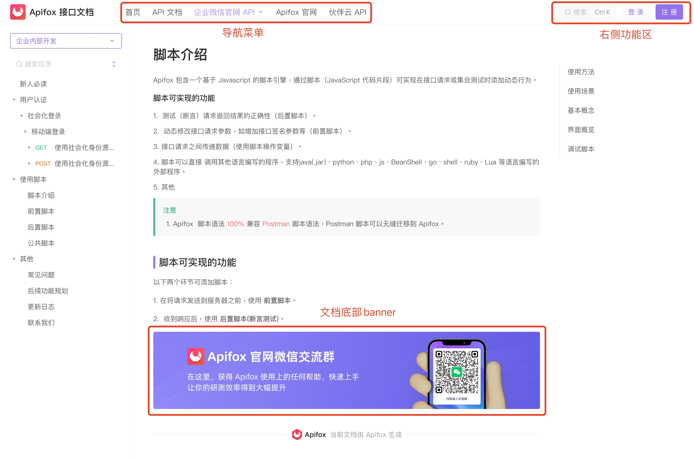
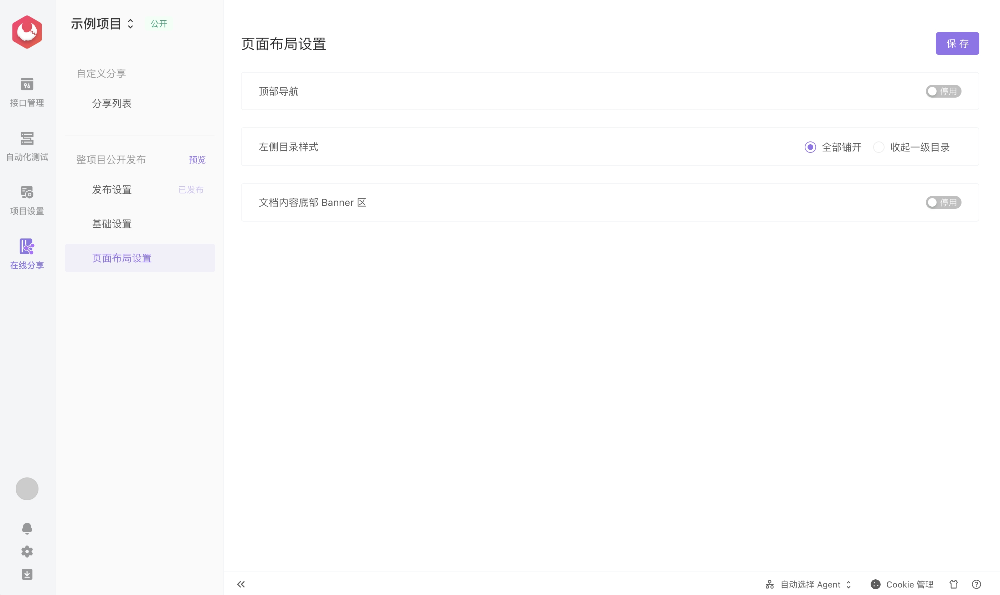
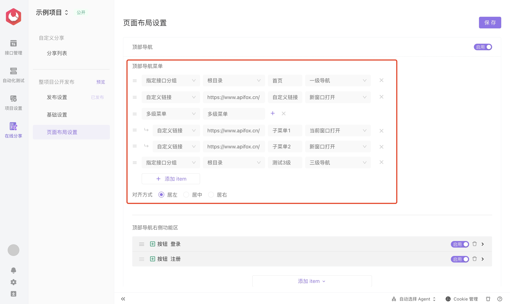
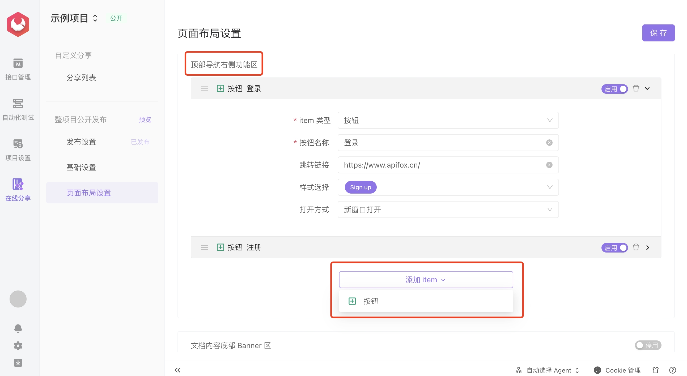
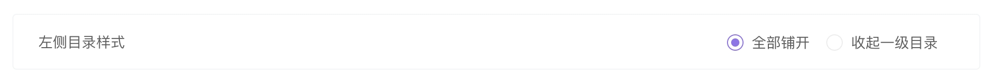
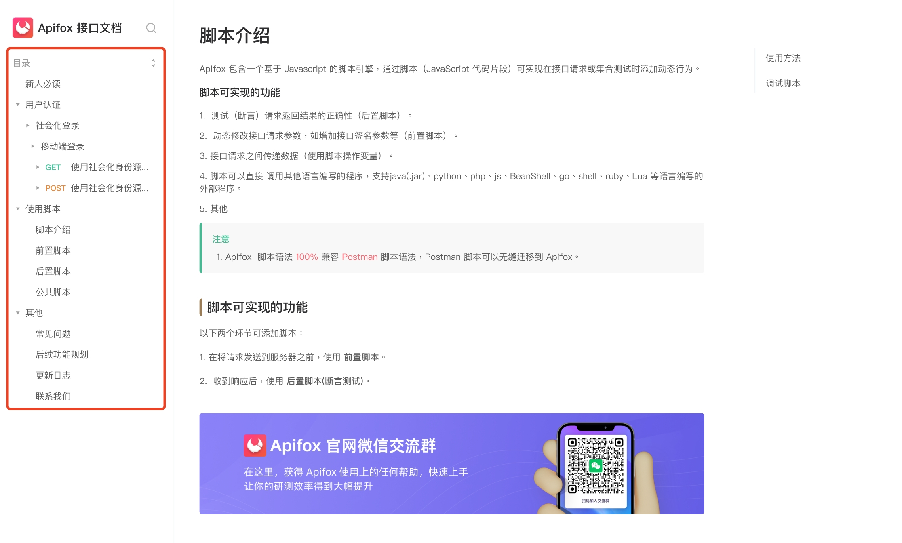
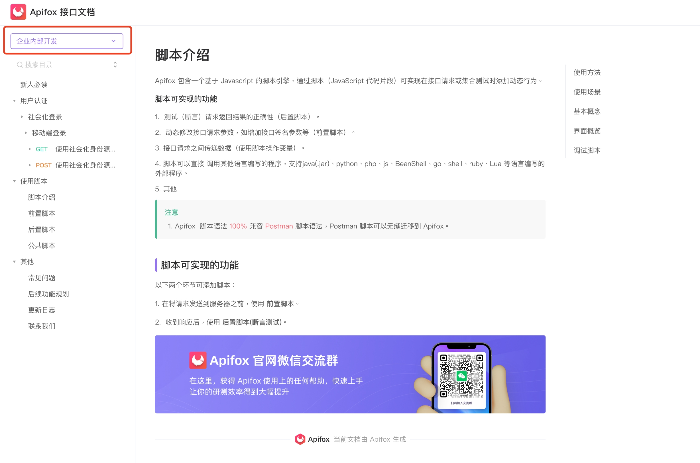
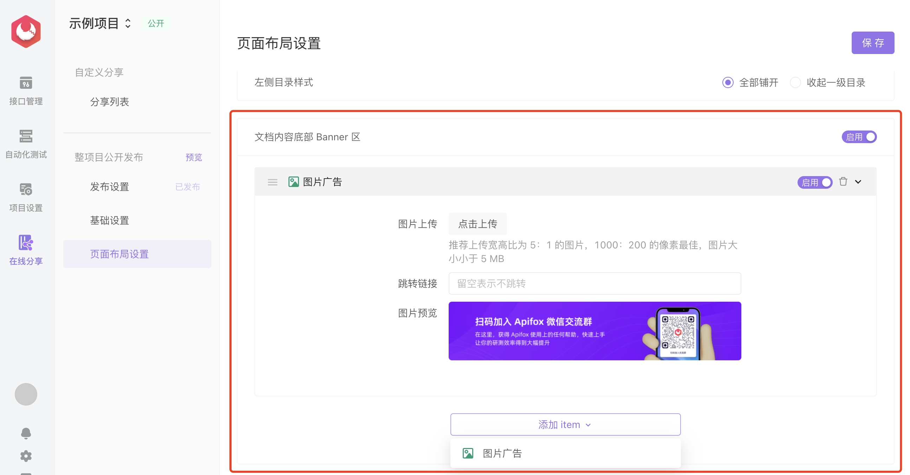

# 页面布局设置

## 功能说明

页面布局设置，支持用户对`在线文档界面`进行自定义，包括：`添加导航功能`，`添加文档底部banner`，`添加登录注册按钮`等便捷入口。

::: tip 注意

后续还将支持更多组件，如左侧目录功能区组件、右侧目录功能区组件、右下角浮动区组件

:::

## 模块

目前有三个模块，支持在模块中添加各种组件。分别是：`顶部导航`、`左侧目录样式`、`文档内容底部Banner区`

### 一、顶部导航模块

#### 1、顶部导航菜单组件

提供自定义导航菜单编辑，支持三种类型导航：

1. **指定接口分组**：支持选择所有接口或者某一接口分组
2. **自定义链接**：支持自定义文字链接
3. **多级菜单**：支持定义二级菜单

#### 2.按钮组件

顶部导航右侧功能区，目前支持添加`按钮组件`，后续将支持：`icon组件`、`文字组件`、`搜索框组件`、`亮暗模式切换组件`

### 二、左侧目录样式模块

`顶部导航`模块和`左侧目录样式`模块，不可同时启用，在启用了顶部导航模块，左侧目录样式会直接失效。如果要使用左侧目录样式模块，则需要关闭顶部导航模块。

全部铺开效果：

收起一级目录效果：

### 三、文档内容底部 Banner 区

目前支持`图片广告`组件，可以在文档内容底部添加图片，帮助业务推广等

