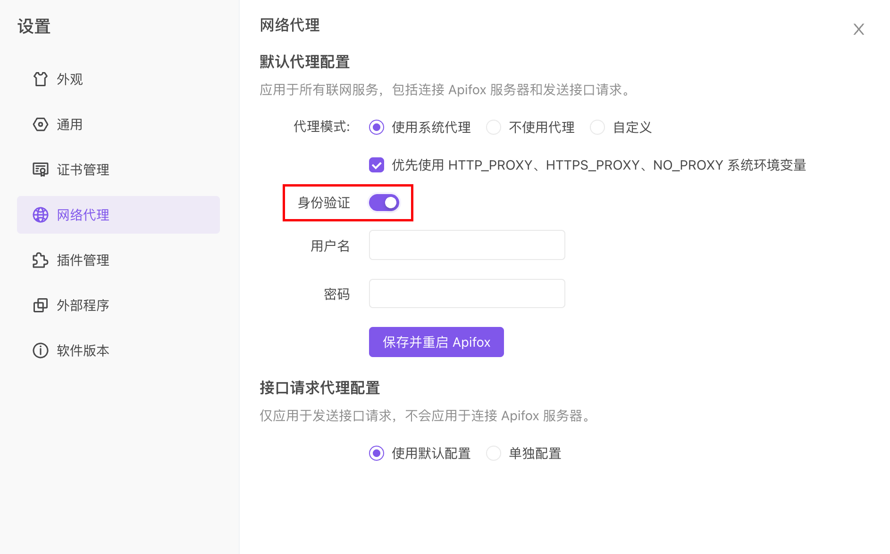

# 网络代理

`网络代理`是 Apifox 和服务器之间的中介服务器。`代理服务器` 作为一个安全屏障，代表你向网站和其他互联网资源发出请求，并阻止其他人访问您的内部网络。

- 默认情况下，Apifox 使用 `默认代理配置` 发送 API 请求或访问互联网。
- `默认代理配置` 应用于所有联网服务，包括连接 Apifox 服务器和发送接口请求。
- `接口请求代理配置` 仅应用于发送接口请求，不会应用于连接 Apifox 服务器，可以单独配置 Apifox 在发送请求时使用 `默认代理配置` 或 `单独配置`。
- 如果你的系统配置的代理服务器需要身份验证，可以在页面左下角的 `设置-网络代理` 中输入对应的身份验证信息。

`默认代理配置` 默认选择 `不使用代理`；`接口请求代理配置` 默认选择 `使用默认配置`。

## 默认代理配置

1. `默认代理配置` 应用于所有联网服务，包括连接 Apifox 服务器和发送接口请求。默认选择 `不使用代理`。

2. 如果你为本地系统配置了代理，可以在 Apifox 内设置 `默认代理配置` 选择 `使用系统代理`。

3. 同时也支持配置 `自定义代理`。

## 接口请求代理配置

1. `接口请求代理配置` 选择 `使用默认配置`，则 `接口请求代理配置` 与 `默认代理配置` 保持相同。

2. 使用系统代理发送接口请求，需要设置 `默认代理配置` 选择 `使用系统代理`，`接口请求代理配置` 选择 `使用默认配置` 。注意：如果你想让 Apifox 使用你的操作系统配置的 HTTP_PROXY、HTTPS_PROXY、NO_PROXY 环境变量时，请选中下图选项

3. 针对发送接口请求，支持单独配置代理。根据不同的情况，可以选择 `使用系统代理`、`不使用代理`、`自定义`。

## 代理具体配置

### 配置自定义代理

配置自定义代理，以便使用系统代理以外的代理服务器发送 API 请求。你可以通过自定义代理发送 HTTP 请求、HTTPS 请求或两种类型的请求。

- 接口类型：选择通过代理服务器发送的请求类型。默认同时勾选“HTTP”和“HTTPS”。
- 代理服务器：输入代理服务器的主机名或 IP 地址和端口号。(不要在主机名或 IP 地址之前包含协议)
- Bypass：输入以逗号分隔的主机列表。发送到这些主机的请求不会使用自定义代理。
- 身份验证：如果代理服务器需要身份验证，请打开此开关，输入代理服务器的用户名和密码。

### 身份验证

如果你的系统配置的代理服务器需要身份验证，请在 Apifox 中输入身份信息。在左下角的 `设置-网络代理` 中，在 `默认代理配置` 下的 `系统代理` 或 `自定义`，打开 `身份验证`，输入代理服务器需要的 `用户名` 和 `密码` ，然后选择 `保存并重启 Apifox`。

## 登录时设置网络代理

如登录前已经开启了代理服务器，可以在登录界面设置 `网络代理`。

