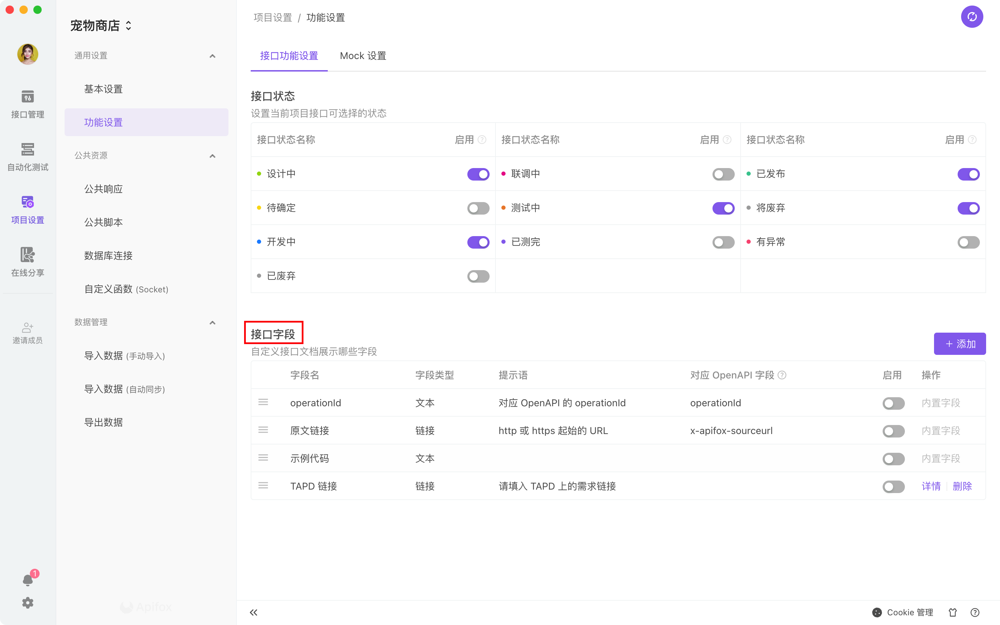
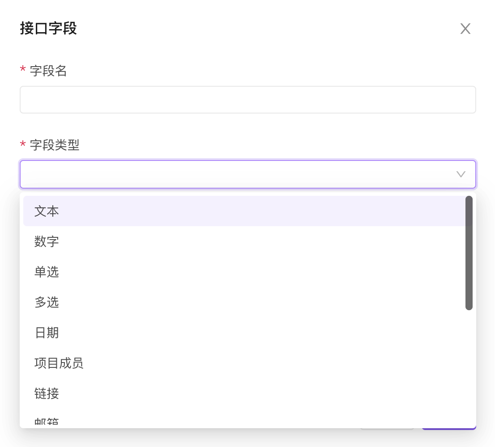
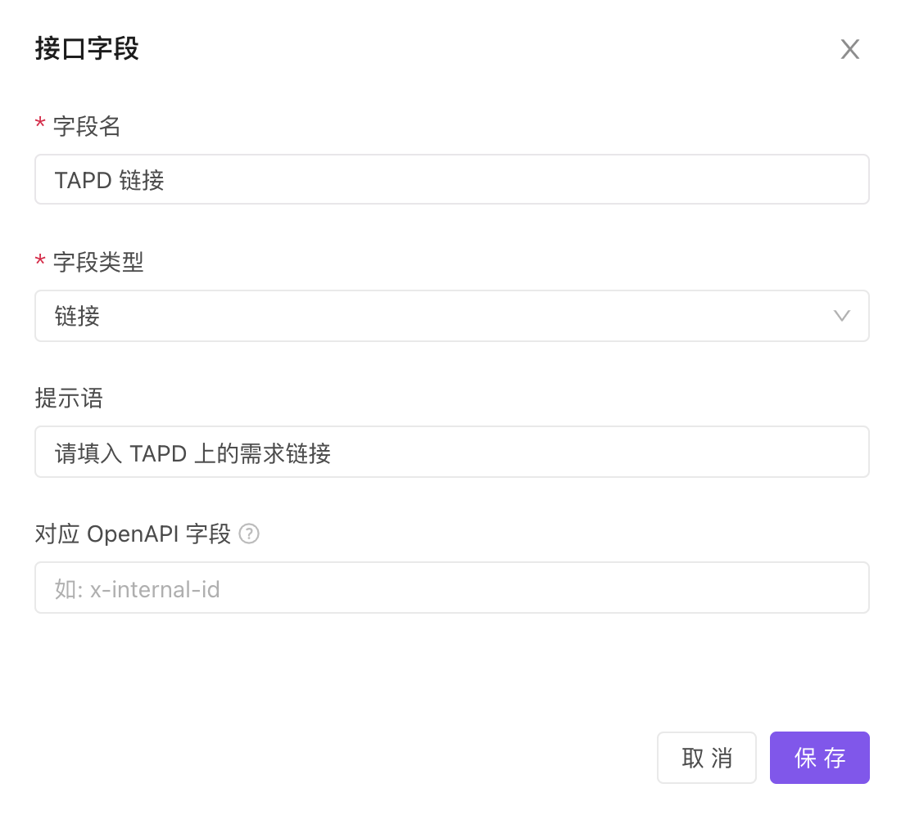
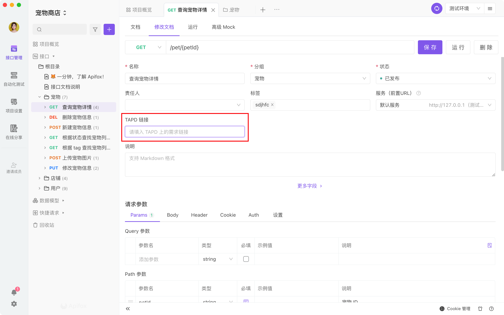
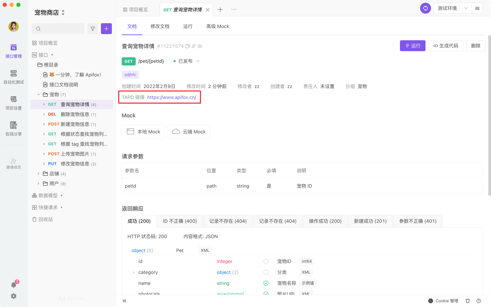

# 自定义字段

`自定义字段`功能，可以支持到项目管理者，可以根据自己的需要，设置接口文档的通用字段，比如：创建时间、TAPD 链接、需求文档链接等，更方便的管理项目

## 配置自定义字段-管理者

在`项目设置-功能设置`处，管理者可以根据项目需要，配置`自定义字段`：

1. 字段名：该字段的名称

2. 字段类型：支持文本、数字、单选、多选、日期、项目成员、链接、邮箱、单选标签、多选标签
   （单选、多选支持管理者设置选项）

3. 提示语：展示给项目成员，填写内容时给予提示

4. 对应 OpenAPI 字段：导入/导出 OpenAPI/Swagger 格式数据时使用，留空则在导入/导出 OpenAPI/Swagger 格式数据时忽略该字段

5. 启用：管理者可以根据需要，开启/关闭该`自定义字段`

 

## 填写自定义字段-项目成员

在配置`自定义字段`并开启后，`接口文档-修改文档页面`就会出现该字段，项目成员根据要求填写

## 展示自定义字段

在配置`自定义字段`并填写后，`接口文档-文档页面`就会显示出对应的信息

