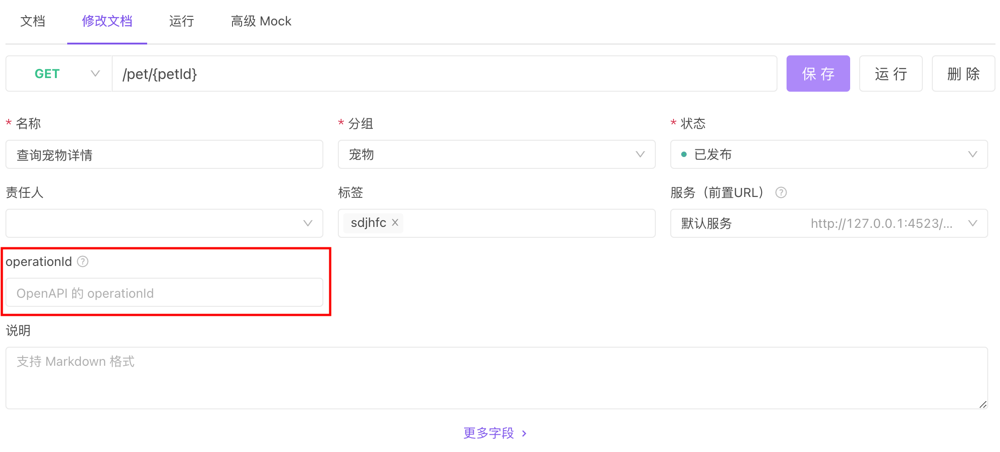

# 接口设计 (接口文档)

接口设计即定义接口文档规范（如接口路径、参数、返回值、数据结构等）。

:::tip 新人注意

和 Postman 不一样，[Apifox](https://www.apifox.cn/) 是区分`接口设计`和`接口运行`两个概念的。

- **接口设计**：即 **新建接口** 界面或接口详情里的 **编辑** 界面，用途是 **定义接口文档规范**，而不是 **运行** 接口，所以该界面是只能定义接口基本信息、`参数名`及参数说明等，而不能设置`参数值`。**参数值**、**前置脚本/后置脚本** 等信息请在`接口运行`界面或`接口用例`界面填写。
- **接口运行**：即接口详情里的 **运行** 界面，用途是 **临时调试接口**，**运行** 完后，需要点击`保存为用例`，才能将填写的 **参数值**、**前置脚本/后置脚本** 等信息保存下来；否则关闭 tab 后，这些信息将会丢失。

:::

::: tip 新人常见问题

- **如何像 Postman 那样不用提前设计接口就能快速调试？** 使用 [快捷请求](./quick-debugging) 功能。
- **如何固定 tab，避免新打开接口的时候覆盖掉已打开的 tab？** `双击 tab 头`或者`双击树形菜单的对应内容`，用法和 `VS Code`完全一样。（修改 tab 里的内容后，会自动固定 tab）

:::

## 快速上手

1. 点击左侧搜索框旁边的 `+` 号按钮即可打开新建窗口，也可使用 [快捷键](/user-interface/shortcuts) Ctrl(⌘) + N。

   

2. 在打开的窗口中，直接定义接口相关信息。

   

## 接口路径

以斜杠`/`起始的接口 path 部分，如`/pets`、`/pets/{id}`。

:::tip 注意

1. **接口路径** 建议`不要包含 HTTP 协议及域名`，这部分建议在 [环境管理](./environments) 的`前置URL`里设置，接口调试时的 URL 会自动加上当前环境的`前置URL`。

2. 特殊情况需在接口路径要带上`HTTP 协议及域名`的，系统也能支持，但不建议这么做。接口调试时，系统如检测到接口路径是以`http://`或`https://`起始的，会自动忽略当前环境里前置 URL。
3. Apifox 中的 `Path 参数`是以大括号包裹起来表示，而非冒号起始表示。**正确示例**：`/pets/{id}`，**错误示例**`/pets/:id`。
4. **接口路径** 不可包含`Query 参数`（即 URL 中 `?`后的参数），Query 参数在下方`请求参数`部分填写。

:::

## 基础信息

这部分比较简单，一看就懂，不再赘述。

## 请求参数

### Params 参数

包含 `Query 参数`和 `Path 参数`两部分。

- **Query 参数**：即 URL 中 `?`后的参数。
- **Path 参数**：自动提取`接口路径`中大括号包裹起来的参数，如`/pets/{id}`中的的`{id}`即表示名为`id`的 Path 参数。

### Body 参数

#### Body 参数类型

- **none**：无 body 参数。
- **form-data**：即 Content-Type 为`multipart/form-data`。
- **x-www-form-urlencoded**：即 Content-Type 为`application/x-www-form-urlencoded`。
- **json**：即 Content-Type 为 `application/json`。
- **xml**：即 Content-Type 为 `application/xml`。
- **binary**：发送文件类数据时使用。
- **raw**：发送其他文本类数据时使用。

:::tip 注意

- Body 参数类型为`json`或`xml`时，需要设置数据结构，并且数据结构可以引用`数据模型`，详细说明请查看文档：[数据结构/数据模型](./schemas)。

:::

:::tip 注意

- 接口发送请求的时候会根据`Body 参数类型`自动在请求`Header`加上对应的`Content-Type`，无需手动设置。
- 若需要手动设置`Header`中的`Content-Type`，则其值必须和`Body 参数类型`相匹配，否则系统会自动忽略掉手动设置的`Content-Type`。
  1. 示例：如 Body 参数类型为`form-data`，手动设置`Content-Type`的值为`multipart/form-data; charset=GBK`是有效的；但如果把值设置为`application/json`则会被系统忽略掉，因为和参数类型不匹配。
  2. Body 参数类型为`raw`时，手动设置`Content-Type`的值不受限制。

:::

## 参数中使用环境变量（或全局变量/临时变量）

:::v-pre

所有参数都可以使用变量，使用方式为双大括号包裹变量名，如`{{my_variable}}`，表示引用名为`my_variable`的变量。

参数值使用变量时可以包含变量以外的字符串，如：参数值设置为`prefix-{{my_variable}}-surfix`，假设运行时变量`my_variable`的值为`123`，则实际请求时参数的值为`prefix-123-surfix`。

:::

更多关于变量的说明请查看文档：[环境变量/全局变量/临时变量](./variables)。

## 返回响应

返回响应定义主要包含以下几部分

- 接口返回的 HTTP 状态码
- 返回内容的数据格式：`JSON`、`XML`、`HTML`、`Raw`、`Binary`
- 数据结构：仅`JSON`、`XML`可配置数据结构，关于数据结构详细说明，请查看文档：[数据结构/数据模型](./schemas)

:::tip 注意

- 当一个接口在不同情况下会返回不同数据结构时，可设置多个`返回响应`。点击`返回响应`模块右上方的`+ 新建`即可添加。
- 定义好数据结构后，`接口调试`时，系统会自动校验返回的数据是否符合定义的数据结构，非常方便，更多说明请查看文档：[接口调试/接口用例](./api-debugging)。
- 定义好数据结构后，`使用 mock 功能`时，系统会自动根据定义的数据结构 mock 出非常人性化的数据，非常方便，更多说明请查看文档：[Mock 数据](/mock/)

:::

## 公共响应

`公共响应`主要用来实现返回响应的复用。

通常不同接口在某些情况下会返回相同的数据结构，如`资源不存在(404)`、`没有访问权限(401)`等，这些建议设置为`公共响应`，避免重复编写，方便统一管理。

设置方法：打开`项目设置`->`公共响应`，在这里管理公共响应。

## 响应示例

设置返回响应的示例数据，方便查阅接口文档的人快速了解数据结构。

返回 Response 的示例数据也可以设置多次，点击`响应示例`模块右上方的`+ 新建`即可添加。建议至少设置两个示例：`成功示例`、`失败示例`。

## 其他

### OperationID

支持设置 `OperationId`属性，导出`OpenAPI `格式时会将此处的值导出到 Operation 对象的 OperationId 里

