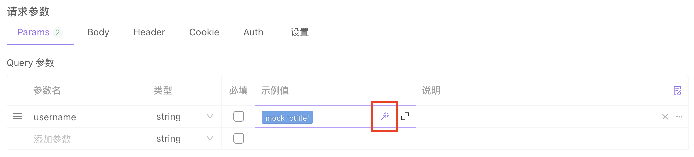
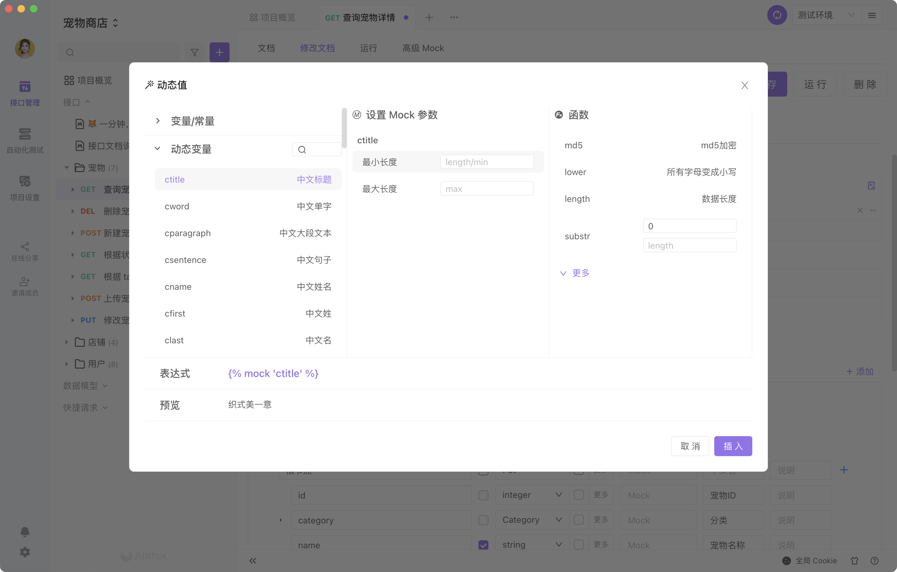
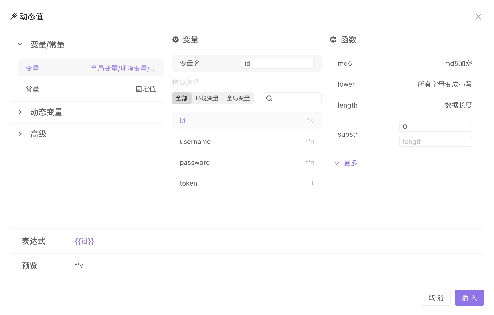
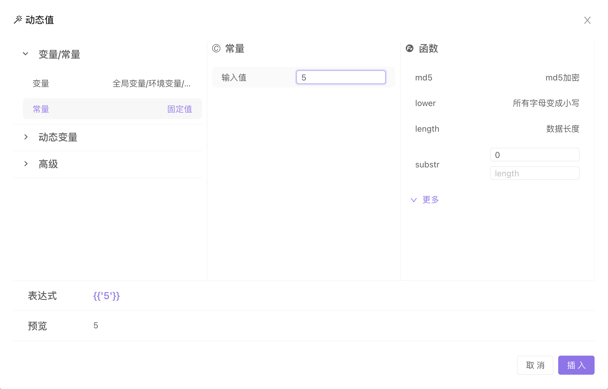
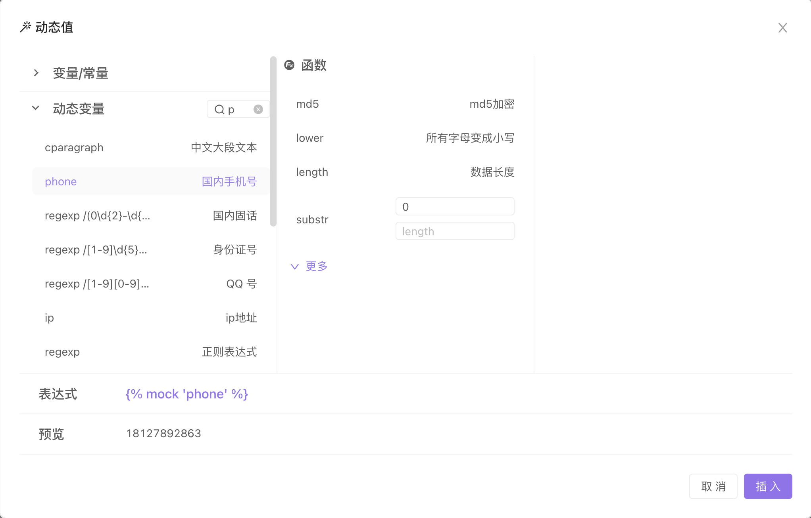
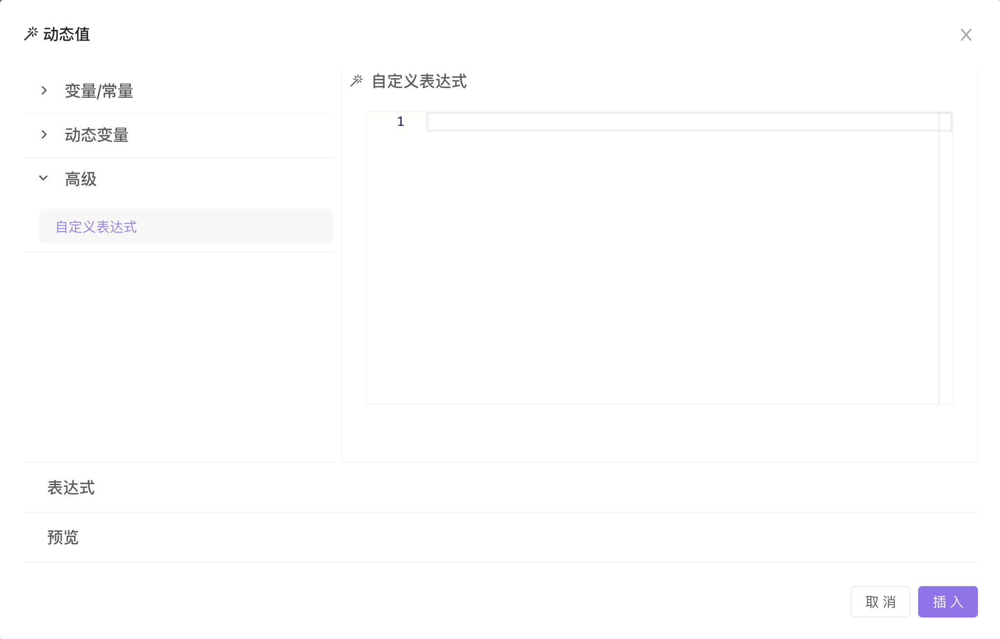
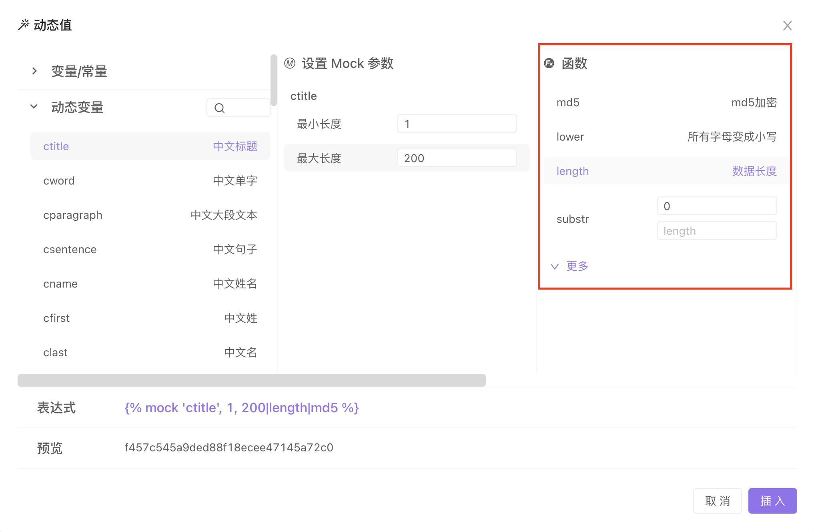

# 动态变量 / 随机参数

动态变量是在接口运行中，参数的值按照指定规则生成的变量。

## 操作路径

在请求参数的示例值的位置，鼠标移动到输入框上时，会显示一个 `魔法棒` 的图标，点击即可设置动态变量。

操作方式可以看如下视频

<video id="video" controls="" preload="none" poster="http://img.blog.fandong.me/2017-08-26-Markdown-Advance-Video.jpg" style="width:900px"> <source id="mp4" src="https://cdn.apifox.cn/markdown-img/202203/25/144843-xRReuw.mp4" type="video/mp4"> </video>

## 操作说明

1.  变量：可以引用 `环境管理` 中的 `环境变量`、`全局变量`。

2.  常量：想要参数的示例值保持为一个常量，需要在 `动态值` 中选择 `常量` 后，在 `输入值` 处输入需要的常量。

3.  动态变量：如果想要按照规则随机生成一个变量，可以在这里选择，比如电话、邮箱、地址等。

4.  自定义表达式：如果上述都没有符合你的需求，可以自己定规则。支持 `Mock.js` 、`Nunjucks` 语法。

5.  变量、常量、动态变量，支持使用函数进行多层嵌套。

