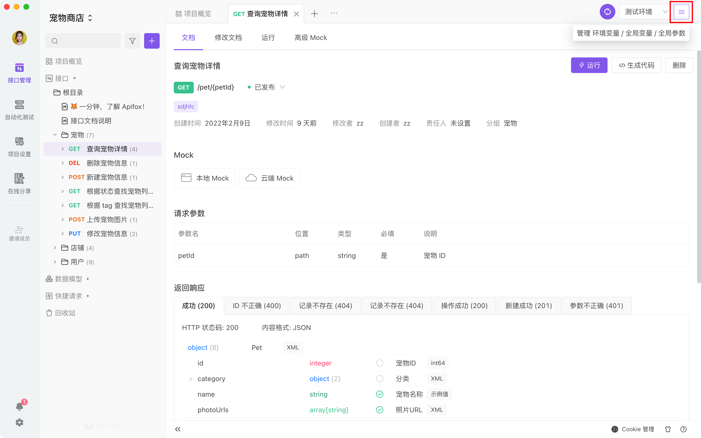
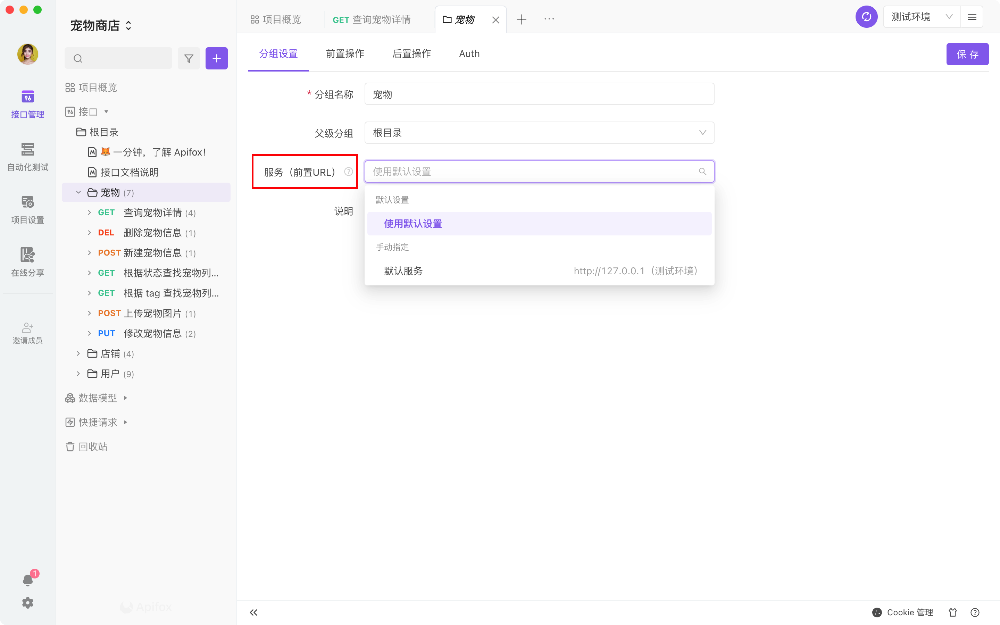

# 环境管理

一个项目在不同的阶段会处于不同的环境中，比如`开发环境`、`测试环境`、`生产环境`，通常不同的环境有不同的`前置 URL`、`接口参数值`等。因环境不同而频繁的更改接口前置 URL 及参数，是非常的麻烦的。 Apifox 的`环境管理`功能，只需在不同的`环境`设置不同的前置 URL 及参数，在不同环境中测试时，直接切换环境即可。

## 设置环境

### 环境管理的入口

在界面的右上角，是`环境管理`的入口，可以用过下图两种方式，进入`环境管理`页面。




### 环境管理页面

可以在左侧新建或删除环境，右侧可以对某个环境进行编辑。


### 功能点说明

1. **前置 URL**：接口运行时自动添加到接口路径前组成接口实际请求的 URL，如前置 URL 为`https://www.api.com`，接口路径为`/pets/123`，那么实际请求的 URL 为`https://www.api.com/pets/123`。
2. **环境变量**：跟随环境切换而发生改变的变量，具体说明可以查看文档 [环境变量/全局变量/临时变量](./variables)。
3. **额外参数**：当前环境下，给所有接口请求额外加上参数。注：额外参数的参数值可以引用环境变量/全局变量/临时变量。

:::tip 注意

1. **前置 URL** 末尾建议`不要`加上斜杠`/`，接口设计时 **接口路径** 建议以斜杠`/`起始。
2. 如果`接口路径`本身就以`http://`或`https://`起始，实际发出请求的时候`不会`自动加上前置 URL。但通常不建议这么使用。

:::

::: v-pre

:::tip 注意

- 2.1.39 版本之后，脚本可通过 `pm.request.getBaseUrl()` 获取当前运行环境选择的的 `前置URL`。

:::

### 快捷切换环境

根据需要，可以在页面右上角，快速切换为你所需要的环境


## 服务（前置 URL）

注意：正常情况不要添加多个“服务”！！!

`当且仅当`同一“环境”下，多个接口使用不同的 “前置 URL”时，才需要添加多个服务。这种场景下，每个服务设置不同 “前置 URL”，不同接口或分组选择不同 “服务”即可。

### 服务和环境的区别

使用场景示例：

```
环境：
  开发环境
  测试环境
  预发布环境
  正式环境

服务：
  用户服务（user.xxx.com）：登录等接口
  交易服务（trade.xxx.com）：交易相关接口
  直播服务（live.xxx.com）：直播相关接口
```

### 设置服务

在`环境管理`页面，可以填入所需要的`前置 URL`。


### 使用服务

1. 在分组设置中，可以设置当前环境下的不同服务。（推荐使用）



2. 在接口文档-修改文档中，可以设置当前环境下的不同服务。


## 环境变量使用

[查看文档](./variables)
