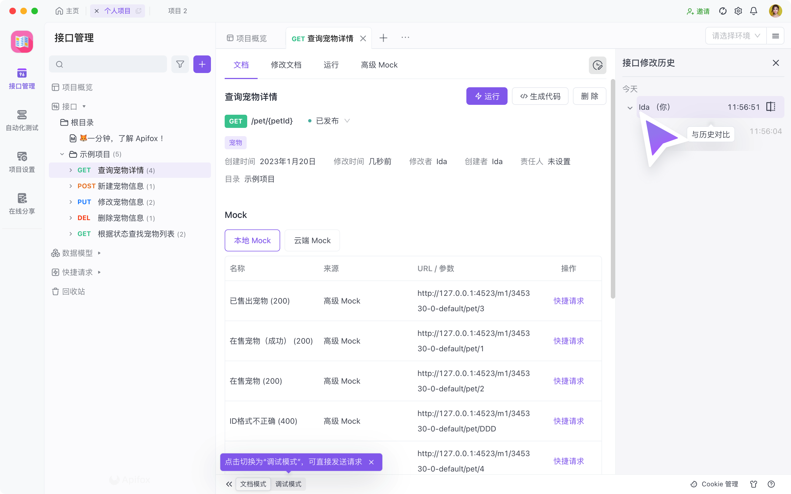
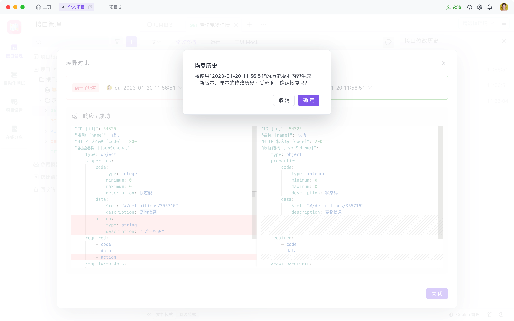

# 接口修改历史

为了更好的支持团队协作的场景，在 2.2.18 之后的版本中，新增 `接口修改历史` 功能。

`接口修改历史` 会记录团队成员对接口各个字段的 `修改` 操作，也会记录因为 `导入覆盖` 造成的接口文档的修改，并且支持 `对比` 操作前后的差异，你可以选择 `还原` 到任意一个历史版本中。

## 快速上手

当你需要查看 `接口修改历史` 时，点击 `接口文档` 内的右上角的 icon，即可展开 `接口修改历史`。

点击某一条记录，则可以显示这次操作前后，各个字段变化的情况

如果需要恢复到上一个版本，可以点击 `还原此版本`，则会将使用这个的历史版本内容生成一个新版本，原本的修改历史不受影响。

