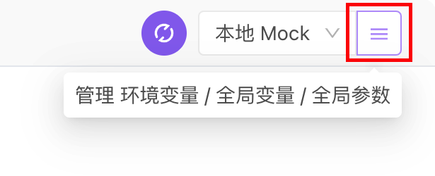
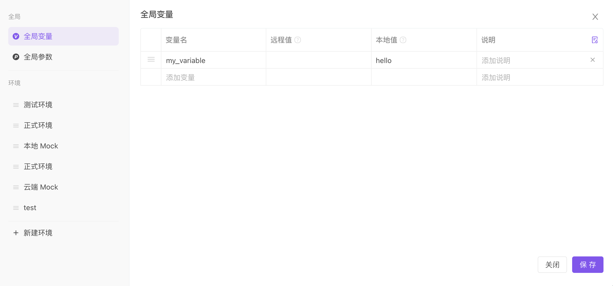

# 环境变量 / 全局变量 / 临时变量

和编程语言类似，变量是允许在多个地方重复使用的值。不同的接口用例（请求参数、脚本等）可以引用相同的变量值，只需要更改一次变量值，就能改变所有引用了该变量的相关值。使用变量可以大幅提升工作效率。

## 快速上手

::: v-pre

1. 打开`环境管理`（软件右上角`设置形状`的按钮），选择`全局变量` tab。

   

   

2. 添加一个名为`my_variable`的变量，将`本地值`设置值为`hello`，点击`保存`。

3. 打开一个接口，在`运行` tab （或接口用例）的参数值里输入`{{my_variable}}`即可引用该变量。

4. 点击`运行`按钮，发送请求，实际运行的时候系统会将`{{my_variable}}`替换为`hello`，然后发出请求。

:::tip 注意

- 系统内置名为`BASE_URL`的特殊环境变量，其值为当前环境的`前置URL`，使用方式`{{BASE_URL}}`。
- 如用户手动添加了名为`BASE_URL`的环境变量，则会覆盖掉系统内置`BASE_URL`的值。
- 脚本可通过 `pm.environment.get('BASE_URL')` 方式读取`前置URL`。
- 脚本`不能`修改`前置URL`，脚本 `pm.environment.set('BASE_URL','xxx')`会生成一个真正的名为`BASE_URL`的环境变量，而不会修改`前置URL`。
- Apifox 版本号大于等于 `1.0.12` 才支持内置`BASE_URL`。

:::

## 本地值和远程值的区别

1. 所有使用到变量的地方，实际运行的时候都是读写`本地值`，而不会读写`远程值`。
2. **本地值** 仅存放在本地，不会同步到云端，团队成员之间也不会相互同步，适合存放`token`、`账号`、`密码`之类的敏感数据。
3. **远程值** 会同步到云端，主要用来团队成员之间共享数据值。

::: tip 注意
由于`本地值`仅存放在本地，使用一些清理软件清理 Apifox 文件缓存会导致`本地值`被清空，请务必注意。

:::

## 变量类型

1. **环境变量** 是最常用的变量，同一个变量可以在不同的环境设置不同的值，变量值会跟随环境切换而改变。环境变量在`环境管理`模块设置，查看文档：[环境管理](./environments)
2. **全局变量** 使用方法类环境变量类似，但全局变量不会跟随环境切换而改变。
3. **临时变量** 仅在单次运行`接口用例`或测试管理里的`测试用例`或`测试套件`过程中有效，不会持久化保存。

## 使用变量

::: v-pre

1. 所有类型的变量都是通过双大括号的方式，如`{{token}}`。
2. `接口运行tab`、`接口用例`、`快捷调试`、`集合测试`的所有`参数值`、`前置/后置脚本`都可以使用变量。
3. `环境`里的`额外参数`也可以使用变量。

:::

:::tip 提示

请求 Body 为 json 或者 raw 格式的，也可以直接使用变量、动态变量，使用方式如下：

```js
{
    "field1": "{{stringVariable}}",
    "field2": {{intVariable}},
    "field3": {{arrayVariable}},
    "field4": {{objectVariable}},
    "field5": {{$timestamp}}
}
```

注意：

1. json 格式里 string 类型的值，使用变量的时候需要加上`双引用`；其他类型的值`不要加双引号`，如上面例子所示。
2. 如果以`没有加双引号`的方式使用了变量，请不要使用`格式化`功能，如有提示 JSON 格式不正确，直接忽略即可。

:::

::: v-pre

若变量的值为`对象`或`数组`形式，可以通过`{{variableName.attributeName}}`或`{{variableName[0].attributeName}}`方式读取变量里的属性值，示例：

1. 变量`user`的值为如下格式`对象`：

   ```json
   {
     "id": 1,
     "name": "jack"
   }
   ```

   1. 接口参数中以`{{user.name}}`方式引用`user`对象里的`name`属性值。
   2. 自定义代码中以`pm.variables.get("user.name")`方式引用`user`对象里的`name`属性值。

1. 变量`user`的值为如下格式`数组`：

   ```json
   [
     {
       "id": 1,
       "name": "jack"
     }
   ]
   ```

   1. 接口参数中以`{{user[0].name}}`方式引用`user`数组里第一个对象里的`name`属性值。
   2. 自定义代码中以`pm.variables.get("user[0].name")`方式引用`user`数组里第一个对象里的`name`属性值。

如上所示，读取变量（对象或数组）里的属性值写法`{{user.name}}`遵循`JSON Path`语法规范，只需将`JSON Path`里的`$`符号替换为`变量名`既可。

:::

更多`JSON Path`语法规范请[查看文档](../reference/json-path/)。

## 变量优先级

所有变量都是通过双大括号的方式引用，当`不同类型变量`存在`相同名称的变量`时，系统会根据优先级决定使用哪个类型的变量。

变量优先级：临时变量 > 测试数据变量 > 环境变量 > 全局变量。

## 脚本中使用变量

### 环境变量

```javascript
// 设置环境变量
pm.environment.set('variable_key', 'variable_value');

// 获取环境变量
var variable_key = pm.environment.get('variable_key');

// unset 环境变量
pm.environment.unset('variable_key');
```

#### 将对象或数组（非字符串）写入环境变量

#### 环境变量写入

环境变量支持数组、对象、字符串等形式存储

```javascript
var array = [1, 2, 3, 4];
pm.environment.set('array', JSON.stringify(array));

var obj = { a: [1, 2, 3, 4], b: { c: 'val' } };
pm.environment.set('obj', JSON.stringify(obj));
```

读取的时候，需要使用`JSON.parse`转换回来

```javascript
try {
  var array = JSON.parse(pm.environment.get('array'));
  var obj = JSON.parse(pm.environment.get('obj'));
} catch (e) {
  // 处理异常
}
```

### 全局变量

```javascript
// 设置全局变量
pm.globals.set('variable_key', 'variable_value');

// 获取全局变量
var variable_key = pm.globals.get('variable_key');

// unset 全局变量
pm.globals.unset('variable_key');
```

### 临时变量

```javascript
// 设置临时变量
pm.variables.set('variable_key', 'variable_value');

// 获取临时变量
var variable_key = pm.variables.get('variable_key');

// unset 临时变量
pm.variables.unset('variable_key');
```
