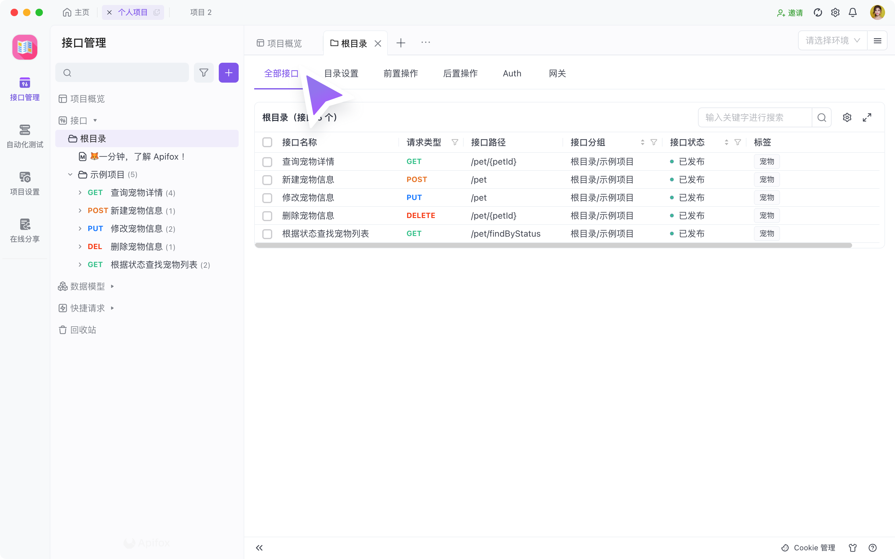
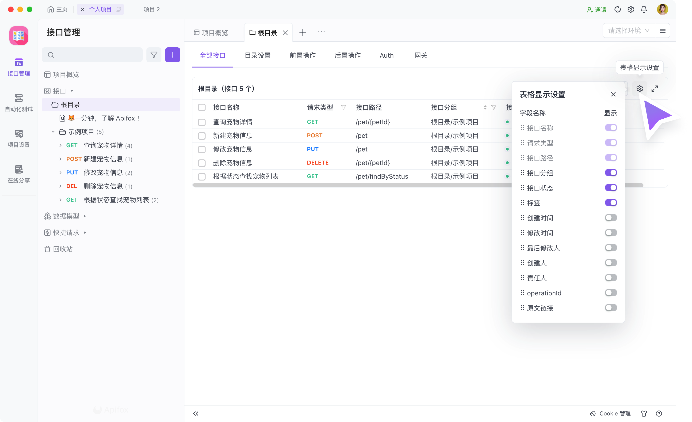
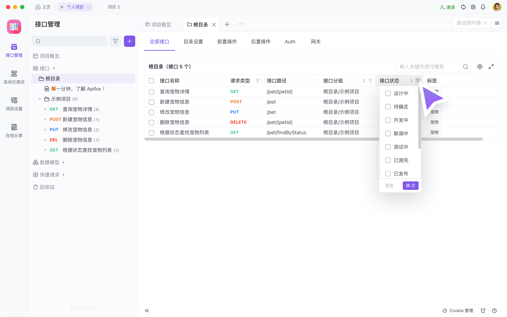
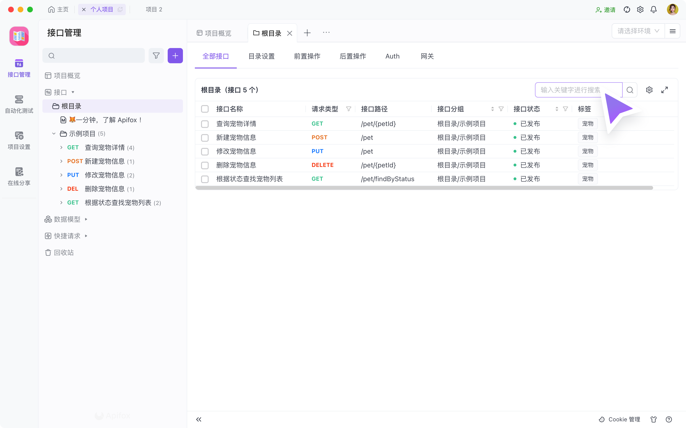
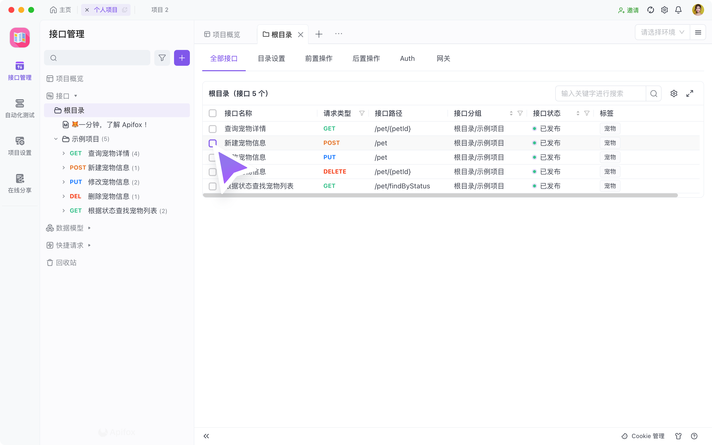
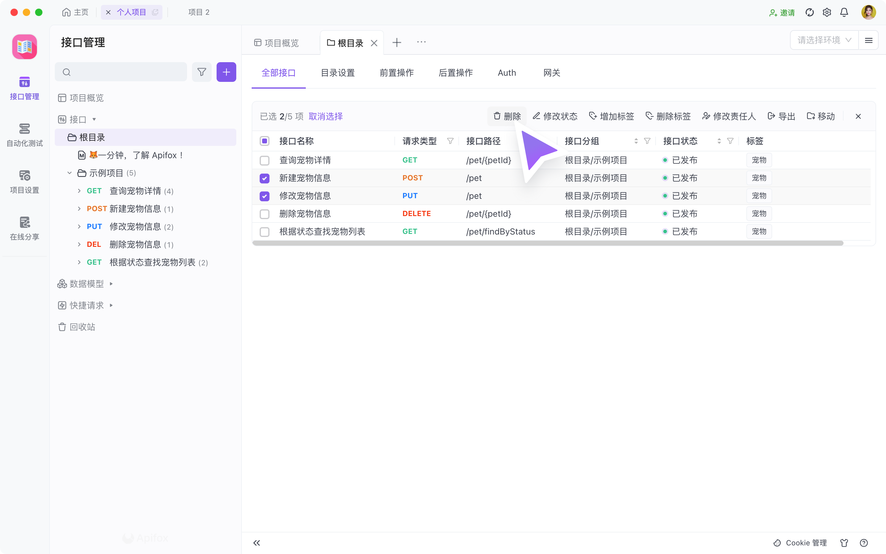

# 接口批量管理

为了提高接口管理的能力，在 2.2.19 之后的版本中，新增 `接口批量管理` 功能。

你可以在目录的 `全部接口 tab` 内浏览该目录下的所有接口文档的信息，并支持并支持 `批量删除`、批量移动等接口批量操作。

## 浏览全部接口

1. 如果你需要看当前项目的所有接口，可以点击 `根目录` 下的 `全部接口 tab` 查看。如果你需要看某个目录/微服务下的所有接口，可以点击对应的目录查看。

    

2. 根据你需要看到的接口文档的信息，可以在 `表格显示设置` 里修改。支持选择显示 `自定义字段`。

    

3. 设置好表头之后，可以根据你的需要，对数据表进行筛选、排序。排序支持多个筛选条件叠加。

    

4. 在 `全部接口 tab` 中支持对接口名称、接口路径进行关键字搜索。

    

5. 当需要详细查看接口文档内的字段时，可以点击接口名称/接口路径。

    

## 接口批量操作

先对你需要操作的接口文档进行多选。

然后根据你的需要进行批量处理。`支持批量删除`、批量修改接口状态、批量增加标签、批量删除标签、批量修改责任人、批量导出、批量移动目录。

