# 数据结构 / 数据模型

<iframe src="//player.bilibili.com/player.html?aid=297677383&bvid=BV1ZF411W7Rv&cid=562670264&page=1&high_quality=1&danmaku=0" scrolling="no" border="0" frameborder="no" framespacing="0" width="100%" height="550" allowfullscreen="true"> </iframe>

## 数据结构

`数据结构` 和编程语言里的数据结构类似，主要使用在 [接口设计](../api-design/) 的`返回响应`和 json / xml 类型的`Body 参数`。

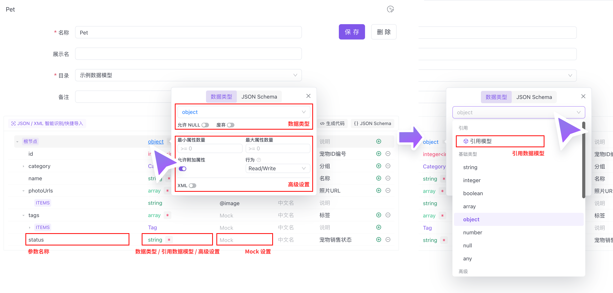

### JSON / XML 智能识别/快捷导入

通过 JSON 数据自动识别生成数据结构，如果你已经有 JSON 数据了，这是一个快捷生成的方式。

::: tip 注意

JSON 智能识别的作用只是生成数据结构，并不会将 JSON 里的值保存下来。
在 2.1.39 版本之后，JSON 智能识别支持识别 `注释` 字段，并写入说明

:::

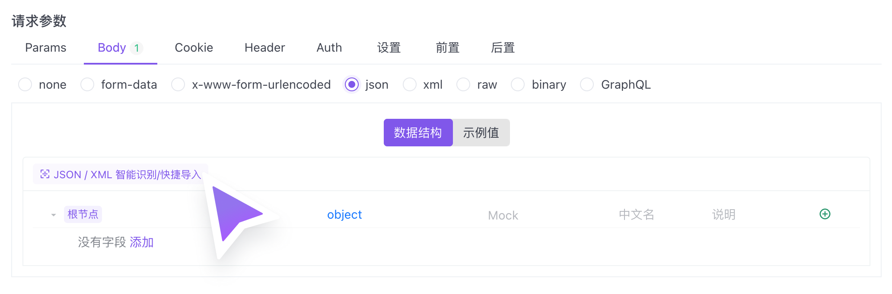

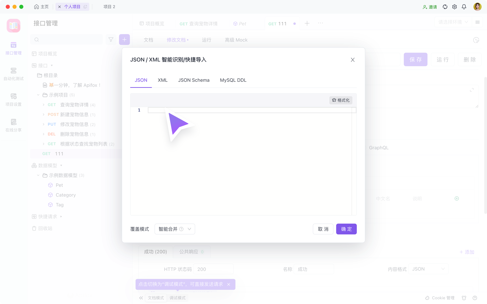

#### 智能合并

在 2.1.39 版本之后。当字段已经存在 mock、中文名、说明时，使用`智能合并`。导入相同字段，新导入的部分不会覆盖原有的 mock、中文名、说明。

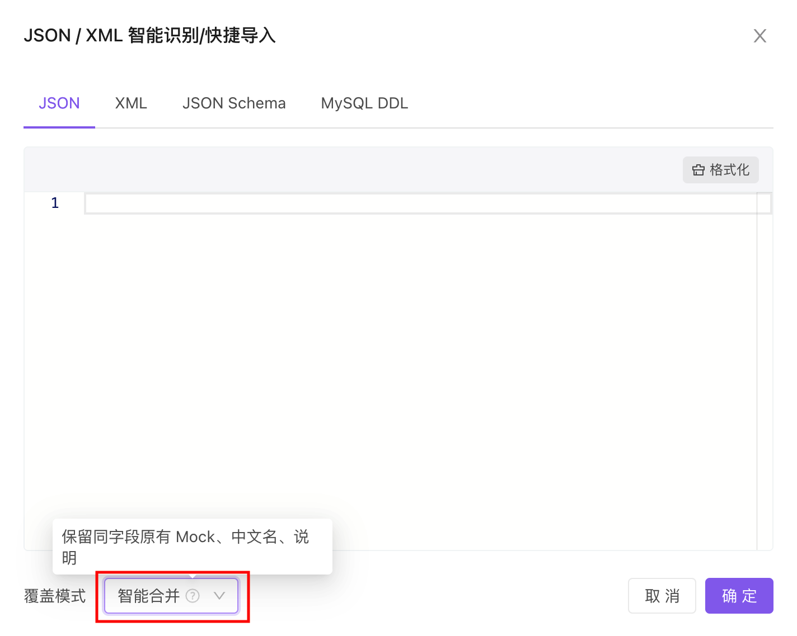

#### 快捷导入支持 SQL 建表语句

在 2.1.39 版本之后。快捷导入支持 SQL 建表语句，并读取数据库字段长度，写入字段属性。

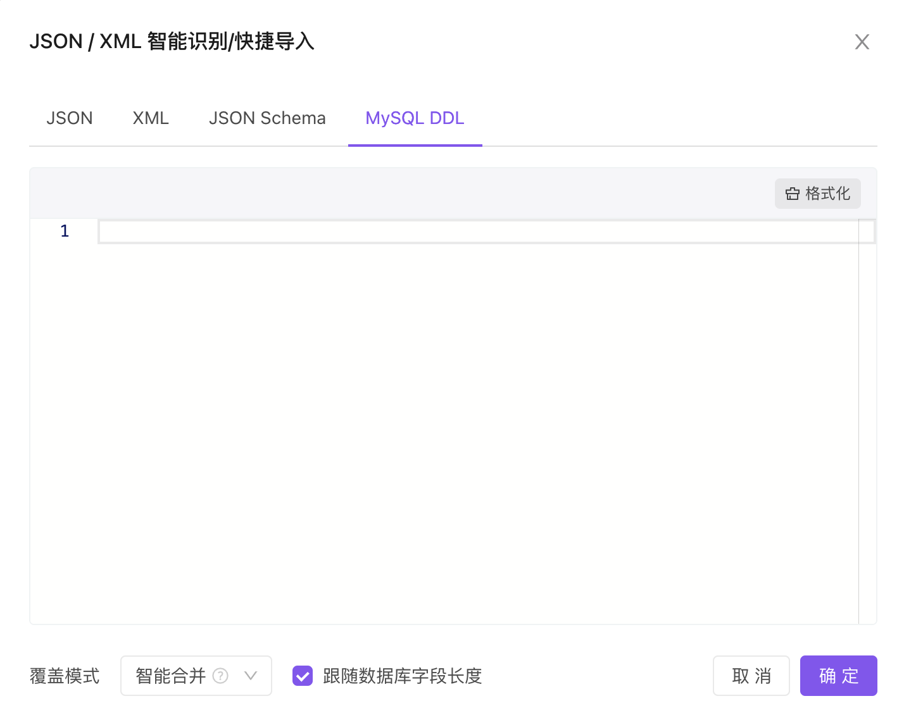

### 编辑数据结构

1. 可以选择该字段是否必填

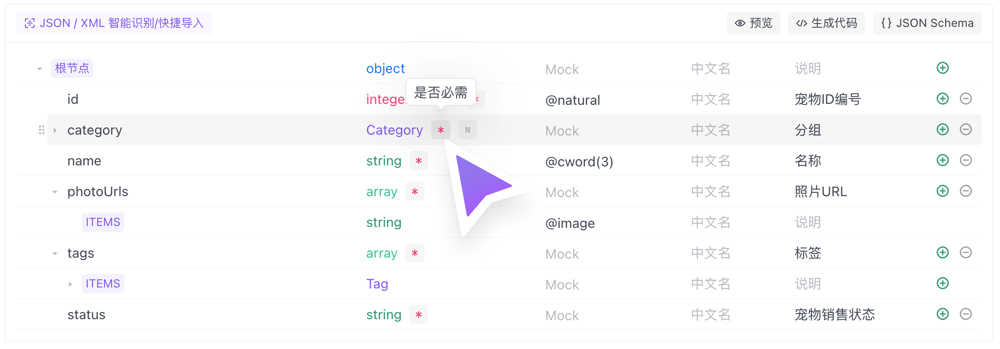

2. 可以选择该字段的数据类型

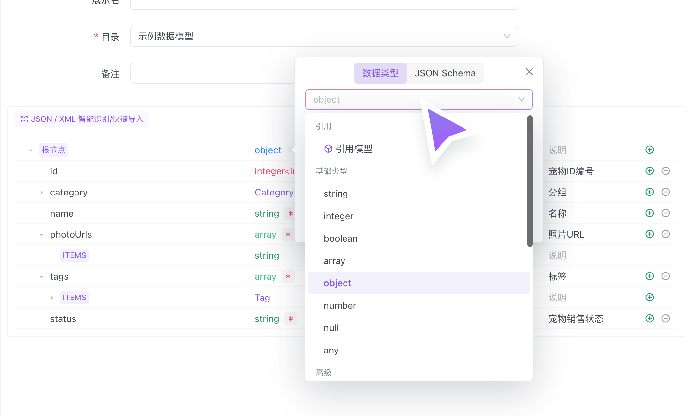

3. 可以编辑该字段的`Mock 设置`，具体语法可以查看 [Mock 语法](../../mock/mock-rules/)

4. 可以新增字段，或删除该字段

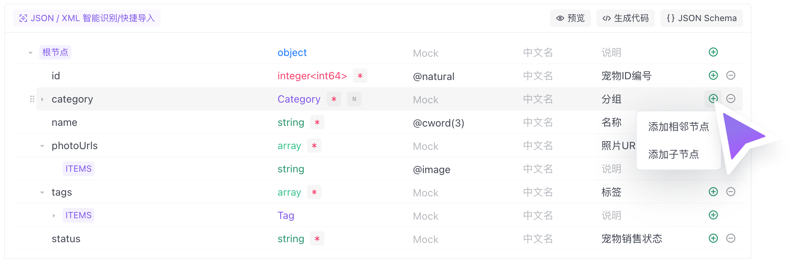

5. 可拖拽移动，改变字段之间的排序

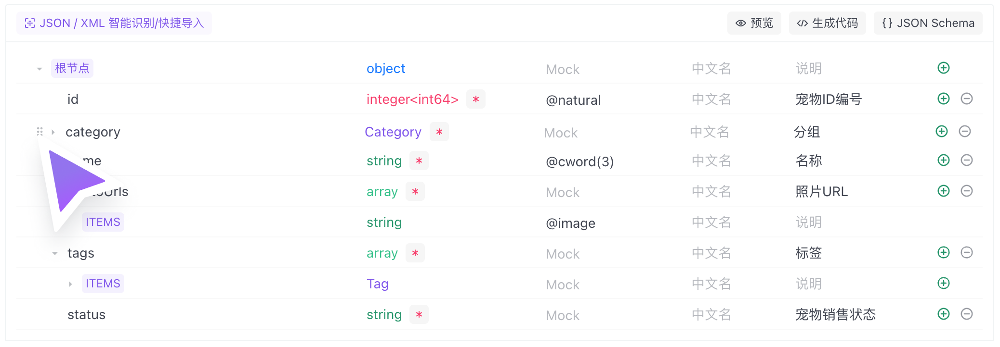

6. 关于填写`说明`的高效率的方式，我们正在开发中，敬请期待。

## 数据模型

数据模型是`可复用的数据结构`。在设计数据结构时可以在`数据类型`直接选择已经定义好的`数据模型`。

### 管理数据模型
在使用`数据模型`前，需要先建立`可复用的数据结构`。如下图，根据项目需要，可以先在`数据模型`下新建，也可以简单的管理不同数据模型间的关系。

::: tip 注意

数据模型之间也可以相互引用

:::

### 数据模型的引用

在 [接口设计](../api-design/) 的`返回响应`和 json / xml 类型的`Body 参数`处，在`数据类型`处可以引用已经建立好的`数据模型`，如下图。

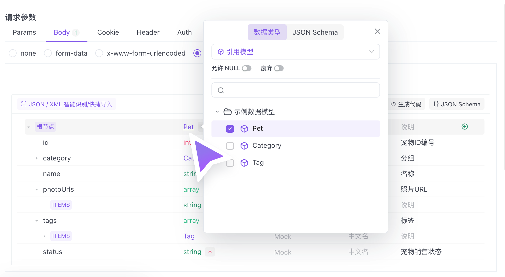

1. 当前引用的数据模型不符合要求，需要修改时，可以直接跳转到`数据模型`进行修改

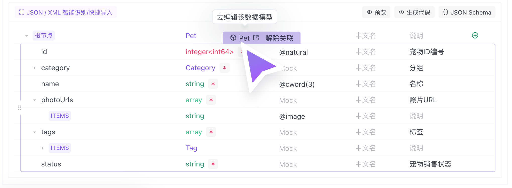

2. 当下接口需要部分引用`数据模型`时，可以在引用的情况下修改，并且不影响原`数据模型`

    1. 当不需要`数据模型`中的某个字段时，可以点击`隐藏字段`，则接口文档中就不会显示了

    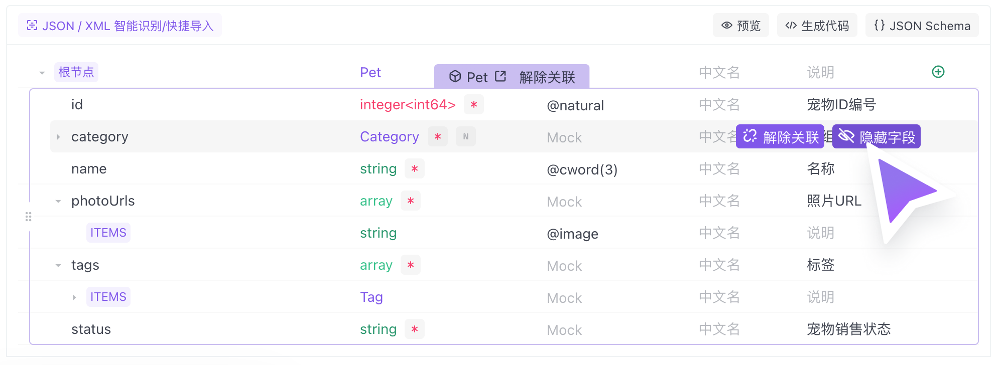

    2. 当需要对`数据模型`中的某个字段，特殊编辑时，可以点击`取消关联`。当然后续也可以`恢复关联`

    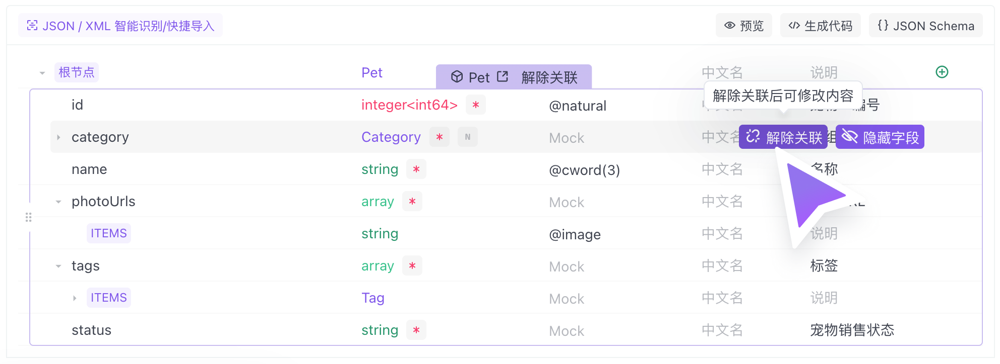

    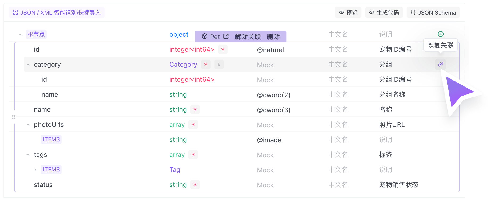

3. 可以引用多个`数据模型`，并支持`数据模型`之间拖拽排序

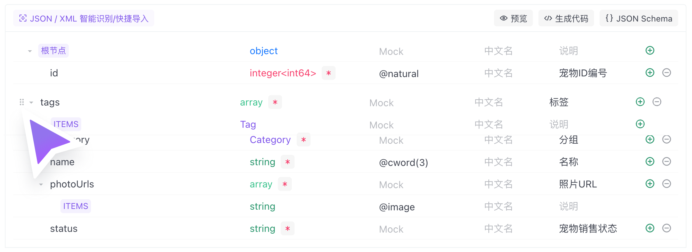

### 预览

根据设计的数据结构，mock 出假数据，方便查看数据结构的实际效果。

### 生成代码

根据数据结构生成各种语言的代码，更多信息请查看文档：[代码生成](../../code-generator/)。

### 编辑源码

Apifox 的数据结构和数据模型是完全遵守 [JSON Schema 规范](https://json-schema.org/) 的，所以可以直接编辑 JSON Schema 的方式来定义数据结构。参考文档：[JSON Schema 介绍](../../../reference/json-schema/)
