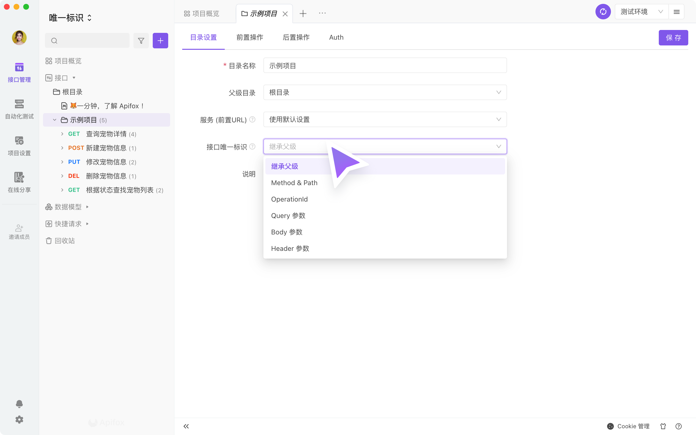
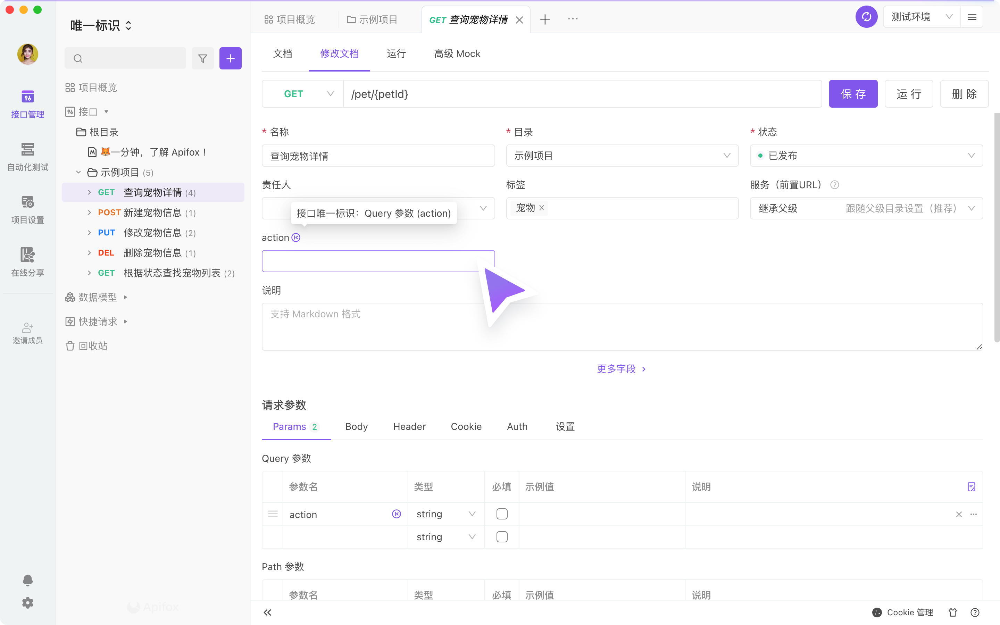
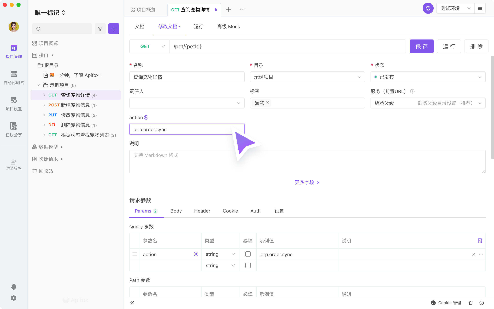
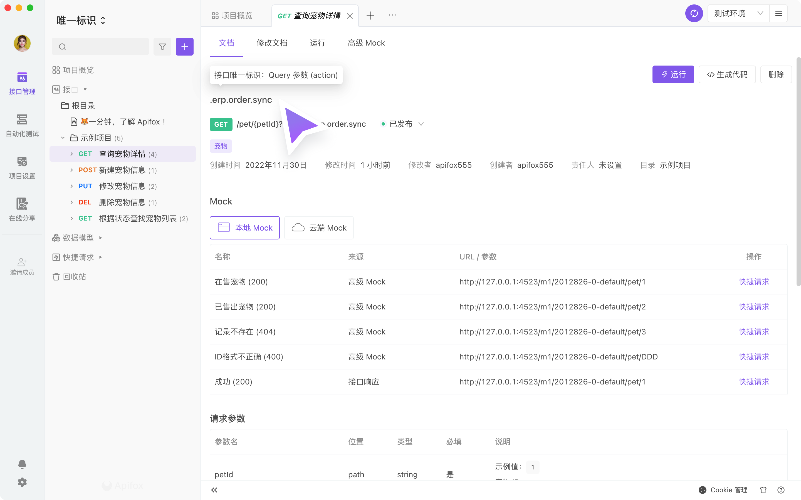
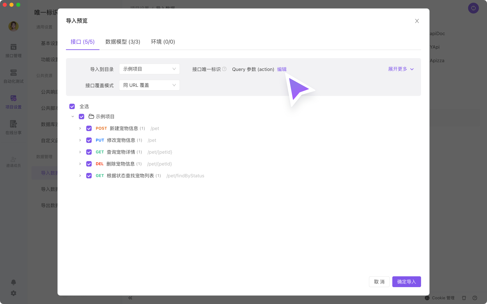
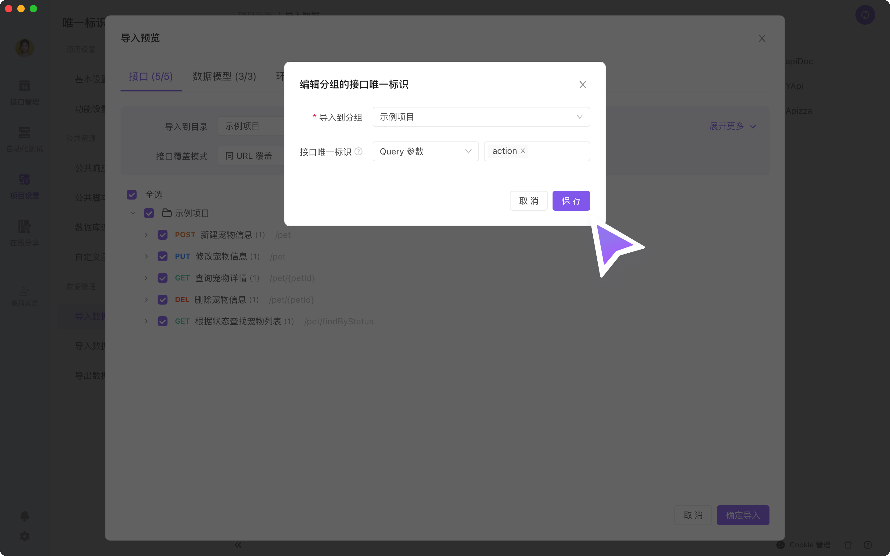
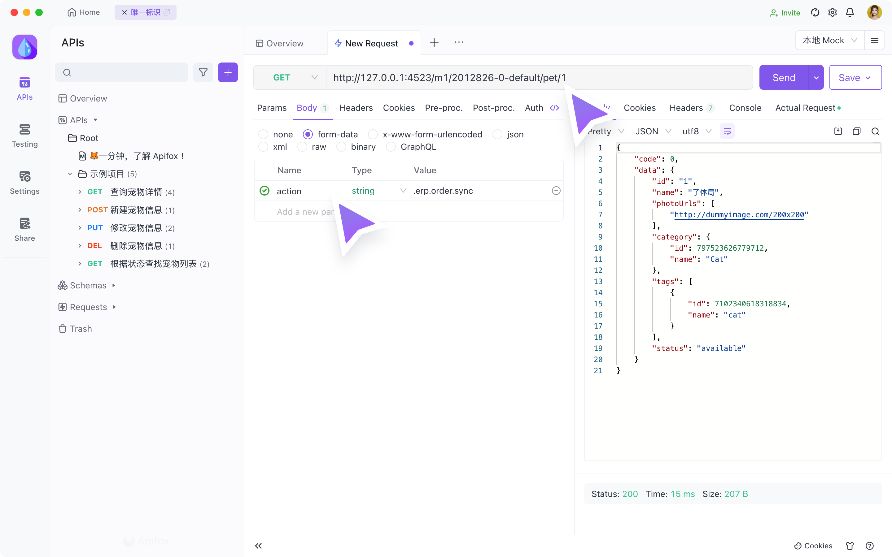

# 接口唯一标识

目前大多数接口是通过 `method & path` 来区分接口。而有的开发项目（例如一些电商 API 文档），接口请求的 URL 是不变的，通过 Query / Header 中的参数来区分接口。

在 2.2.9 版本之后，我们新增 `接口唯一标识` 功能，新增支持 `operationId`、`Query 参数`、`Body 参数`、`Header 参数` 作为区分接口的唯一标识的参数。

## 1. 设置接口唯一标识

`接口唯一标识` 定义为 `目录` 层级的设置。当你需要设置某个接口为唯一标识的时候，需要再其接口的 `父级目录` 中设置。根据你的需要，选择你需要的唯一标识参数，点击保存后对该目录下的所有接口生效。

举例：某一个电商 API 接口，以 `Query 参数` 的参数 action ，作为 `接口唯一标识` 的参数。在下图选择为 `Query 参数` 后，在其右侧的输入框中输入对应的参数名。

## 2. 填写对应的唯一标识的参数值

设置目录的 `接口唯一标识` 后，点击该目录下的某个接口，点击 `修改文档` tab，在接口的基础信息中，和下方的请求参数中，均有一个 `K` 的 icon，均代表该 `接口唯一标识` 的参数。

可以在对应参数下填入对应的值，作为接口唯一标识的值。

## 3. 文档页显示唯一标识

在 `接口-修改文档` 页填写了 `接口唯一标识` 的值后，在 `接口-文档` 页以及在 `在线文档` 显示如下。

## 4. 导入

当你的项目中已经是通过 Query / Header 中的参数来区分接口，通过 `OpenAPI 格式` 的文件导入 Apifox 时，如下页面。

导入时匹配接口的规则，根据导入的目标 `目录` 的设置为准。当导入的目标 `目录` 的设置 `接口唯一标识` 不符合需要时，可以在导入设置中修改；修改后，会直接对目标 `目录` 生效。

举例：某一个电商 API 接口，以 `Query 参数` 的参数 action ，作为 `接口唯一标识` 的参数。如下页面，导入 Apifox 时，点击`编辑` 修改 `接口唯一标识`。

::: tip 注意
1. 已经使用 Query 参数 `固定值` 的功能的用户，不用担心，功能依然会保留。但 `固定值` 在导入时是根据 URL 进行覆盖判断的，建议已经使用 `固定值` 功能的用户使用 `接口唯一标识` 功能。
2. `接口唯一标识` 功能支持设置多个参数。
3. 如果你的目录中，只有某个子目录特殊设置为 `接口唯一标识`，在导入 Swagger 并更新全部目录时，请避免全部项目导入到根目录进行更新，推荐设置为 `接口唯一标识` 的接口单独导入到该特殊子目录中。
:::

## 5. Mock 数据

在 2.2.24 版本之后，如果接口设置了 `接口唯一标识` 为 `Body 参数`、`Header 参数`，需要通过发送 `路径 + 唯一标识的参数与参数值`，才能获得对应的 Mock 数据。

::: tip 注意
1. 前端同学在开发时访问 Mock 数据，如果接口设置了 `接口唯一标识` 为 `Body 参数`、`Header 参数`，同样是需要通过发送 `路径 + 唯一标识的参数与参数值`，才能获得对应的 Mock 数据。
2. 存在 `接口唯一标识` 的项目，接口填写需要规范，避免出现同 URL 的接口但没有设置 `接口唯一标识` 的情况。避免无法正确的获得 Mock 数据
:::

