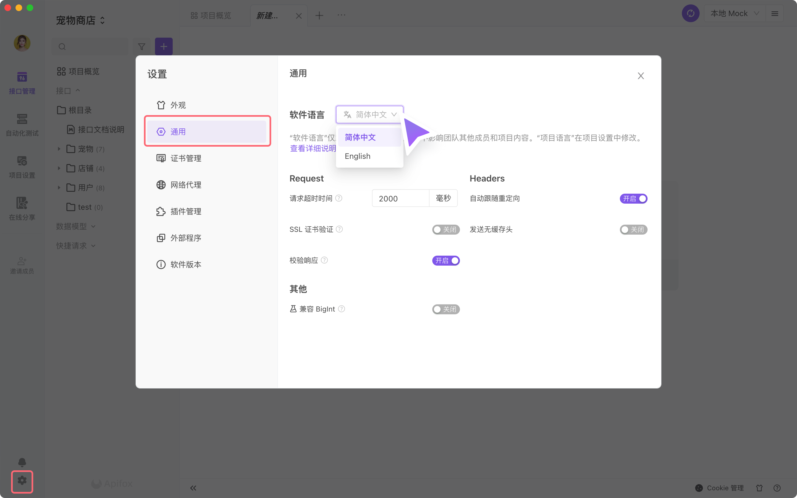
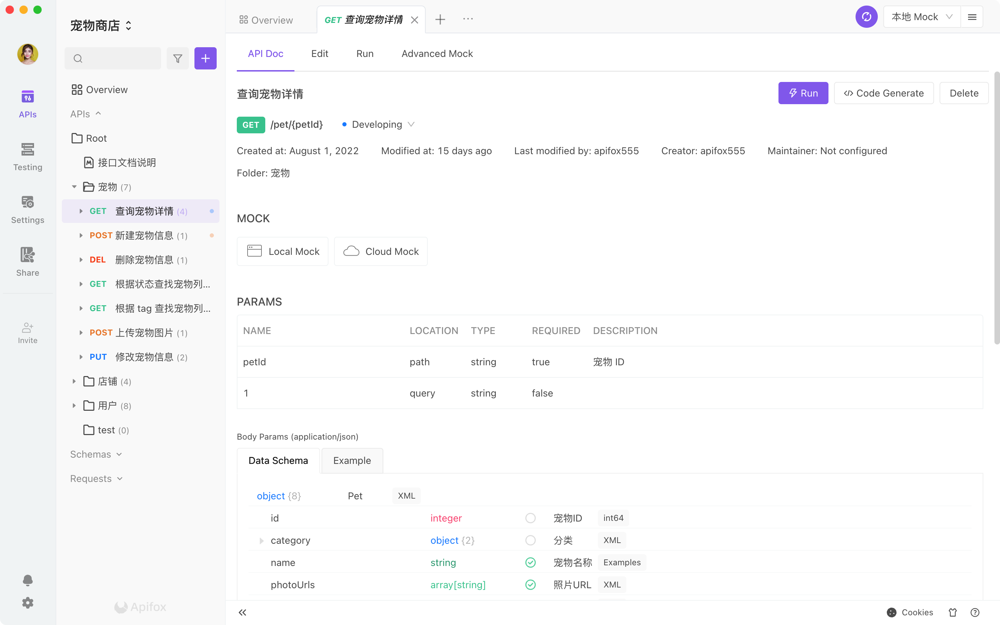
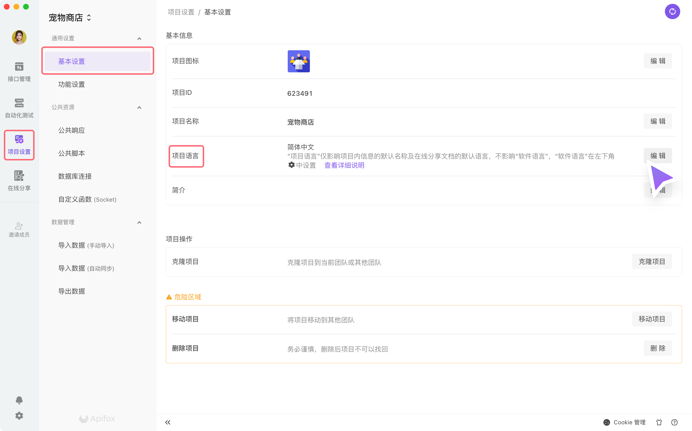
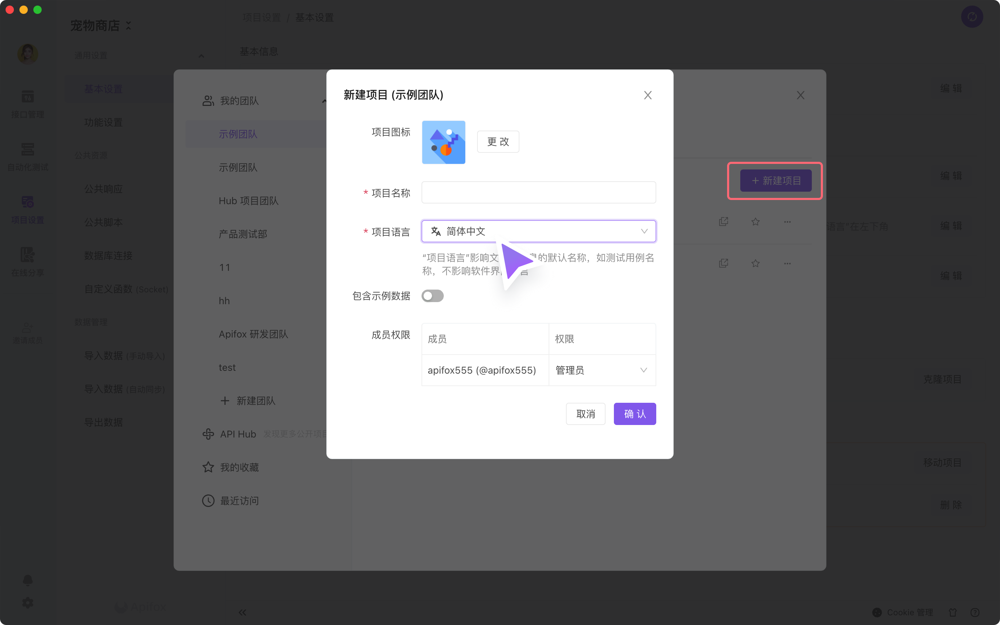
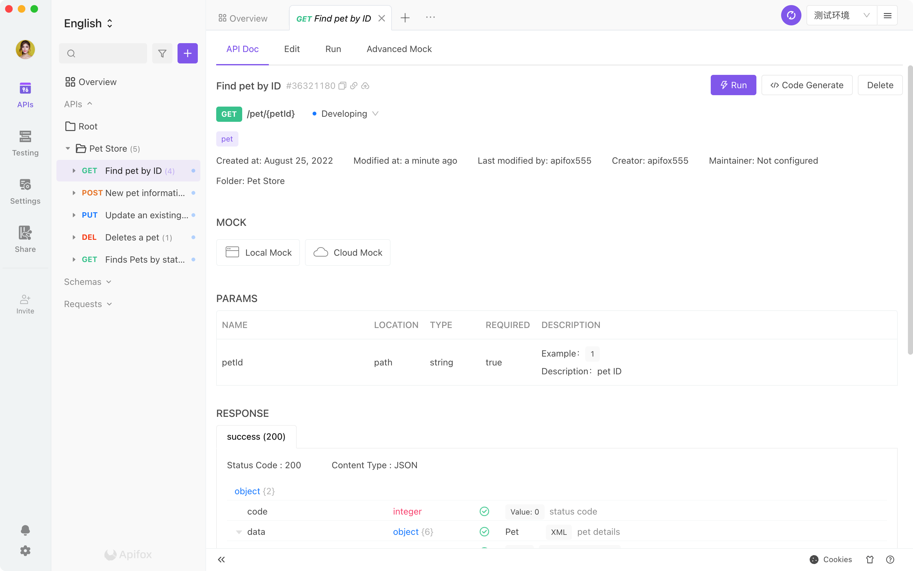
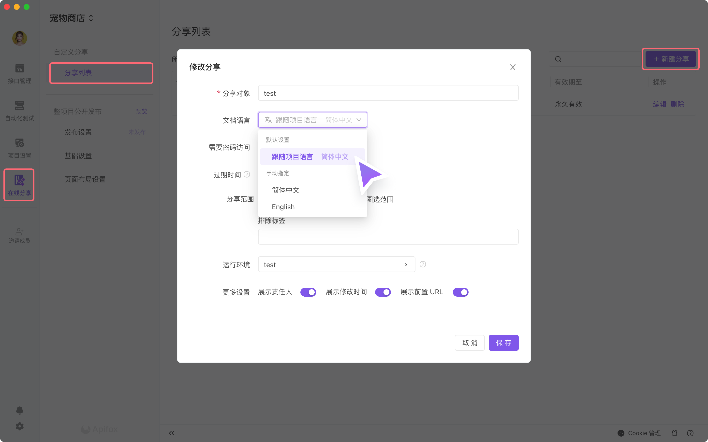
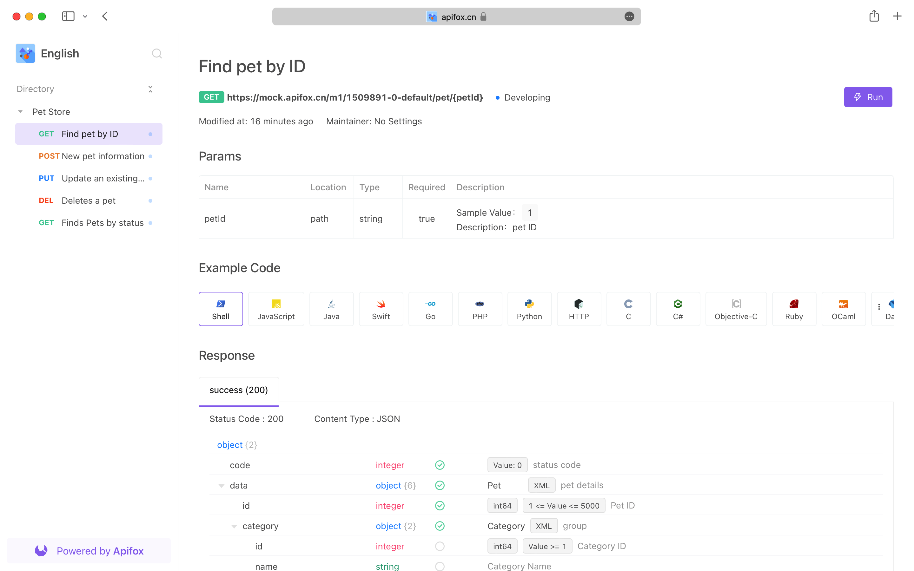

# 语言设置

为了更好的支持国际化团队的开发工作，我们提供 3 种维度的语言设置

## 软件语言

`软件语言` 表示软件工具界面上的语言，在左下角 `设置-通用-软件语言` 设置，只会影响本地使用，不会影响团队其他人员，不会影响 `在线文档`。

效果如下图

会发现切换 `软件语言` 为英语后，还有一部分内容以英语显示，这是我们引入第二个维度 `项目语言`。

## 项目语言

`项目语言` 表示项目内自动生成的默认名称的语言，包含 `返回响应`、`响应示例`、`接口用例`、`Markdown 文档` 的默认名称、`测试数据` 的默认数据集名称。

在 `项目设置-基本设置-项目语言` 设置，只有管理者有权限修改，不会影响 `软件语言`。`项目语言` 保存在项目维度，团队成员会使用同一套 `项目语言`，包括 `在线文档` 也是使用同一套 `项目语言`。

:::tip 提示

在接口文档内自己填写的数据，是没办法通过切换 `项目语言` 来完成语言翻译的，需要自己翻译修改。

:::

### 新建项目时支持设置项目语言

在新建项目时，可以直接设置 `软件语言` 。

如果你选择 `包含示例数据`，项目的示例数据会根据 `软件语言` 生成全英文的数据，效果如下图。

## 文档语言

`软件语言` 表示 `在线文档` 上工具本身提供的语言（可以理解为 `在线文档` 上的 `软件语言`），在左侧 `在线分享-分享列表-编辑/新建分析` 设置。

`在线文档` 效果如下图

