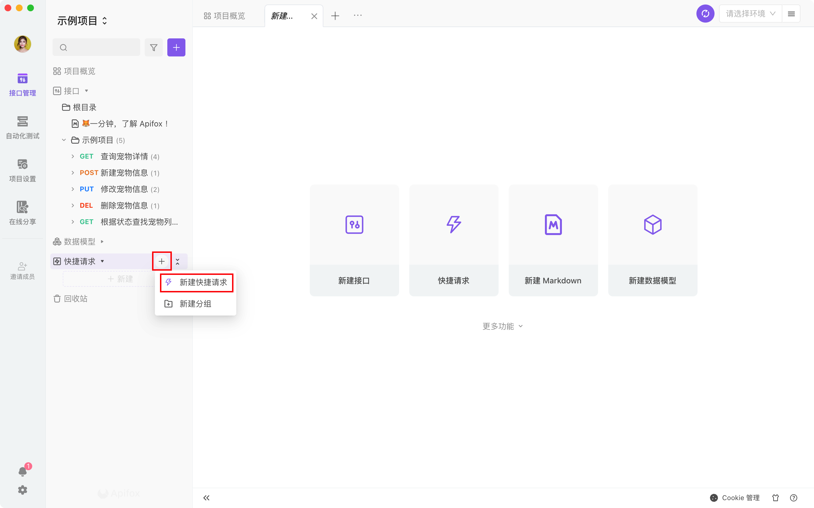
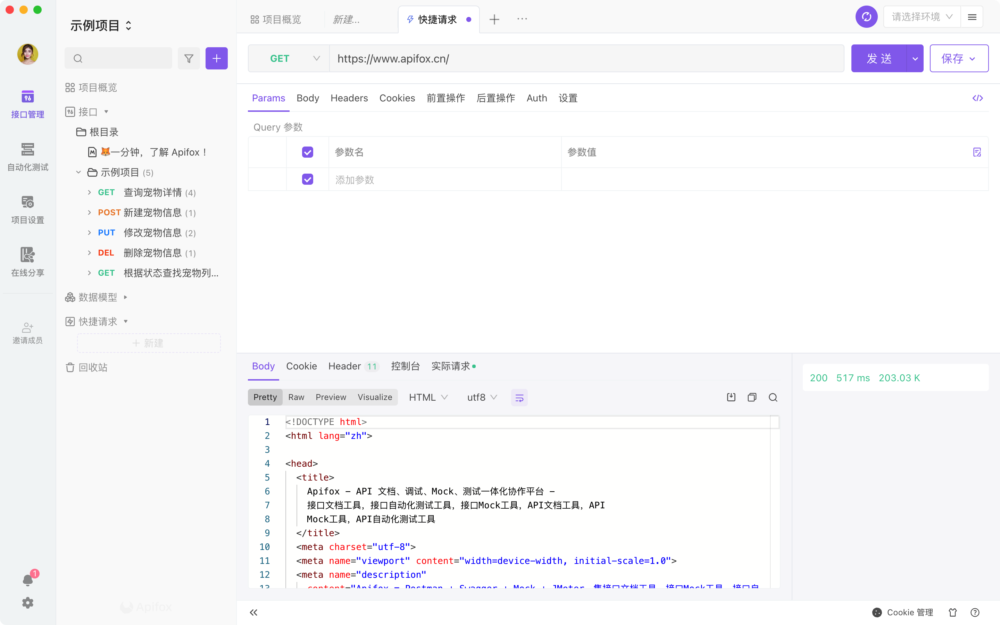
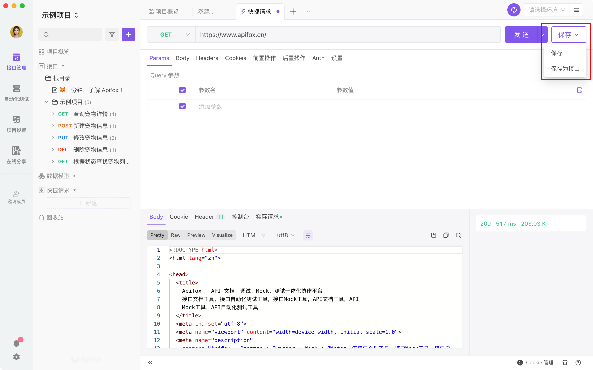
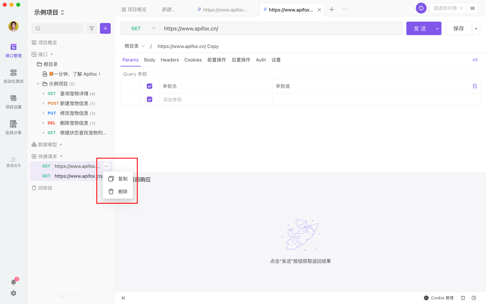
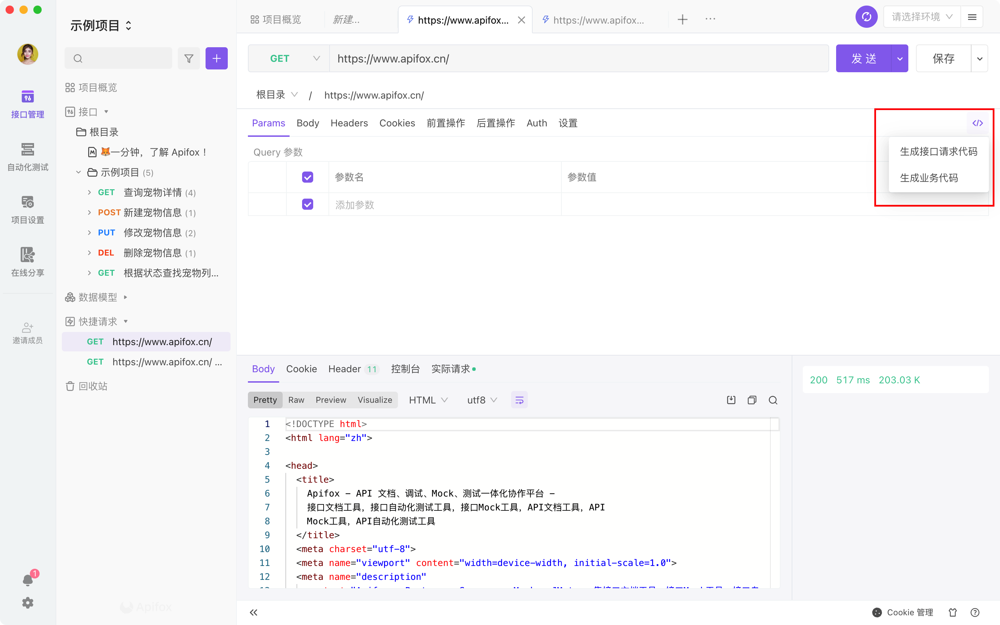

# 快捷请求

## 使用场景

临时需要调试某个接口，而不需要保存为文档或者用例。

## 快速上手

1. 鼠标移到左侧搜索框旁边的 `+` 号按钮，在下拉列表里选择`快捷请求`，也可使用 [快捷键](../../shortcuts/)：Ctrl(⌘) + T。

   

2. 鼠标移动到左侧目录中，在`快捷请求`右边点击 `+` 号按钮，也可新建`快捷请求`

   

3. 输入接口 URL 及参数，即可快速请求接口

   

:::tip 注意

如果输入的 URL `不是`以`http://`或`https://`起始，实际发出请求的时候`会`自动加上`当前环境`里前置 URL。
:::

4. 调试完成后，可以保存为`快捷请求`或`接口文档`

   

5. 在左侧目录可以管理已保存的`快捷请求`

   

6. `快捷请求` 支持 `生成代码`，详情请见 [生成代码](../../code-generator/)

   