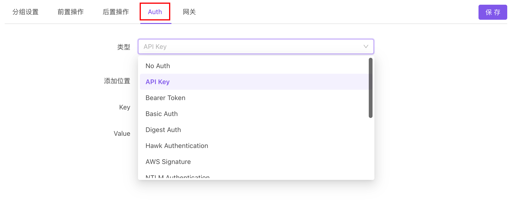

# 登录态（Auth）如何处理

## 常见处理方式

### 一、Session/Cookie 方式

[Apifox](https://www.apifox.cn/) 会自动保持 Session/Cookie 方式的登录态。

**使用方法**：

- 先执行登录接口，执行完成后全局 Cookie 会自动保存返回的 Session/Cookie 信息。
- 然后运行其他接口，会自动带上 Session/Cookie 信息。

:::tip 注意

Session/Cookie 方式可以按下文方法实现`全自动登录`。

:::

### 二、Token 方式

Token 方式是将登录凭证放在接口请求参数里（通常会放在 Header）。常见的有`Basic Auth`、`Bearer Token`、`API Key`等方式。

**使用方法**：
::: v-pre

- 方法 1. 通过全局(项目概览页）、分组(分组设置)、接口(文档编辑页）的 `Auth` 设置授权信息，支持如下多种授权类型

  

- 方法 2. 手动将 token 写入 Header 或其他对应参数里（推荐使用 [环境变量](../../api-manage/environments/) 存放 token）。示例：

  - **Bearer Token**：设置一个名为`Authorization`的 Header，设置值为`Bearer eyJhbGciOiJIUzI1NiIsInR5cCI6IkpXVCJ9yJpZCI6`（或者使用环境变量，设置值为`Bearer {{AUTH_TOKEN}}`）

- 方法 3. 在 [环境](../../api-manage/environments/) 里的`全局参数`统一设置，所有接口运行时会自动加上`全局参数`，无需每个接口手动设置。
  :::

:::tip 注意

Token 方式可以按下文方法实现`全自动登录`。

:::

### 三、全自动登录

运行接口用例的时候，自动调用登录接口完成登录，而无需手动登录。

**使用方法**：

- 请看下文

## 全自动登录实现方式

### 期望效果

1. 运行接口用例的时候，自动完成登录，而无需手动登录。
2. 自动登录过一次后，保存登录态，避免每次执行用例都调用登录接口。

### 实现思路

::: v-pre

1. 使用 [环境变量](../../api-manage/environments/)（如：`ACCESS_TOKEN`）保存登录需要的凭证。
2. 如凭证有过期时间，使用环境变量（如：`ACCESS_TOKEN_EXPIRES`）保存登录凭证的过期时间。
3. 创建一个 [公共脚本](../../scripts/common-script/) ：
   1. 判断环境变量`ACCESS_TOKEN`是否有值，以及`ACCESS_TOKEN_EXPIRES`是否过期，如果存在且未过期，跳出执行，否则下一步。
   2. 使用 [pm.sendRequest](../../scripts/api-references/pm-reference/#pm-sendrequest) 调用登录接口，将登录接口返回的登录凭证写入环境变量，过期时间也写入环境变量。
4. 设置需要登录态的接口用例：
   1. 将用来验证登录态的参数值设置为 `{{ACCESS_TOKEN}}` 。
      - 将 header 里的`Authorization`的设置为`{{ACCESS_TOKEN}}`。注意：这里也可以使用 Cookie 或其他位置的参数，请根据实际情况确定。
      - 此处也可以在 **环境** 里的 **全局参数** 统一设置，所有接口运行时会自动加上 **全局参数**，无需每个接口手动设置。
   2. 在 **前置脚本** 里引用前面创建公共脚本。

:::

### 公共脚本示例

:::tip 注意

- 示例脚本里的登录`用户名`和`密码`，是从环境变变量 `LOGIN_USERNAME` 和 `LOGIN_PASSWORD` 获取，如果你直接拷贝代码的话，记得要手动设置这两个环境变量。
- 如果你们的 token 没有过期时间，可以将 `ACCESS_TOKEN_EXPIRES`相关的代码去除。
- [pm.sendrequest 参考文档](../../scripts/api-references/pm-reference/#pm-sendrequest)
- [pm.cookies 参考文档](../../scripts/api-references/pm-reference/#pm-cookies)

:::

```js
// 定义发送登录接口请求方法
function sendLoginRequest() {
  // 获取环境里的 前置URL
  const baseUrl = pm.environment.get("BASE_URL");

  // 登录用户名，这里从环境变量 LOGIN_USERNAME 获取，也可以写死（但是不建议）
  const username = pm.environment.get("LOGIN_USERNAME");

  // 登录密码，这里从环境变量 LOGIN_PASSWORD 获取，也可以写死（但是不建议）
  const password = pm.environment.get("LOGIN_PASSWORD");

  // 构造一个 POST x-www-form-urlencoded 格式请求。这里需要改成你们实际登录接口的请求参数。
  const loginRequest = {
    url: baseUrl + "/api/v1/login",
    method: "POST",
    // body 为 x-www-form-urlencoded 格式
    body: {
      mode: "urlencoded", // 此处为 urlencoded
      // 此处为 urlencoded
      urlencoded: [
        { key: "account", value: "apifox" },
        { key: "password", value: "123456" },
      ],
    },
    /*
    // body 为 form-data 格式
    body: {
      mode: 'formdata', // 此处为 formdata
      // 此处为 formdata
      formdata: [
        { key: 'account', value: 'apifox' },
        { key: 'password', value: '123456' }
      ]
    }

    // body 为 json 格式
    header: {
      "Content-Type": "application/json", // 注意：header 需要加上 Content-Type
    },
    body: {
      mode: 'raw',// 此处为 raw
      raw: JSON.stringify({ account: 'apifox', password:'123456' }), // 序列化后的 json 字符串
    }

    // body 为 raw 或 json 格式
    body: {
      mode: 'raw',
      raw: '此处为 body 内容',
    }
    */
  };

  // 发送请求。
  // pm.sendrequest 参考文档: https://www.apifox.cn/help/app/scripts/api-references/pm-reference/#pm-sendrequest
  pm.sendRequest(loginRequest, function(err, res) {
    if (err) {
      console.log(err);
    } else {
      // 读取接口返回的 json 数据。
      // 如果你的 token 信息是存放在 cookie 的，可以使用 res.cookies.get('token') 方式获取。
      // cookies 参考文档：https://www.apifox.cn/help/app/scripts/api-references/pm-reference/#pm-cookies
      const jsonData = res.json();
      // 将 accessToken 写入环境变量 ACCESS_TOKEN
      pm.environment.set("ACCESS_TOKEN", jsonData.data.accessToken);
      // 将 accessTokenExpires 过期时间写入环境变量 ACCESS_TOKEN_EXPIRES
      pm.environment.set(
        "ACCESS_TOKEN_EXPIRES",
        jsonData.data.accessTokenExpires
      );
    }
  });
}

// 获取环境变量里的 ACCESS_TOKEN
const accessToken = pm.environment.get("ACCESS_TOKEN");

// 获取环境变量里的 ACCESS_TOKEN_EXPIRES
const accessTokenExpires = pm.environment.get("ACCESS_TOKEN_EXPIRES");

// 如 ACCESS_TOKEN 没有值，或 ACCESS_TOKEN_EXPIRES 已过期，则执行发送登录接口请求
if (
  !accessToken ||
  (accessTokenExpires && new Date(accessTokenExpires) <= new Date())
) {
  sendLoginRequest();
}
```
