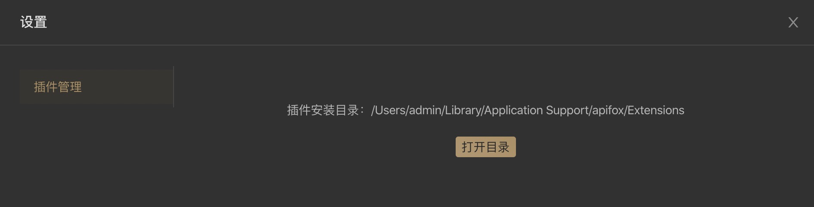

# Socket 封包插件

## 一、选择一个插件ID

每一个插件都需要一个唯一的`插件 ID`，该 ID 需要使用倒置的域名作为前缀，如`cn.apifox.ApifoxExtensions.DemoSocketPacker`。

## 二、创建插件目录和插件文件

打开插件安装目录，点击软件右上角`设置`形状的 icon ，选择`插件管理`，即可查看插件安装目录。



1. 创建一个名为`插件 ID`的目录
2. 该目录下，创建一个 `.js` 文件，该文件名必须为`插件ID`最后一个`.`后面部分，如`DemoSocketPacker.js`。

创建后的插件目录如下：

```
Extensions/
		cn.apifox.ApifoxExtensions.DemoSocketPacker/
				DemoSocketPacker.js
```

## 三、JavaScript  类结构

javascript 支持 **ES6** 语法，**CommonJS** 模块化

#### 静态属性：

- `id` **必须**: 插件 ID
- `title` **必须**: 插件展示名称
- `type` **必须**: 插件类型，填`socketPacker`
- `dataType` **必须**: 输入数据的类型，`text`或 `json`
- `inputs` *可选*: 使用插件时插件用户输入项
- `help` *可选*: 插件的使用文档 URL
- `hint` *可选*: 插件的提示语

#### 方法：

- `evaluate(data, options, context)` **必须**: 用来处理封包逻辑。

#### 示例：

```js
/**
 * Apifox Socket 封包插件示例
 * 封装 JSON 格式包数据
 *
 * @class DemoSocketPacker
 */
class DemoSocketPacker {
  // 插件 ID，取 ID 要避免和其他插件冲突
  static id = 'cn.apifox.ApifoxExtensions.DemoSocketPacker';
  // 插件展示名称
  static title = '封包插件示例';
  // 插件使用帮助链接，可选
  static help = 'https://www.apifox.cn/help/app/extensions/socket-packer/';
  // 插件类型 Socket 封包插件：'socketPacker'
  static type = 'socketPacker';
  // 插件版本号
  static version = '1.0.0';
  // 前端用户输入项设置
  static inputs = [
    ['eol', '包尾分隔符', 'Input', {
      defaultValue: '\\r\\n'
    }]
  ];
  // 解包后的 message 数据类型，可选 'json' 和 'string'
  static dataType = 'json';

  // 等待处理的数据
  _bufferedData = null;

  /**
   * 封包，将用户输入的数据封装处理后用来发送 Socket 包
   *
   * @param {*} data  String。
   * @param {*} options 对象。options.inputs 可读取用户输入项
   * @param {*} context 对象。context.executeJar 可调用 jar 文件
   * @returns String | Buffer
   */
  evaluate(data, options, context) {
    // 包尾结束符
    let eof = '';
    if (options.inputs['eol']) {
      // 处理需要转义的字符
      eof = options.inputs['eol']
        .replace(/\\n/g, '\n') // 换行: \n
        .replace(/\\r/g, '\r') // 回车: \r
        .replace(/\\t/g, '\t') // tab(制表符): \t
        .replace(/\\r/g, '\b') // 退格符: \b
        .replace(/\\r/g, '\f') // 换页符: \f
        .replace(/\\\\/g, '\\'); // 反斜杠: \\
    }
    return JSON.stringify(data) + eof;
  }
}

module.exports = DemoSocketPacker;
```

#### 下载示例代码

github 地址：[cn.apifox.ApifoxExtensions.DemoSocketPacker](https://github.com/apifox/apifox-extensions/tree/master/packages/cn.apifox.ApifoxExtensions.DemoSocketPacker)

gitee 地址：[cn.apifox.ApifoxExtensions.DemoSocketPacker](https://gitee.com/apifox/apifox-extensions/tree/master/packages/cn.apifox.ApifoxExtensions.DemoSocketPacker)


## 四、插件调用 jar 包示例

#### 调用方式：

`onData(chunk, options, context)`第三个参数`context`包含`executeJar`方法，可以调用 `jar`包。

#### 示例：

1. 将`cn.apifox.Base64EncodeDemo.jar`包放入插件目录，目录结构如下：

   ```
   Extensions/
       cn.apifox.ApifoxExtensions.DemoExecuteJarSocketPacker/
           DemoExecuteJarSocketPacker.js
           cn.apifox.Base64EncodeDemo.jar
   ```

2. DemoExecuteJarSocketPacker.js 代码

   ```js
   /**
    * Apifox Socket 封包插件示例 (含调用 Jar)
    * 封装 JSON 格式包数据，并调用 jar 计算 Base64
    *
    * @class DemoExecuteJarSocketPacker
    */
   class DemoExecuteJarSocketPacker {
     // 插件 ID，取 ID 要避免和其他插件冲突
     static id = 'cn.apifox.ApifoxExtensions.DemoExecuteJarSocketPacker';
     // 插件展示名称
     static title = '封包插件示例 (含调用 Jar)';
     // 插件使用帮助链接，可选
     static help = 'https://www.apifox.cn/help/app/extensions/socket-packer/';
     // 插件类型 Socket 封包插件：'socketPacker'
     static type = 'socketPacker';
     // 插件版本号
     static version = '1.0.0';
     // 前端用户输入项设置
     static inputs = [
       ['eol', '包尾分隔符', 'Input', {
         defaultValue: '\\r\\n'
       }]
     ];
     // 解包后的 message 数据类型，可选 'json' 和 'string'
     static dataType = 'json';
   
     // 等待处理的数据
     _bufferedData = null;
   
     /**
      * 封包，将用户输入的数据封装处理后用来发送 Socket 包
      *
      * @param {*} message  String | JSON。数据类型同上面的 dataType 保存一致
      * @param {*} options 对象。options.inputs 可读取用户输入项
      * @param {*} context 对象。context.executeJar 可调用 jar 文件
      * @returns String | Buffer
      */
     evaluate(message, options, context) {
       // 包尾结束符
       let eof = '';
       if (options.inputs['eol']) {
         // 处理需要转义的字符
         eof = options.inputs['eol']
           .replace(/\\n/g, '\n') // 换行: \n
           .replace(/\\r/g, '\r') // 回车: \r
           .replace(/\\t/g, '\t') // tab(制表符): \t
           .replace(/\\r/g, '\b') // 退格符: \b
           .replace(/\\r/g, '\f') // 换页符: \f
           .replace(/\\\\/g, '\\'); // 反斜杠: \\
       }
       /**
        * 调用 jar 示例。如果不需调用 jar 可以忽略这段代码
        * 给 message 增加一个字段 base64Data，值为 packetString 的 MD5。
        * 注意：jar 文件 cn.apifox.Base64EncodeDemo.jar 需存放在当前 js 相同目录下
        */
       try {
         if (message) {
           /**
            * context.executeJar 用法说明
            * context.executeJar(jarFileName: string, args?: string[])
            * @param {*} jarFileName String jar 文件名。注意：jar 文件需存放在当前 js 相同目录下。
            * @param {*} args Array<String> 运行参数，为字符串数组
            */
           message.base64Data = context.executeJar('cn.apifox.Base64EncodeDemo.jar', [JSON.stringify(message)]);
         }
       } catch (e) {
         throw new Error(`调用 jar 出错: ${e.message}`);
       }
   
       return JSON.stringify(message) + eof;
     }
   }
   
   module.exports = DemoExecuteJarSocketPacker;
   ```

3. cn.apifox.Base64EncodeDemo.jar 对应的 java 源码

   ```java
   import java.io.UnsupportedEncodingException;
   import java.util.Base64;
   
   public class Base64Encode {
       public static void main(String[] args) throws UnsupportedEncodingException {
           if(args!=null&&args.length == 1){
               System.out.print(toParse(args[0]));
           }else{
               System.out.print("参数错误");
           }
       }
       static String toParse(String str){
           return Base64.getUrlEncoder().encodeToString(str.getBytes());
       }
   }
   ```

   

#### 下载示例代码

github 地址：[cn.apifox.ApifoxExtensions.DemoExecuteJarSocketPacker](https://github.com/apifox/apifox-extensions/tree/master/packages/cn.apifox.ApifoxExtensions.DemoExecuteJarSocketPacker)

gitee 地址：[cn.apifox.ApifoxExtensions.DemoExecuteJarSocketPacker](https://gitee.com/apifox/apifox-extensions/tree/master/packages/cn.apifox.ApifoxExtensions.DemoExecuteJarSocketPacker)


## 五、插件脚本使用`npm`包

参考：[插件中使用 npm 包](../use-npm/)