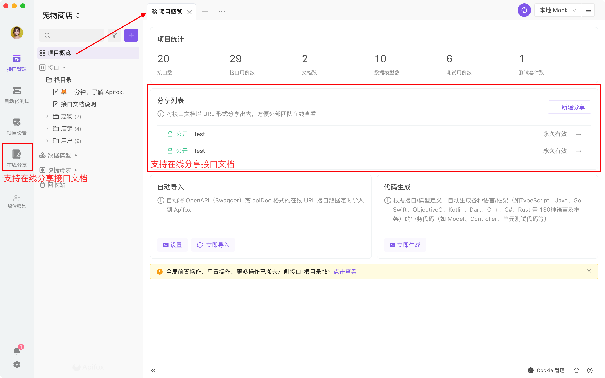
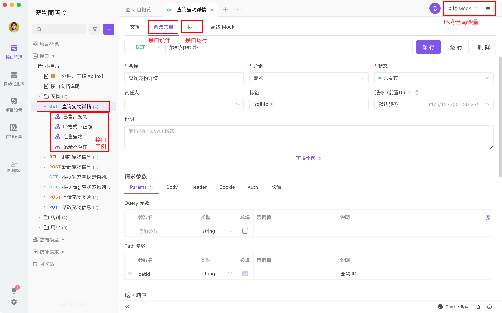
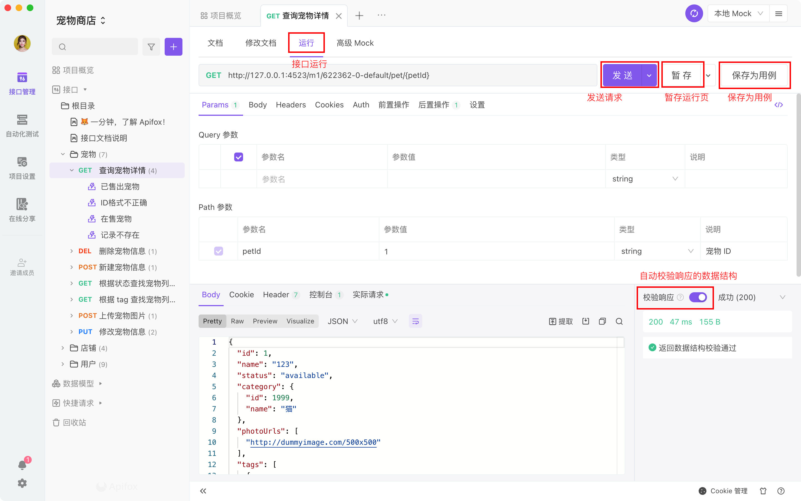

# 快速上手

## 使用场景

[Apifox](https://www.apifox.cn/) 是接口管理、开发、测试全流程集成工具，使用受众为整个研发技术团队，主要使用者为`前端开发`、`后端开发`和`测试人员`。

- **前端开发**

  - 接口文档管理
  - 接口数据 Mock
  - 接口调试
  - 前端代码自动生成

- **后端开发**

  - 接口文档管理
  - 接口调试
  - 接口自动化测试
  - 后端代码自动生成

- **测试人员**
  - 接口调试
  - 接口自动化测试

## 最佳实践

1. **前端**（或**后端**）在 **Apifox** 上定好`接口文档`初稿。
2. **前后端** 一起评审、完善`接口文档`，定好`接口用例`。
3. **前端** 使用系统根据接口文档自动生成的 `Mock 数据`进入开发，无需手写 mock 规则。
4. **后端** 使用`接口用例` 调试开发中接口，只要所有接口用例调试通过，接口就开发完成了。如开发过中接口有变化，调试的时候就自动更新了文档，零成本的保障了接口维护的及时性。
5. **后端** 每次调试完一个功能就保存为一个`接口用例`。
6. **测试人员** 直接使用`接口用例`测试接口。
7. 所有接口开发完成后，**测试人员**（也可以是**后端**）使用`集合测试`功能进行多接口集成测试，完整测试整个接口调用流程。
8. **前后端** 都开发完，前端从`Mock 数据`切换到`正式数据`，联调通常都会非常顺利，因为前后端双方都完全遵守了接口定义的规范。

## 基本概念

1. **接口设计**：定义接口规范（如接口路径、参数、返回值、数据结构等），也就是编写`接口文档`。
2. **接口运行**：输入特定的接口参数，然后运行，主要用来调试接口。接口运行完之后点击`保存为用例`按钮，即可生成`接口用例`，后续可直接运行接口用例，无需再输入参数，非常方便。
3. **接口用例**：通常一个接口会有多种情况用例，比如`参数正确`用例、`参数错误`用例、`数据为空`用例、`不同数据状态`用例等等。运行接口用例时会自动校验数据正确性，用接口用例来调试接口非常高效。
4. **数据模型**：可复用的数据结构，定义接口`返回数据结构`及`请求参数数据结构`（仅 JSON 和 XML 模式）时可直接引用。
5. **集合测试**：多接口集成测试，主要有`功能测试`、`性能测试`、`对比测试`。
6. **快捷请求**：类似 Postman 的接口调试方式，主要用途为临时调试一些`无需文档化`的接口，无需提前定义接口即可快速调试。
7. **代码生成**：根据接口及数据数据模型定义，系统自动生成`接口请求代码`、`前端业务代码`及`后端业务代码`。

:::tip 新人注意

和 Postman 不一样，Apifox 是区分`接口设计`和`接口运行`两个概念的。

- **接口设计**：即 **新建接口** 界面或接口详情里的 **编辑** 界面，用途是 **定义接口文档规范**，而不是 **运行** 接口，所以该界面是只能定义接口基本信息、`参数名`及参数说明等，而不能设置`参数值`。**参数值**、**前置脚本/后置脚本** 等信息请在`接口运行`界面或`接口用例`界面填写。
- **接口运行**：即接口详情里的 **运行** 界面，用途是 **临时调试接口**，**运行** 完后，需要点击`保存为用例`，才能将填写的 **参数值**、**前置脚本/后置脚本** 等信息保存下来；否则关闭 tab 后，这些信息将会丢失。

:::

## 界面概览

#### 接口概览页

#### 接口设计界面

#### 接口运行界面

