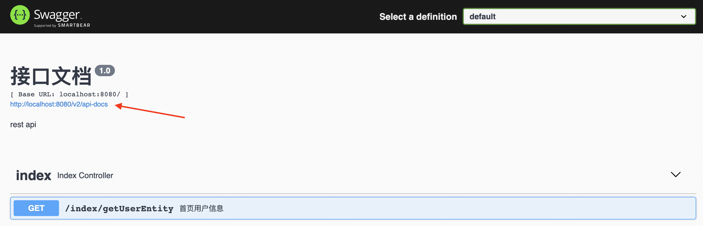
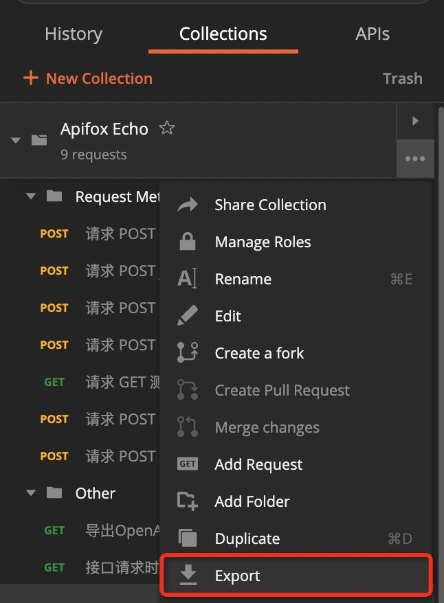

# 导入数据

<iframe src="//player.bilibili.com/player.html?aid=382352735&bvid=BV13Z4y1674b&cid=550813434&page=1&high_quality=1&danmaku=0" scrolling="no" border="0" frameborder="no" framespacing="0" width="100%" height="550" allowfullscreen="true"> </iframe>

## 功能说明

支持导入 `OpenApi (原Swagger)`、`Postman`、`HAR`、`RAML`、`RAP2`、`JMeter`、`YApi`、`Eolinker`、`NEI`、`DOClever`、`ApiPost` 、`Apizza` 、`DOCWAY`、`ShowDoc`、`apiDoc`、`I/O Docs`、`WADL`、`Google Discovery`等数据格式，方便旧项目迁移。

## 快速上手

### 手动导入

打开 `项目设置` 面板，点击 `手动导入` ，可选择文件导入或 URL 导入。

以导入 Apifox 格式为例，导入可选内容包括：`接口、数据模型、环境、测试用例、测试套件`

:::tip 注意
1. 导入 OpenAPI/Swagger 格式只包含 `接口、数据模型、环境`

2. 导入 Postman 格式只包含 `接口`

:::

### 手动导入-高级设置

####  匹配相同接口时

  

  - 覆盖所有字段：当两个接口的接口唯一标识相同时，新文件会覆盖旧文件

  - 不导入：当两个接口的接口唯一标识相同时，新文件不会导入

  - 保留两者：当两个接口的接口唯一标识相同时，新文件会导入，旧文件不会被删除

#### 匹配相同文档时

  - 覆盖：当两个文档名称相同时，新文件会覆盖旧文件

  - 不导入：当两个文档名称相同时，新文件不会导入

  - 保留两者：当两个文档名称相同时，新文件会导入，旧文件不会被删除

#### 导入到目录

 支持将文件导入到具体的目录中

 

#### 导入接口用例

  开启开关后，已选择接口下的`接口用例`默认全选，也可以在 `导入预览` 中选择对应 `接口用例`

  > 当导入非 Apifox 格式文件，且接口文档覆盖时，名称相同的 `接口用例` 不会导入，不同名称的 `接口用例` 会新增。  当导入 Apifox 格式文件，且接口文档覆盖时，名称相同的 `接口用例` 会覆盖，不同名称的 `接口用例` 会新增。

  

### 自动导入

打开`项目设置`面板，点击`自动导入`，可设置`多个数据源`，定时同步到`具体分组`中

:::tip 注意

只有角色为管理员，且打开客户端的时候，才会按照设置的导入频率 `自动导入` 。

其他角色不会触发`自动导入` 。

:::

## 导入不同的数据源

### 一、导入 OpenAPI (Swagger) 数据

支持导入 `OpenAPI 3`、`Swagger 1、2、3`数据格式的`json`或`yaml`文件。

:::tip 注意

需要`URL`导入的时候，需要填写的是`json`或`yaml`数据文件的 URL，而不是`Swagger UI`的 URL。

:::

### 二、导入 Postman 数据

支持 `Postman Collection v2.1` 格式。

数据导出方法：找到 Postman 左侧列表 Collections，鼠标移到需要导出的集合，点击`···`，选择`Export`然后选择`Collection v2.1 (recommended)`即可导出，如下图所示：

### 三、导入 ShowDoc 格式数据
数据导出方法：点击 ShowDoc 文档右侧的展开按钮，找到导出按钮，点击后选择 `markdown 压缩包` 导出。

将从 ShowDoc 导出的 `Markdown 压缩包` 解压，会看到一个文件名为`prefix_info.json`的 json 文件。

导入 Apifox 的时候，选择`ShowDoc`格式，然后导入前面解压得到的`prefix_info.json`文件即可。

### 四、导入 Eolink 数据

支持`Eolink 项目数据 (.json)`格式。

Eolink 数据导出方法：打开 Eolink 里对应项目，点击左侧菜单`项目管理`，展开后再点击`项目设置`，在右侧点击展开`导出项目`，展开后再点击`导出项目`按钮，选择`Eolinker 项目数据 (.json)`，然后导出，如下图所示：

注意：在 Eolink 中，只有`管理员`才能导出数据。当无法导出数据时，请检查项目权限。

### 五、导入 ApiPost 数据

支持 ApiPost `Markdown 格式`数据格式.

数据导出方法：Apipost 版本 ≥5.4.2，打开 ApiPost，点击左侧导航`项目`，选择对应项目，点击右侧`分享项目文档`，在浏览器打开分享链接，在打开的网页里，找到右上角`导出文档`，选择`导出MarkDown`，然后导出，如下图所示：

### 六、导入 DOCWAY 数据

支持 DOCWAY `复制分享地址`的方式导入数据。

使用方法：打开 DOCWAY，进入对应项目，鼠标移到左上角`更多功能`点击`分享项目`（注意仅`项目创建者`有权限分享项目），创建分享 (注意“阅读密码”必须设置为空)，然后`复制分享地址`将地址黏贴到下面输入框。如下图所示：

### 七、导入 NEI 数据

支持 NEI json 格式数据导入。

NEI 导出数据方法：[https://github.com/NEIAPI/nei/issues/27](https://github.com/NEIAPI/nei/issues/27)

### 八、导入 apiDoc 数据

支持 api_data.json 或 api_data.js 的文件，详情可以看 [https://apidocjs.com](https://apidocjs.com)

导出方法：
1. 本地安装 node 环境，使用 `0.29.0` 版本的 `apidoc`，进入源代码文件所在目录，运行 `npx apidoc@0.29.0 -i src -o dist`。
2. `src` 是接口的源代码文件，`dist` 是apidoc命令编译后生成的文件，`dist` 下面的 `api_data.js` 和 `api_data.json` 就是导入 Apifox 用到的接口文件。

### 九、导入 Knife4j 数据

支持 Knife4j 的 URL 直接导入，如图

导入方法：
1. 先输入 URL 进行 `解析地址`
2. 在 `解析地址` 后选择需要的数据源（目前一次只能选择一个数据源）

