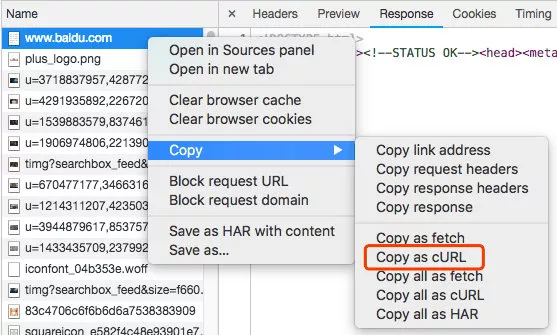
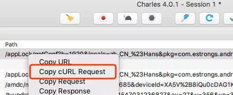
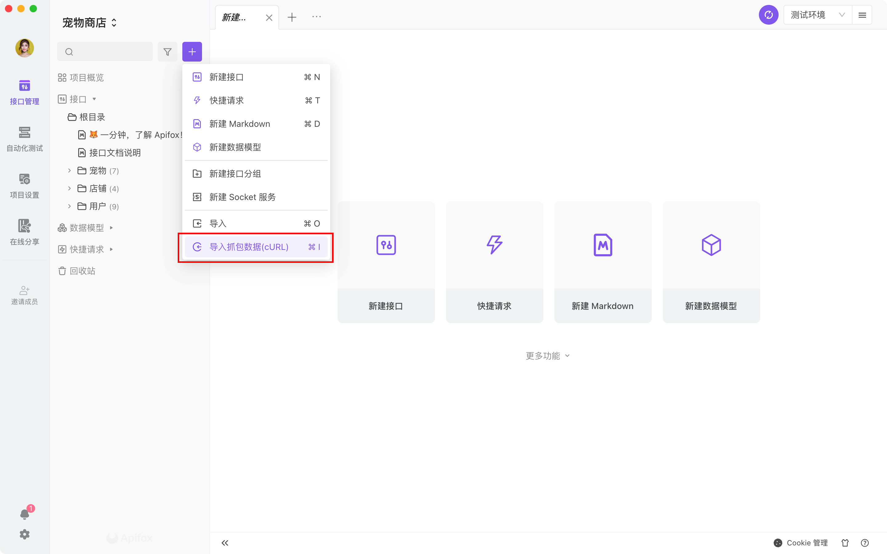
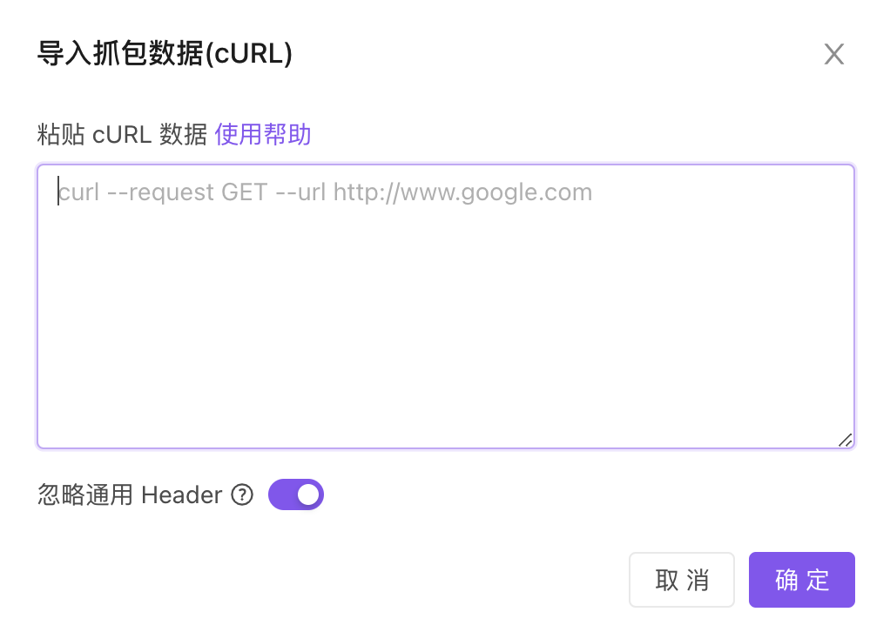
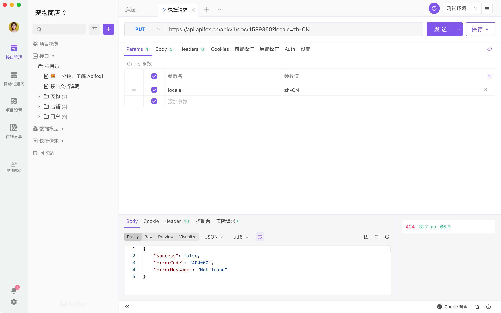

# 导入抓包数据 (cURL)

快速导入 Chome、Charles 或 Fiddler 等工具的抓包数据。

<iframe src="//player.bilibili.com/player.html?aid=595629502&bvid=BV1FB4y1U7W6&cid=576480398&page=1&high_quality=1&danmaku=0" scrolling="no" border="0" frameborder="no" framespacing="0" width="100%" height="550" allowfullscreen="true"> </iframe>

## 快速上手

1. 使用 Chrome、Charles 或 Fiddler 等工具抓包，然后复制为`cURL`格式。

   - Chrome 使用方式：打开 Chrome 开发中工具，抓包，找到对应接口请求，`单击右键`->`Copy`->`Copy as cURL`，如下图所示。

   

   - Charles 使用方式：抓包，找到对应接口，`单击右键`->`Copy cURL Request`，如下图所示。

   

   - Fiddler  使用方式：抓包，点击左上角菜单 `File`->`Export Sessions`->`Selected Sessions`，选项第一个默认 `cURL script`，点击`Next`即可保存为`.bat`文件，文件编辑工具打开该`.bat` ，复制内容即可。[查看详细使用说明](https://cloud.tencent.com/developer/article/1656688)

2. 鼠标移到左侧搜索框旁边的 `+` 号按钮，在下拉列表里点击`导入抓包数据`，也可使用 [快捷键](../../shortcuts/) Ctrl(⌘) + I。

   

3. 在打开的窗口中，粘贴从前面抓包数据里复制的 `cURL` 格式数据。

   

4. 点击`确定`按钮，即可看到抓包的数据已复制到如下[快捷调试](../api-manage/quick-debug/)界面。

   

5. 快捷调试窗口可以直接调试接口，点击`保存`按钮，可以保存为接口。