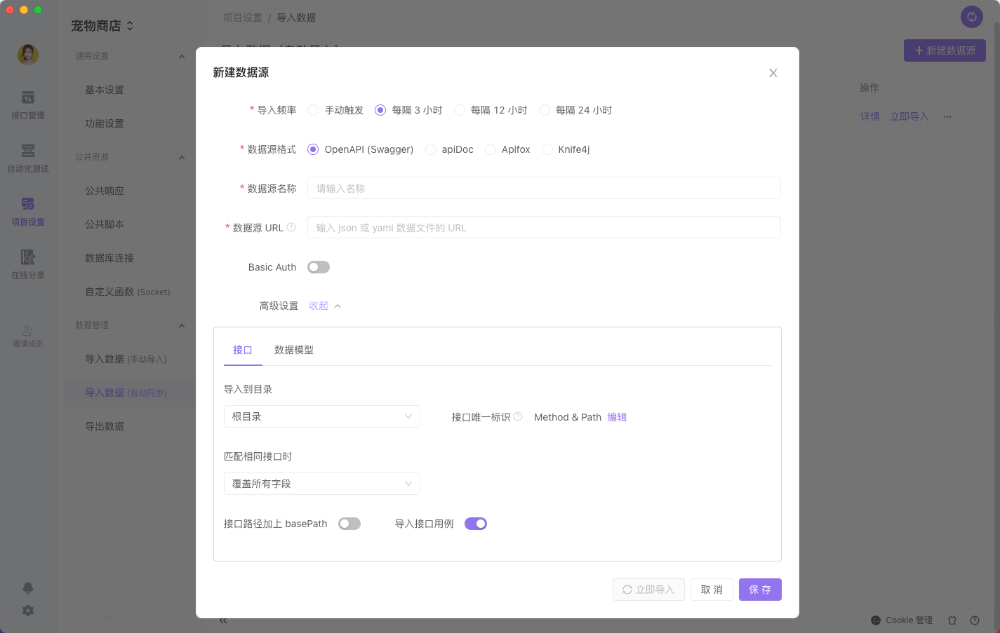

# 导入 OpenAPI (Swagger) 数据

支持导入 `OpenAPI 3`、`Swagger 1、2、3` 数据格式的 `json` 或 `yaml` 文件。

## 手动导入

打开 `项目设置` 面板，点击 `手动导入` ，可选择文件导入或 URL 导入。

### 手动导入-文件导入

可以将 `json` 或 `yaml` 文件拖拽到下图区域，也可以点击下图区域通过系统的文件管理器选择对应的 `json` 或 `yaml` 文件。

### 手动导入-URL 导入

:::tip 注意

需要 `URL` 导入的时候，需要填写的是 `json` 或 `yaml` 数据文件的 URL，而不是 `Swagger UI` 的 URL。

:::

### 导入-高级设置

导入 OpenAPI/Swagger 格式只包含 `接口、数据模型、环境` 。

1.  接口覆盖模式

    

    1. 同 URL 覆盖：当两个文件 URL、method 相同时，新文件会覆盖旧文件。

    2. 同 URL 且同分组才覆盖：当两个文件的 URL、method 相同时，并且在同一个分组下时，新文件会覆盖旧文件。

    3. 同 URL 不导入：当两个文件 URL、method 相同时，新文件不会导入。

    4. 同 URL 时保留两者：当两个文件 URL、method 相同时，新文件会导入，旧文件不会被删除。

2.  导入到分组：支持将文件导入到具体的分组中。

    

3.  导入接口用例：开启开关后，已选择接口下的 `接口用例` 默认全选，也可以在 `导入预览` 中选择对应 `接口用例` 。

    tip：当导入非 Apifox 格式文件，且接口文档覆盖时，名称相同的 `接口用例` 不会导入，不同名称的 `接口用例` 会新增。

    

4.  数据模型需要独立设置 `选择覆盖模式` 和 `导入到分组` 的，如图

    

5.  在 2.2.18 版本之后，新增 `同步更新所在目录` 功能。当你既需要将接口文档更新到 Apifox 中，又希望同步目录与 Swagger 内的文件夹保持同步，可以打开 `同步更新所在目录` 开关

    

## 自动导入

打开 `项目设置` 面板，点击 `自动导入` ，可设置 `多个数据源` ，定时同步到 `具体分组` 中。

:::tip 注意

只有角色为管理员，且打开客户端的时候，才会按照设置的导入频率 `自动导入` 。

其他角色不会触发`自动导入` 。

:::

:::tip 注意

需要 `URL` 导入的时候，需要填写的是 `json` 或 `yaml` 数据文件的 URL，而不是 `Swagger UI` 的 URL。

:::

