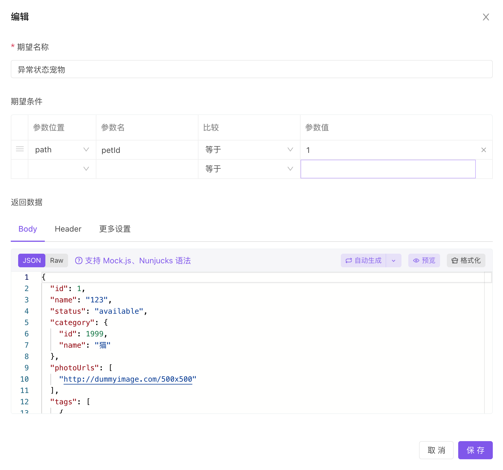
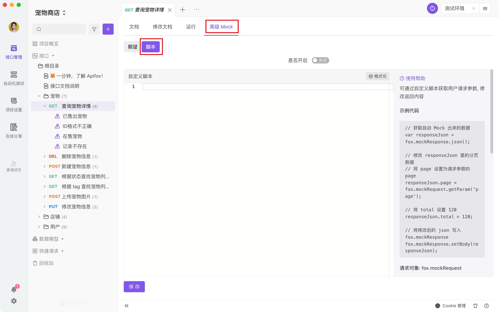

# 高级 Mock

设置位置：`接口详情`-`高级 Mock`

## Mock 优先级说明

请求 Mock 数据时，规则匹配优先级：高级 Mock 里的期望 > 自定义 Mock 脚本。

如果匹配到了`高级 Mock 里的期望`，则不调用`自定义 Mock 脚本`。

## Mock 期望


配置项说明：



1. `期望条件`：根据不同的请求参数，返回不同数据。如创建 2 个 `期望`：

   1. 请求参数`id`为`1`时，返回销售状态为`available`的数据。
   2. 请求参数`id`为`2`时，返回销售状态为`sold`的数据。

2. `期望条件`支持设置多个参数，多个参数`同时匹配`时才会匹配到该期望。

3. `期望条件`支持设置参数名和参数值之间的`比较`关系，包含：等于、小于、大于、存在、包含等

4. 若`期望条件`里的参数位置选择为`body`，则实际请求的 `body 请求类型`需要和该接口定义保持一致，如接口定义的 body 请求类型为`form-data`，则 mock 时该参数也需要放在`form-data`里。

5. `期望条件` ： json 类型的 body 支持使用`JSON Path` 匹配

   - 参数名以 \$ 字符起始的，使用 JSON Path 来匹配
   - 参数名不是以 \$ 字符起始的，直接匹配 JSON 第一级的属性名

6. `返回数据`：即接口请求返回的数据，支持 `mock.js` 、[Nunjucks](https://nunjucks.bootcss.com/templating.html#filter) 语法，即可按一定的规则返回`动态数据`。如下是使用动态模板语法的例子：

   ```json
   {
        "data": {
            "name": "高级 mock 返回的数据",
            "mockJs": [
                "@cname",
                "@integer(0,100)",
                "@image(80x90)"
            ],
            "nunjucks": [
             
             {
                 "id": "{{i}}",
                 "name": "@cname",
                 "friends": [
                     
                     "{{item}}",
                     
                ]
             },
             
            ]
        },
        "success": true
    }
   ```

   生成数据如下：

   ```json
   {
     "data": {
       "name": "高级 mock 返回的数据",
       "mockJs": ["汪敏", 98, "http://dummyimage.com/80x90"],
       "nunjucks": [
         {
           "id": "0",
           "name": "梁强",
           "friends": ["apple", "banana", "cat", "dog"]
         },
         {
           "id": "1",
           "name": "武秀兰",
           "friends": ["apple", "banana", "cat", "dog"]
         },
         {
           "id": "2",
           "name": "胡磊",
           "friends": ["apple", "banana", "cat", "dog"]
         }
       ]
     },
     "success": true
   }
   ```

7. 支持自定义`返回 Header`、`返回 HTTP 状态码`、`返回延迟`。


## Mock 自定义脚本

自定义脚本方式可获取用户请求的参数，可修改返回内容。

注意：此处脚本仅用于 `高级mock` 的 `Mock 自定义脚本`，不能用于前后置脚本中。

### 使用方法

1. 首先开启此功能
2. 使用 JavaScript 脚本修改返回的 JSON 数据，如图



### 示例一

设置分页数据

```JavaScript
// 获取智能 Mock 功能自动 Mock 出来的数据
var responseJson = fox.mockResponse.json();

// 修改 responseJson 里的分页数据
// 将 page 设置为请求参数的 page
responseJson.page = parseInt(fox.mockRequest.getParam('page'));
// 将 total 设置 120
responseJson.total = 120;

// 将修改后的 json 写入 fox.mockResponse
fox.mockResponse.setBody(responseJson);
```

### 示例二

```JavaScript
var MockJs = require('mockjs');

// 获取“智能Mock”自动生成的 json
var responseJson = fox.mockResponse.json();

// 根据请求参数（包括 query、body、path）修改响应值
if(fox.mockRequest.getParam('id') === '123'){
  responseJson.data = null;
  responseJson.code = 400104;
  responseJson.errorMessage = '数据不存在';
  fox.mockResponse.setBody(responseJson);
  fox.mockResponse.setCode(404);
}

// 根据请求的 header 修改响应值
if(!fox.mockRequest.headers.get('token')){
  responseJson.data = null;
  responseJson.code = 400103;
  responseJson.errorMessage = '没有权限';
  fox.mockResponse.setBody(responseJson);
  fox.mockResponse.setCode(403);
}

// 根据请求的 cookie 修改响应值
if(fox.mockRequest.cookies.get('projectId') === '123'){
    var idList = [1,2,3,4,5,6,7,8];
    fox.mockResponse.setBody({
        code: 0,
        data: idList.map(function(id){
            return {
                id: id,
                name: MockJs.mock('@cname'),
                email: MockJs.mock('@email'),
                city: MockJs.mock('@city'),
            }
        })
    });
}

// 设置返回延迟
fox.mockResponse.setDelay(500);

// 添加 header
fox.mockResponse.headers.add({
    key: 'X-Token',
    value: '<token>',
});

// 添加或修改 header
fox.mockResponse.headers.upsert({
    key: 'X-Token',
    value: '<token>',
});
```

### 请求：fox.mockRequest

- `fox.mockRequest.headers` 请求的 HTTP 头
- `fox.mockRequest.cookies` 请求带的 Cookies
- `fox.mockRequest.getParam(key: string)` 获取请求参数，包括 Path 参数、Body 参数、Query 参数。

### 响应：fox.mockResponse

- `fox.mockResponse.headers` 响应的 HTTP 头
- `fox.mockResponse.code` 系统自动生成的的 HTTP 状态码
- `fox.mockResponse.json()` 系统自动生成的 JSON 格式响应数据
- `fox.mockResponse.setBody(body: any)` 设置接口返回 Body，参数支持 JSON 或字符串
- `fox.mockResponse.setCode(code: number)` 设置接口返回的 HTTP 状态码
- `fox.mockResponse.setDelay(duration: number)` 设置 Mock 响应延时，单位为`毫秒`

## 使用技巧

关于如何深刻理解 `高级 mock` 的使用方法，可以看下列文章和视频

[Mock 功能全解析](../../../articles/apifox-mock/)

<iframe src="//player.bilibili.com/player.html?aid=382574576&bvid=BV1BZ4y1B7tD&cid=558386197&page=1&high_quality=1&danmaku=0 " scrolling="no" border="0" frameborder="no" framespacing="0" width="100%" height="550" allowfullscreen="true"> </iframe>
