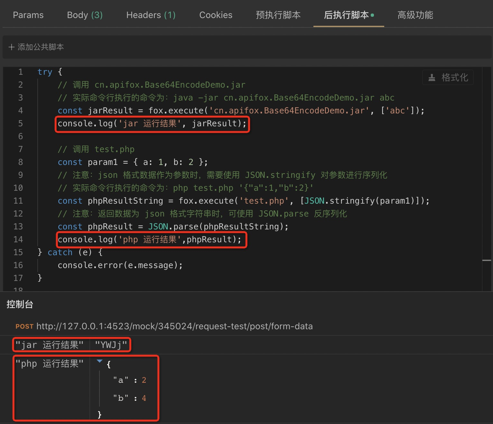

# 脚本调用其他语言（ java、python、php 等）

前置脚本和后置脚本，可以直接调用以下语言编写的外部程序：

- `java` (.jar)
- `python` (.py)
- `php ` (.php)
- `js` (.js)
- `BeanShell ` (.bsh)
- `go ` (.go)
- `shell ` (.sh)
- `ruby` (.rb)
- `lua` (.lua)

::: tip 注意

1. 仅版本号 `>= 1.0.25` 的 Apifox 版本支持脚本调用外部程序。
2. 外部程序是在`沙盒环境以外`运行的，有权限访问和操作电脑上的其他程序、文件及数据，存在一定的安全性风险，使用者请务必自己确保被调用程序的安全性。

:::

## 使用方法

1. 将需要调用的外部程序（ `.jar` 、`.py`、`.php`等文件 ）复制到`外部程序目录`下。点击软件左下角 `⚙` 形状的 icon ，选择`外部程序`，即可查看`外部程序目录`。
2. 脚本中使用方法`pm.execute(fileName, args)`调用外部程序。
   1. 参数 **fileName**：`String`，外部程序文件名，需存放在`外部程序目录`下。
   2. 参数 **args**：`Array<String>`，传给外部程序的运行参数，为字符串数组类型，可以传递多个参数。
   3. 参数 **options**：`JarOptions & CommonOptions`（见下文）（版本号 >= v2.1.x 支持该参数），传递给 `pm.execute` 的可选参数，用于配置某些特性，比如“调用 jar 包中的指定的方法”。
   4. 返回值：`String`，命令行运行程序时，在控制台输出的字符串。
   5. 发生错误时会抛出异常，建议使用`try catch`处理异常。

   `CommonOptions` 类型：
   ```ts
   interface CommonOptions {
      windowsEncoding?: string   // windows 系统用使用的编码格式，默认为 "cp936"
   }
   ```

   `JarOptions` 类型：
   调用 java 程序指定 jar 包中特定类的特定方法时使用。
   ```ts
   interface JarOptions {
     className: string;      // 指定 jar 包中调用的类名，例如 "cn.apifox.Utils"
     method: string;         // 指定 jar 包中调用的方法名，例如 "add"
    paramTypes?: string[];  // 指定 jar 包中调用的方法参数类型，例如 ["int", "int"]
   }
   ```

   **类型说明：**
   1.  `paramTypes` 为选填字段，如果为空，则默认通过 `args` 参数推断类型， 整数推断为 `"int"`，浮点数推断为 `"double"`，布尔值推断为 `"boolean"`，字符串推断为 `"String"`， 数组则根据第一个元素的类型来推断，例如 `[3]` 推断为 `"int[]"`，`[3.14]` 推断为 `"double[]"`，依此类推。
   2.  如果自动推断的类型，不符合被调用方法的参数类型，则需要手动指定 `paramTypes` 的值。
   3.  `paramTypes` 数组支持的元素值有： `"Number"`、 `"int"`、 `"Integer"`、 `"long"`、 `"Long"`、 `"short"`、 `"Short"`、 `"float"`、 `"Float"`、 `"double"`、 `"Double"`、 `"boolean"`、 `"Boolean"`、 `"String"`、 `"Number[]"`、 `"int[]"`、 `"Integer[]"`、 `"long[]"`、 `"Long[]"`、 `"short[]"`、 `"Short[]"`、 `"float[]"`、 `"Float[]"`、 `"double[]"`、 `"Double[]"`、 `"boolean[]"`、 `"Boolean[]"`、 `"String[]"`


3. 确保电脑已经安装相应程序运行需要的环境。
   1. `.jar`程序：需要 [安装 java 环境](../../../../reference/install-java/)。
   2. `.py`程序：需要安装 python 环境。
   3. `.js`程序：需要安装 nodejs 环境。
   4. 其他语言程序：需要安装对应语言的环境。

## 调用原理

1. 调用外部程序是以命令行的方式运行程序，返回值为程序在控制台输出的字符串。
2. 系统会自动根据外部程序的后缀名，调用对应的命令行来运行外部程序。
   1. `.jar`程序：通过`java`命令运行。
      - 如：脚本`pm.execute('cn.apifox.Base64EncodeDemo.jar', ['abc','bcd'])`，实际执行命令为`java -jar cn.apifox.Base64EncodeDemo.jar abc bcd`。
   2. `.py`程序：通过`python`命令运行。
      - 如：脚本`pm.execute('md5-json.py', ['abc','bcd'])`，实际执行命令为`python md5-json.py abc bcd`。
   3. `.js`程序：通过`node`命令运行。
      - 如：脚本`pm.execute('xxx.js', ['abc','bcd'])`，实际执行命令为`node xxx.js abc bcd`。
   4. 其他语言程序也是类似原理。

## 代码示例

后置脚本：

```js
try {
  // jar 示例，调用 cn.apifox.Base64EncodeDemo.jar
  // 实际命令行执行的命令为：java -jar cn.apifox.Base64EncodeDemo.jar abc
  const jarResult = pm.execute("cn.apifox.Base64EncodeDemo.jar", ["abc"]);
  console.log("jar 运行结果", jarResult);

  // php 示例，调用 test.php
  const param1 = { a: 1, b: 2 };
  // 注意：json 格式数据作为参数时，需要使用 JSON.stringify 对参数进行序列化
  // 实际命令行执行的命令为：php test.php '{"a":1,"b":2}'
  const phpResultString = pm.execute("test.php", [JSON.stringify(param1)]);
  // 注意：返回数据为 json 格式字符串时，可使用 JSON.parse 反序列化
  const phpResult = JSON.parse(phpResultString);
  console.log("php 运行结果", phpResult);
} catch (e) {
  console.error(e.message);
}
```

test.php 代码：

```php
<?php
$param = json_decode($argv[1]);

$result = [];

foreach($param as $key=>$value)
{
    $result[$key] = $value * 2;
}

echo json_encode($result);
```

### 调用 jar 包中的指定方法

该特性 2.1.39-alpha.1 之后的版本才支持，请升级到最新版本

cn.apifox.utils.jar 包中代码：

```java
package cn.apifox.utils;

public class Utils {
    public Integer add(Integer a, Integer b) {
        return a + b;
    }
};
```

脚本代码：

```js
try {
  // 调用 cn.apifox.Utils.jar 中的 cn.apifox.utils.Utils.add(Integer, Integer) 方法
  const jarResult = pm.execute('cn.apifox.utils.jar', [3, 5], {
    className: 'cn.apifox.utils.Utils',
    method: 'add',
    paramTypes: ['Integer', 'Integer'],
  })
  console.log(jarResult);  // 执行结果为："8"
} catch (e) {
  console.error(e.message);
}
```


运行结果：



## 常见问题

#### 1. 引用外部程序输出结果时不同系统返回的字符串可能带有不同换行符号

- 可以对要输出的结果进行去除空格与换行符处理

#### 2. 部分系统引用外部脚本，打印中文乱码

- 可以添加以下参数

```js
var result = pm.execute(`hello.go`, [], {windowsEncoding: 'utf-8'})
```