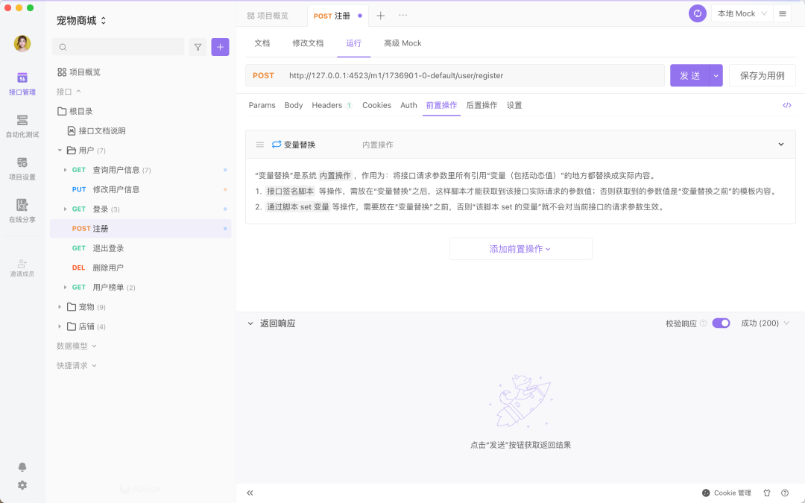
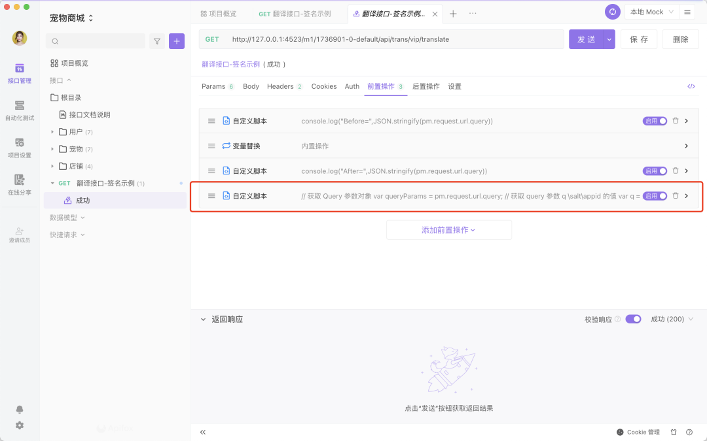
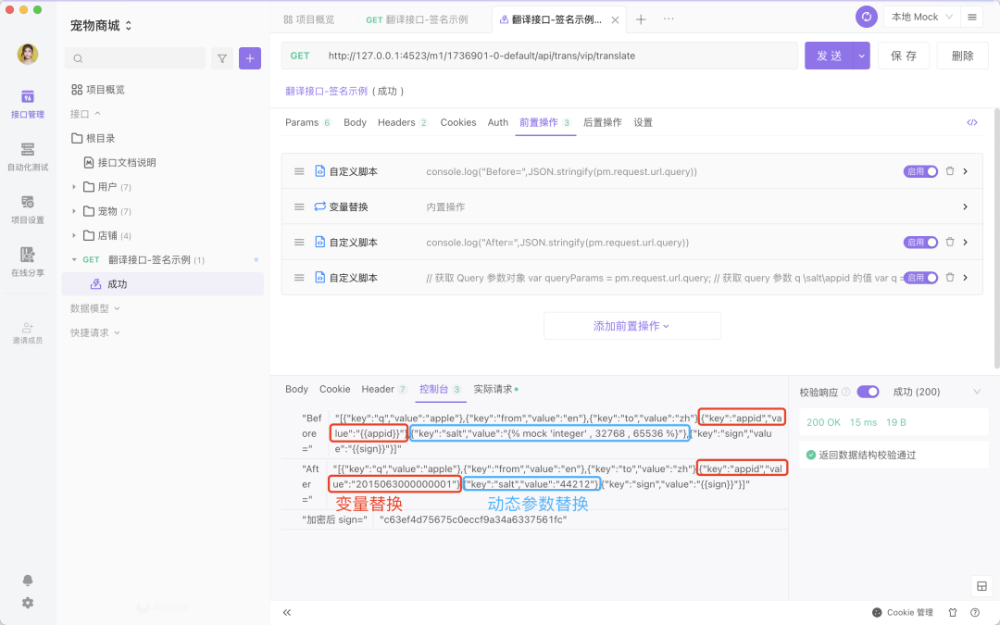

# 自定义脚本支持设置执行时机

我们在请求接口的时候经常需要使用变量作为请求参数值。但是，有些接口需要把整个数据做签名，就得在真实值被组装进请求之后才执行签名脚本。以往，我们的自定义脚本就没办法做到这一点。

在 2.1.39 版本之后，签名脚本可以在请求组装完成之后才生效！这个问题就迎刃而解了。

首先，系统会在所有接口的前置操作中内置一条“变量替换”的操作。

接着，我可以添加接口签名脚本等操作，并且放在“变量替换”之后，这样脚本才能获取到该接口实际请求的参数值；否则获取到的参数值是“变量替换”之前的。

最后，运行接口后，在控制台即可看到接口请求参数里所有引用“变量（包括动态值等）”的地方都替换成实际内容了。

需要注意：通过脚本 set 变量等操作，需要放在“变量替换”之前，否则“该脚本 set 的变量”就不会对当前接口的请求参数生效。