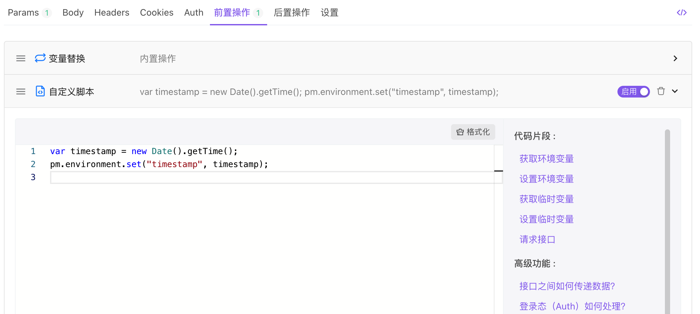
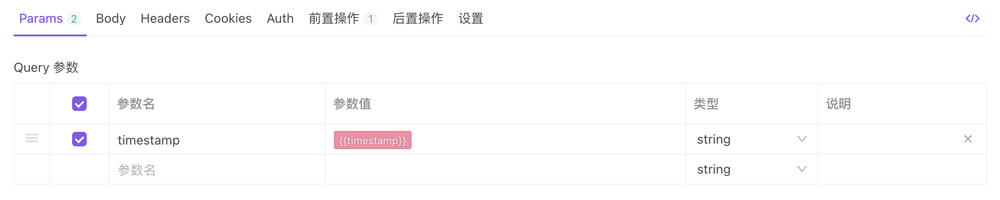

# 前置脚本

前置脚本是在`请求发送前`执行的代码片段。如要在请求头中包含时间戳或在 URL 参数中发送随机的字母数字字符串等类似请求中非常适用。

## 使用示例

::: v-pre

要在请求头中包含当前时间戳，可以使用从函数返回的值来设置环境变量。

将参数 **timestamp** 的值设置为 `{{timestamp}}` 。当请求发送时，前置脚本将被执行，环境变量 **timestamp** 的值会被设置为`当前时间戳`，同时 `{{timestamp}}`也会被替换为`当前时间戳`。

:::

**注意:** 要设置环境变量，该环境必须处于选中状态。

前置脚本使用 JavaScript 编写，语法与[后置脚本](../after-request-script/) 完全相同，但不存在`pm.response`对象。

## 更多示例

1. [使用变量（环境变量、全局变量、临时变量）示例](../examples/variables/)
2. [读取/修改接口请求信息](../examples/request-handle/)
3. [脚本内发送接口请求](../examples/other/#发送接口请求)
4. [加密/解密](../examples/other/#加密-解密)
