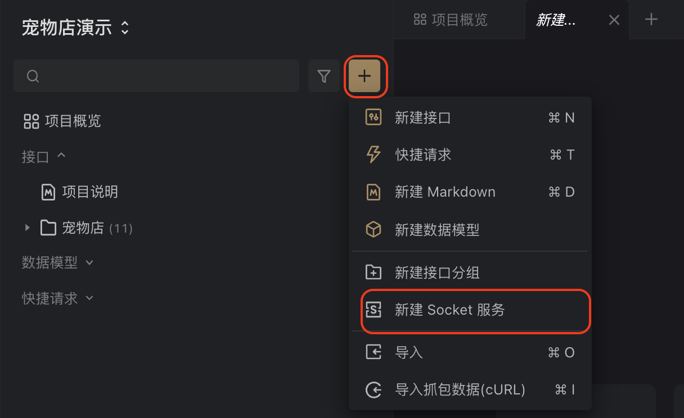
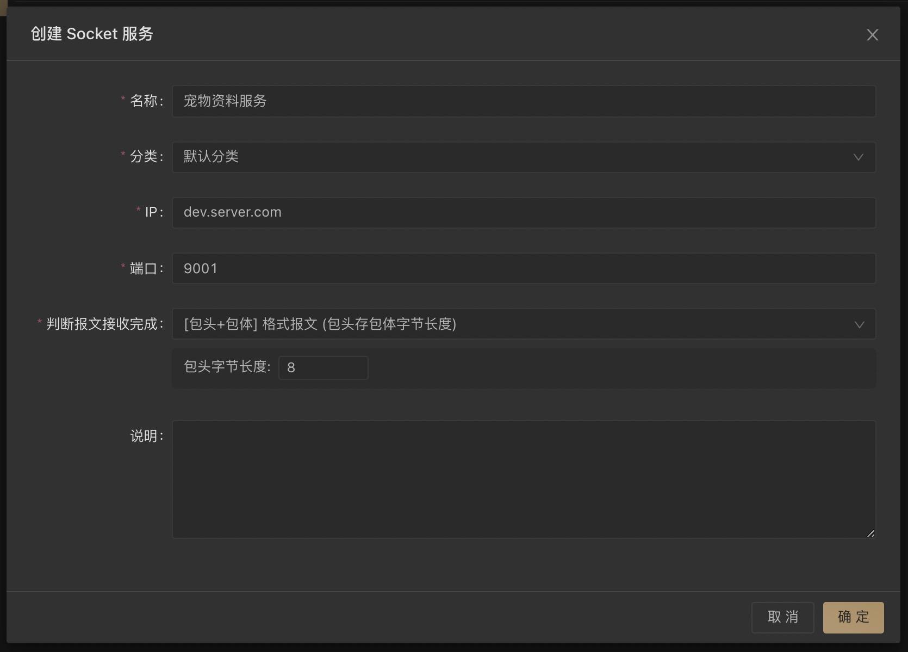
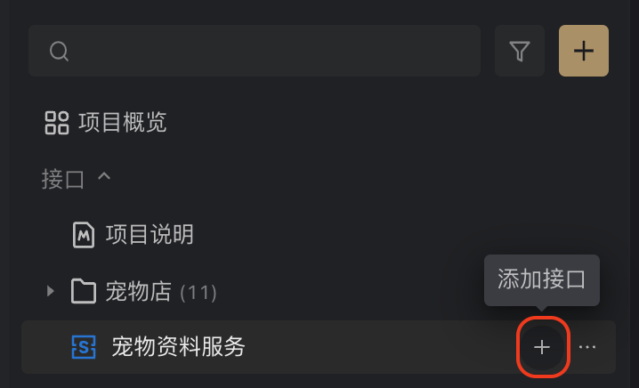
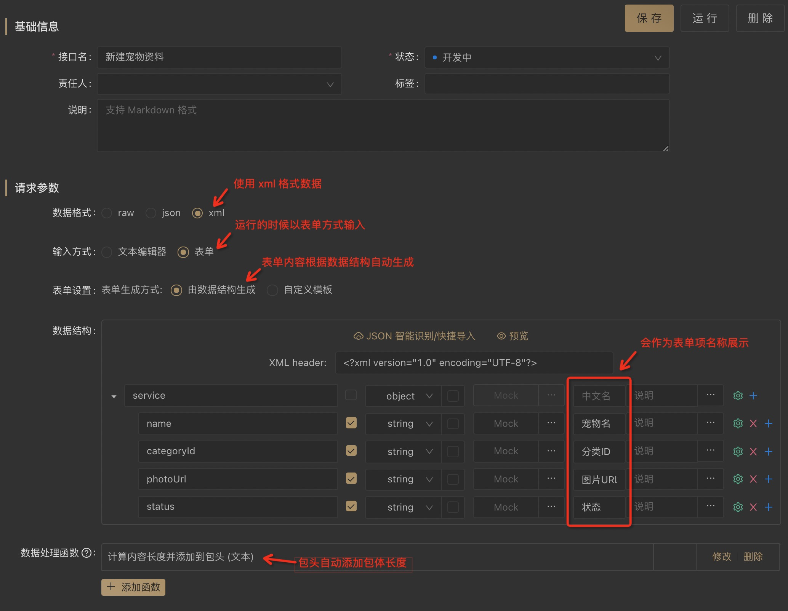
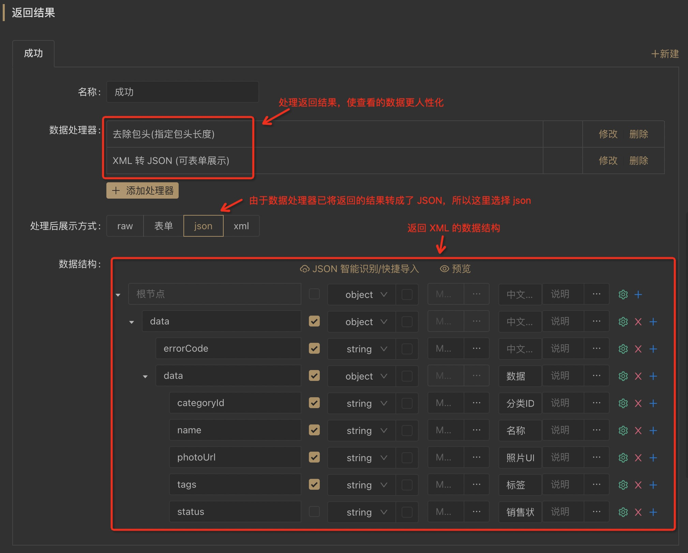
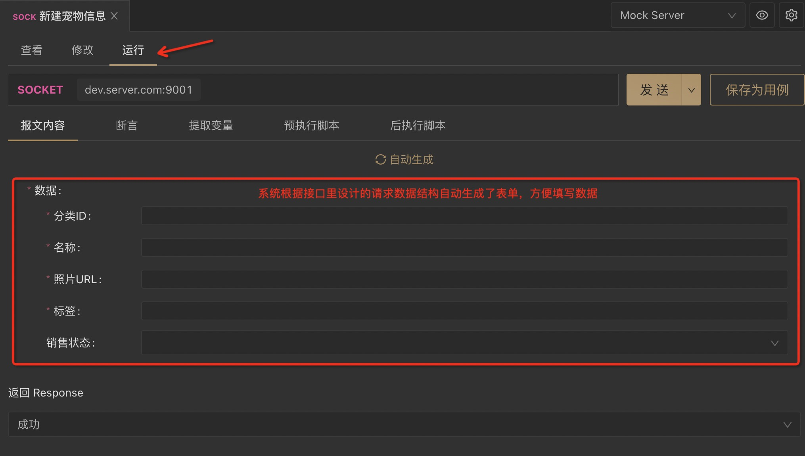
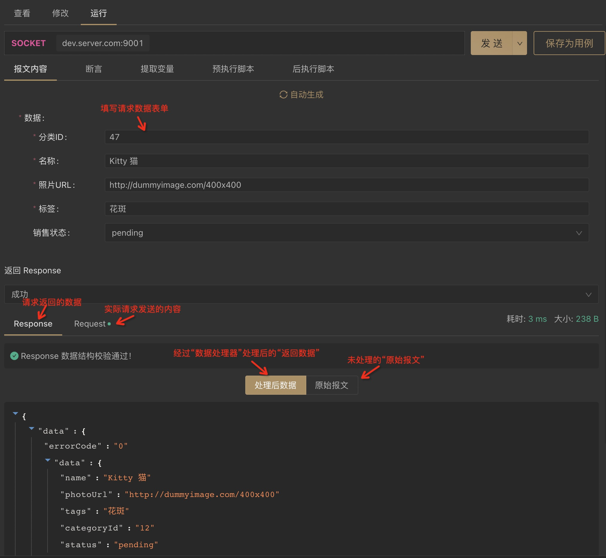
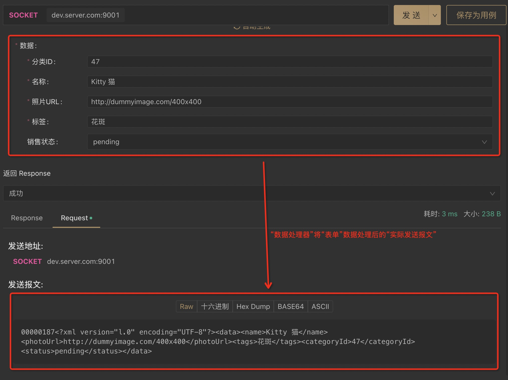
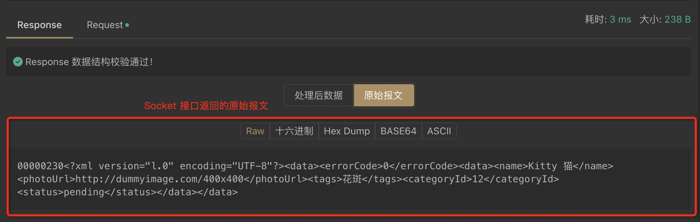

# Socket 接口快速上手

:::tip 注意

- Apifox 版本号大于等于 `1.1.0` 才支持`Socket`接口管理。

:::

## 示例场景

假设我们有一个`宠物商店`的项目，其中有一个 Socket 服务`宠物资料服务`，服务器的地址为:`dev.server.com`，端口为：`9001`。

该服务提供`4`个接口：

1. 新建宠物资料
2. 修改宠物资料
3. 查询宠物资料
4. 删除宠物资料

我们以`新建宠物资料`接口作为示例讲解。

### 【新建宠物资料】接口说明

#### 请求报文

报文示例：

```
00000187<?xml version="l.0" encoding="UTF-8"?><data><name>Kitty 猫</name><photoUrl>http://dummyimage.com/400x400</photoUrl><tags>花斑</tags><categoryId>12</categoryId><status>pending</status></data>
```

报文说明：

1. 前`8`位`0000187`为包头，存储包体的字节长度。
2. 剩余部分为包体，为`XML`格式。
   1. XML 中`<data>`节点存储需要新建的宠物资料数据。


#### 返回报文

报文示例：

```
00000230<?xml version="l.0" encoding="UTF-8"?><data><errorCode>0</errorCode><data><name>Kitty 猫</name><photoUrl>http://dummyimage.com/400x400</photoUrl><tags>花斑</tags><categoryId>12</categoryId><status>pending</status></data></data>
```

报文说明：

1. 前`8`位`00000217`为包头，存储包体的字节长度。
2. 剩余部分为包体，为`XML`格式。
   1. XML 中`<errorCode>`节点表示状态码，`0`表示操作成功。
   2. XML 中`<data>`节点存储新建成功的宠物资料数据。


## Apifox 操作示例

### 一、创建服务

1. 切换到`SOCKET`，然后`新建 SOCKET 服务`：

   


2. 填写`宠物资料服务`相关信息：

   


### 二、创建接口

1. 在刚建的服务下添加接口：

   

2. 填写接口相关信息：

   

   使用数据处理器，实际发送请求前对输入的数据进行处理：

   1. 计算内容长度并添加到包头：用来计算 XML 字节长度并添加到包头。


查看 [数据处理器说明文档](../data-processor/)。

​

3. 设置返回结果：

   

   使用数据处理器，对接口返回的数据进行处理后再展示：

   1. 去除包头(指定包头长度)：去除返回数据里的包头（展示的时候不需要）。

   2. XML 转 JSON(可表单展示)：将返回包体里的 XML 转成 JSON 方便查看。

   查看 [数据处理器说明文档](../data-processor/)。

### 三、运行接口

1. 打开刚新建的接口，切换到“运行” tab，可以看到“报文内容”通过表单方式输入：

   

2. 填写需要新建的宠物信息，点击“发送”即可发送请求并查看返回结果：

   

3. 点击下方“Request” tab 即可查看实际发送的数据：

   

4. 点击“Response”下的“原始报文”，即可查看接口返回的“报文原始内容”

### 四、保存为用例
“运行”接口后，建议点击右上方“保存为用例”，方便下次直接使用。


## 更多 Socket 功能

其他`断言`、`提取变量`、`前置/后置脚本` 等功能的使用方法和 HTTP 接口是一致的，请参考相关文档。

