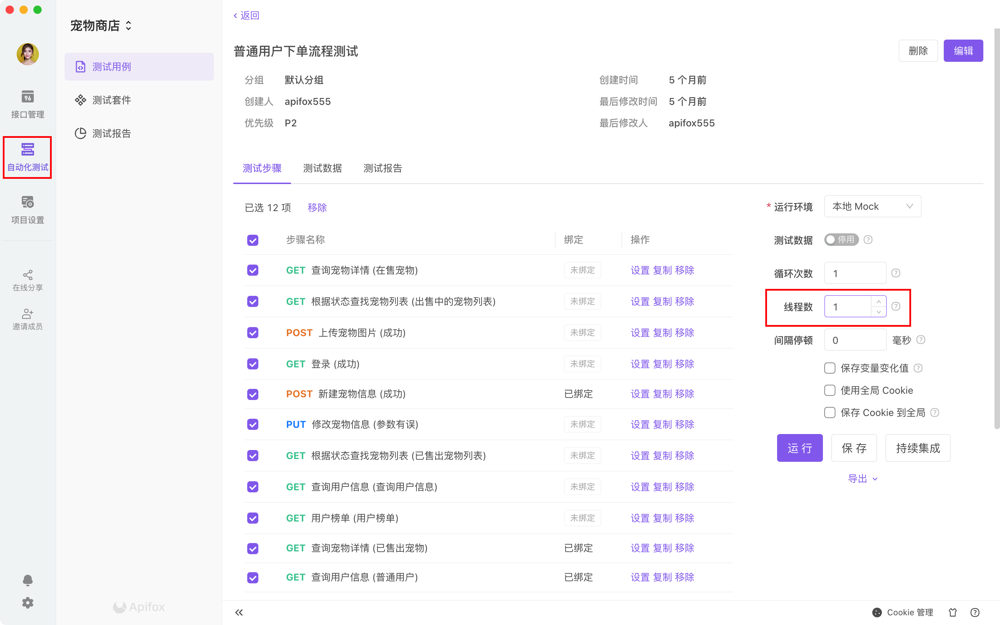

# 性能测试

性能测试有 3 种方式。

## 一、Apifox 应用内测试

运行`测试用例`的时候，设置`线程数`大于`1`即可实现性能测试。

`线程数`即同时【并发】运行的线程数，每个线程都会按顺序运行选中的所有步骤。

:::tip 注意

1. 该功能为 beta 阶段，还在优化中，高并发测试建议导出 JMeter 文件的方式来测试。

:::

## 二、Apifox CLI 方式测试

Apifox CLI 是 Apifox 的命令行运行工具，主要用来做持续集成和压力测试，其压力测试功能目前正在开发中，敬请期待！

## 三、导出 JMeter 测试

`测试用例`和`测试套件`可以导出`JMeter`格式数据，然后可以导入 JMeter 做性能测试。
