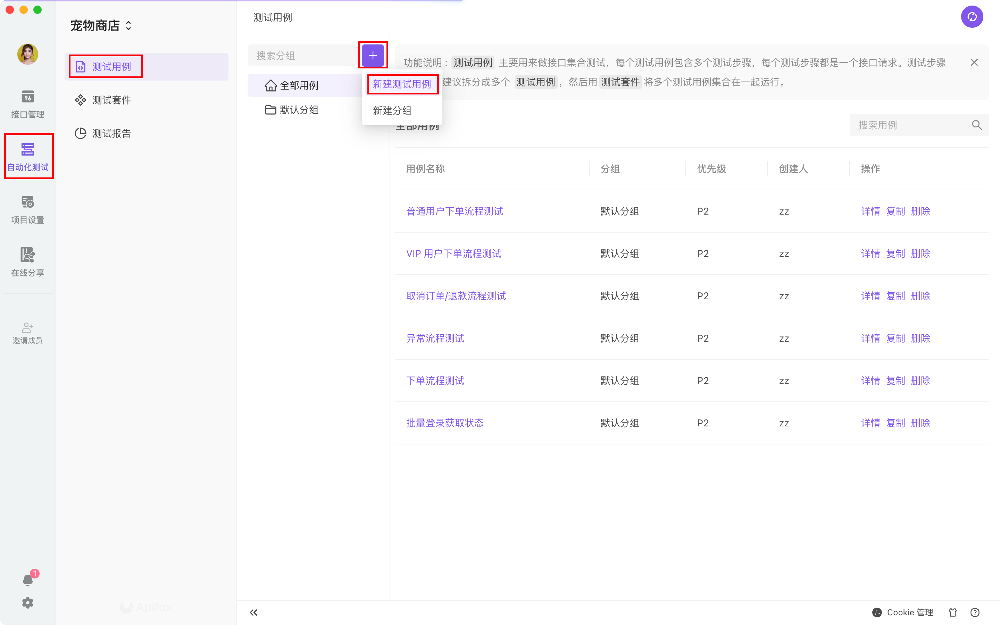
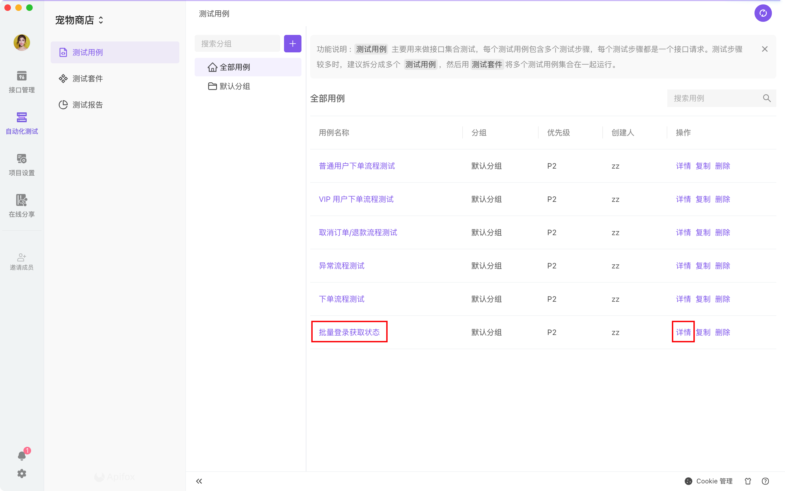
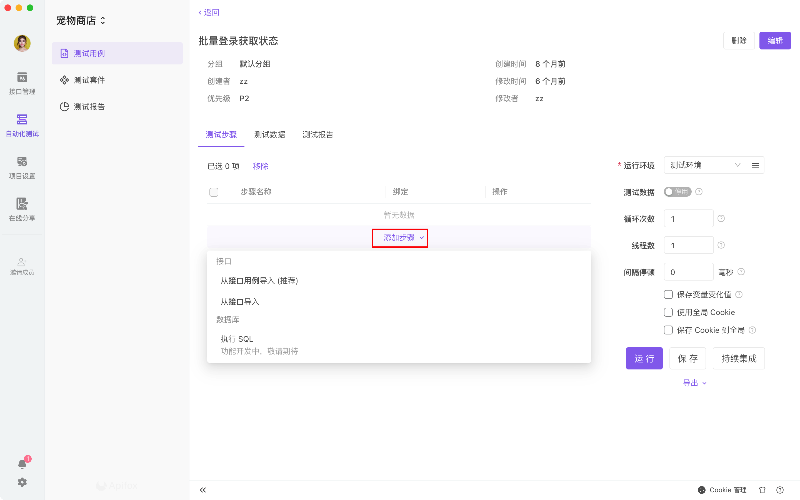
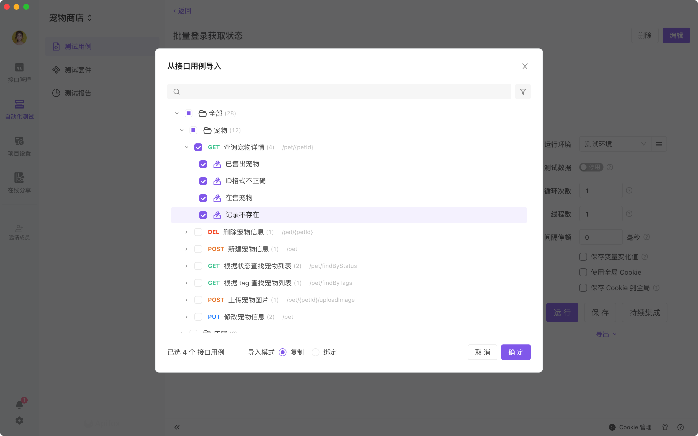
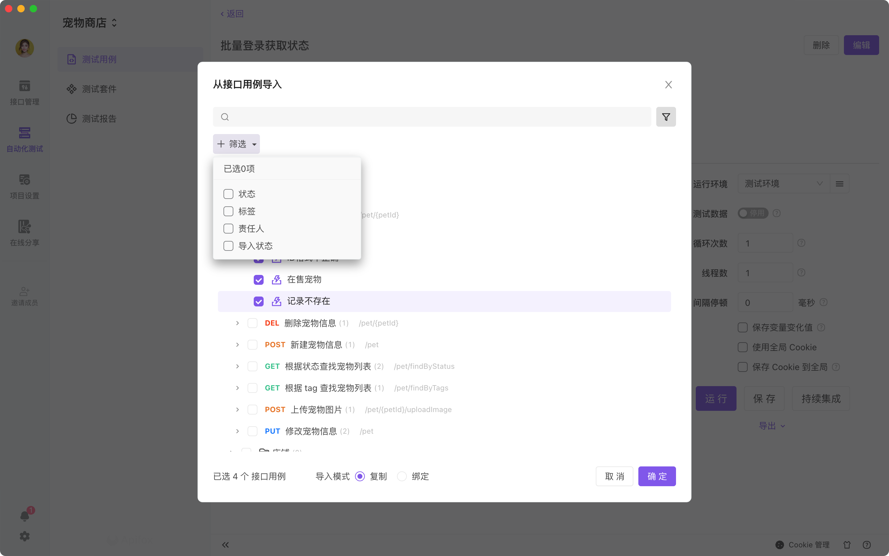
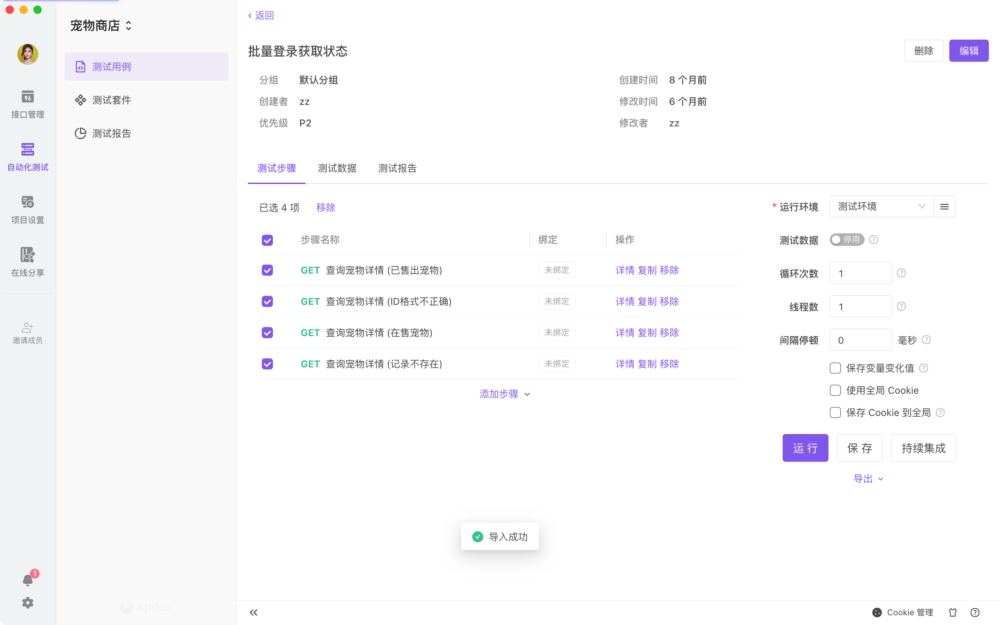
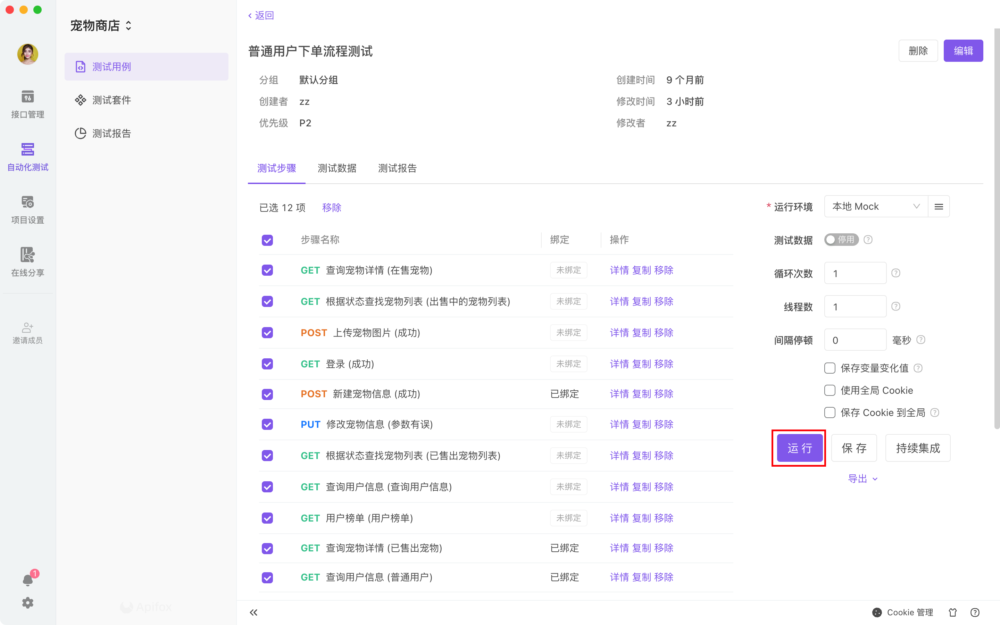
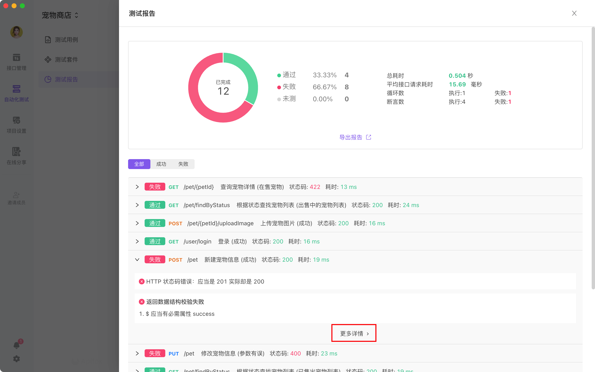
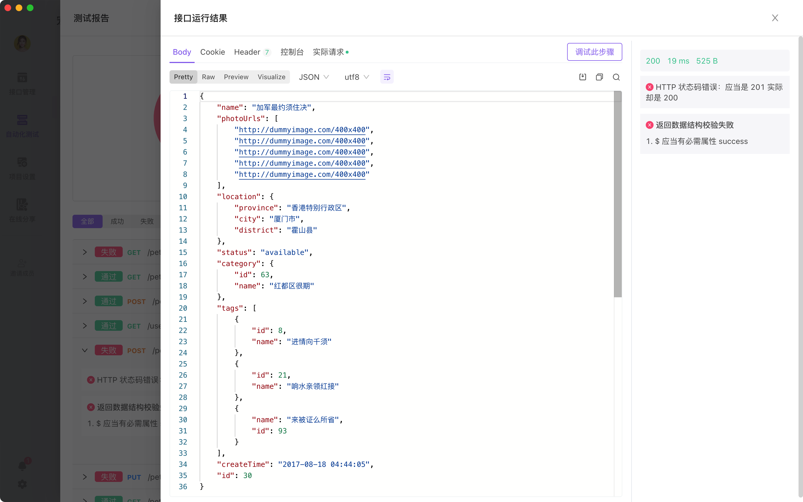
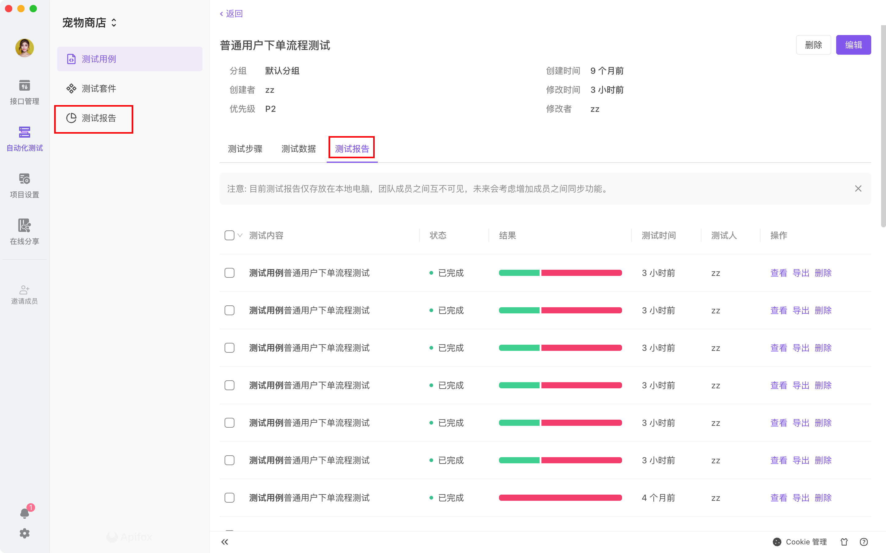

# 测试用例

`测试用例`是将多个`接口`有序地组合在一起运行，用来测试一个完整业务流程。

## 新建测试用例

路径：自动化测试-测试用例

点击`新建测试用例`，根据需要新建一个`测试用例`。




## 添加测试步骤

选中某个`测试用例`，进入编辑页面。




在测试用例的编辑页面，把鼠标移动到`添加步骤`上，会展示菜单。



添加用例有两种方式：`从接口导入`和`从接口用例导入 (推荐)`

- 从【接口】导入：根据接口参数自动生成一个用例，其参数值为空，需要手动填写。
- 从【接口用例】导入：有两种模式`复制`和`绑定`。将接口用例以`复制`的方式导入，接口用例里的参数也会一同复制过来，和原来用例数据相互独立，各自改动后互不影响。将接口用例以`绑定`的方式导入，会直接引用原来的用例，两边的改动都会相互实时同步。

::: tip 注意

- `从接口导入`后，需要手动设置接口参数，否则运行的时候，接口参数是空的。
- `从接口用例导入`后，会同步导入接口用例里的参数，会方便很多。

:::

`从接口用例导入`例图




`从接口导入`例图




导入成功后，一定要记得点击`保存`哦。



::: tip 注意

- 导入的 `接口` 或 `接口用例` 在测试用例中作为一个 `测试步骤` 。`测试步骤` 是引用了 `接口` 或 `接口用例`，
- 复制 `测试步骤`，是复制一个已经设置了绑定模式的 `测试步骤`

:::

## 运行测试用例

点击`运行`，则进入`自动化测试`。




## 测试报告

`运行`完成后，如图所示，可以看到哪些接口没有通过测试，可以点击对应的接口展开详情；点击`更多详情`，可以查看该接口的运行结果，方便定位问题。






运行结束后可以从下面两个入口，查看之前的`测试报告`，也可以导出。




## 测试数据

点击这里查看[《测试数据使用文档》](../test-data/)。

## 常见问题

::: v-pre

### B 接口请求参数依赖于 A 接口返回的数据，如何实现？

使用`后置脚本`和`变量`（普通变量、环境变量或全局变量）。

1. A 接口的用例里编写`后置脚本`，将接口请求返回的数据写入`变量`，示例：

   ```javascript
   // 获取 JSON 格式的请求返回数据
   var jsonData = pm.response.json();

   // 将 jsonData.token 的值写入变量
   pm.variables.set("token", jsonData.token);
   ```

2. B 接口对应的参数值，设置为对应的变量，如`{{token}}`，即可直接引用前面设置的变量`token`的值。
