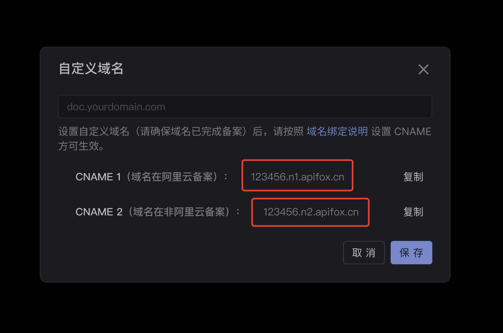
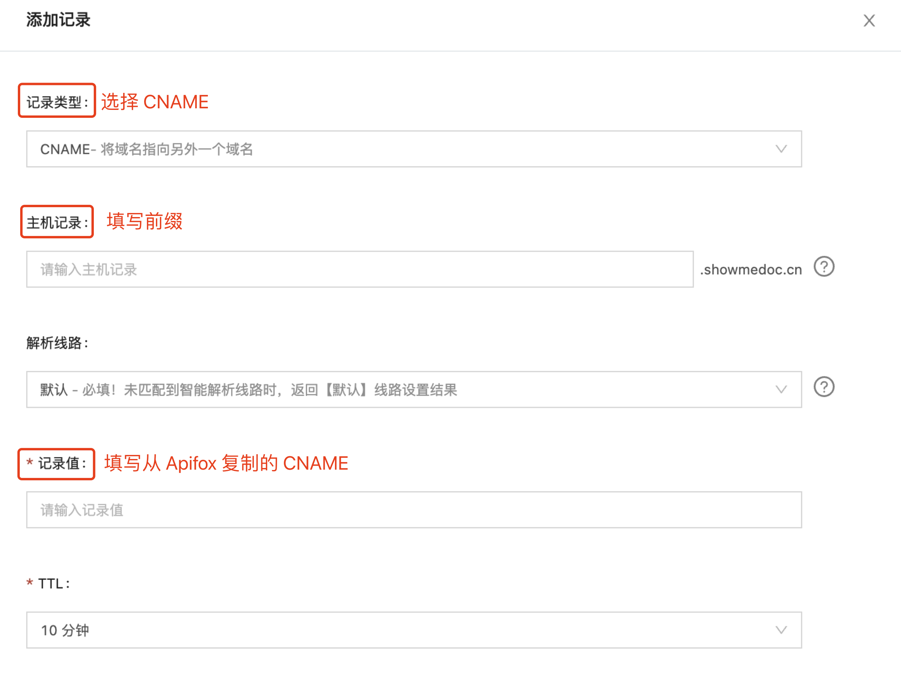

# 自定义域名绑定说明

## CNAME 方式
CNAME 即指别名记录，也被称为规范名字。一般用来把域名解析到别的域名上，当需要将域名指向另一个域名，再由另一个域名提供 ip 地址，就需要添加 CNAME 记录。

目前，公开文档使用 `xxxxxx.apifox.cn` 格式的URL，如果你需要使用特定的域名，比如：www.abc.com 。那么，你需要了解并使用 `自定义域名` 功能，并通过以下方式，进行 CNAME 配置：

::: tip 注意

请确保所使用域名已完成备案

:::

### 一. 获取 CNAME 值
在 **自定义域名** 界面，找到对应 CNAME 值，点击复制即可 ，如下图所示。




### 二. 添加CNAME记录
添加 CNAME 记录需要在您的 `域名厂商` 处配置，比如您在 阿里云 / 腾讯云 / 新网 等处购买的域名，您需要前往 `购买域名的厂商` 相应管理控制台，添加域名解析。

1.  打开您购买域名的厂商官网，登陆后在页面右上角找到 **`控制台`** 或 相关管理后台入口。如果您不清楚域名解析的入口，建议查看您域名厂商的产品文档，或者寻求域名厂商的售后支持。
    
2.  在域名厂商的控制台中，找到您的域名解析添加页面，例如：

    a. 阿里云：在控制台页面的左侧，产品与服务栏中选择 **域名**。
    
    b. 腾讯云：在控制台的云产品中，搜索并选择 **云解析**。
    
    c. DNSPOD：在控制台页面左侧，选择 **域名**。其他域名厂商请参考产品文档说明或咨询产品售后。
    
3.  在域名产品的列表中找到您加速域名对应的`主域名`，点击域名后面的 `解析设置` 或 `解析`，进入解析设置页。
    
4.  选择 `添加记录` ，依次填写 **主机记录**，**记录类型** 以及 **记录值**，其他可设为默认值。
    
    


|参数说明|填写说明| 注意事项|
| ------------ | ---------------------------------------------------------| -------------------------- |
| 主机记录     | 一般是指子域名的前缀（如需创建子域名为www.apifox-doc.com, 主机记录输入 **www**；如需实现apifox-doc.com，主机记录输入 **@** | 该参数唯一，请勿自定义     |
| 记录类型     | 选择 CNAME 类型| 该参数唯一，请勿自定义     |
| 线路类型     | 保持默认 | 该参数可以根据需求自行调整 |
| 记录值       | 从Apifox复制过来的CNAME | 该参数唯一，请勿自定义     |
| TTL          | 保持默认  | 该参数可以根据需求自行调整 |


# 自定义域名一直显示未生效怎么办？

- 首先，配置 CNAME 一般需要 10 分钟左右才生效，请耐心等待
- 如果长时间 `未生效`，可能是以下原因导致：
  
    - CNAME配置不成功，请前往域名管理界面，确认CNAME是否正确配置
    - 域名尚未完成备案


## 自有服务器中转 方式
在版本 2.2.19 之后，如果您想使用自有服务器中转功能目前有两种方式。
- 方式一：使用 nginx 等 web 服务器做简单配置即可实现。即 `Web` 服务器代理
- 方式二：使用阿里云、腾讯云、七牛云等云厂商的全站加速服务 (DCDN) 。即全站加速服务
将您的域名代理到指定的地址且正确设置请求头后即可成功访问域名从而展现您的项目文档。

### 方式一：Web 服务器
- 您可以使用 `Nginx` 来代理您的服务从而使用自有服务器中转功能。
- 在 `Nginx` 中可以使用 `proxy_pass` 命令，这个命令用于将请求转发到其他服务器。
- 在 `Nginx` 中可以使用 `proxy_set_header` 命令，这个命令用于设置代理服务器发送给上游服务器的请求头。
- 例如，您可以在 `Nginx` 配置文件中添加如下内容来进行简单配置。

```TypeScript
server {
    ...
    location / {
        proxy_pass  http://{projectId}.n3.apifox.cn;
        proxy_set_header X-Apifox-Project-ID {projectId}；
        ...
    }
    ...
}
```

- 请注意，在以上配置中 `{projectId}` 为您的项目 `id` ，请确保将正确的 `id` 填入并正确设置 `X-Apifox-Project-ID` 请求头。

### 方式二：全站加速服务
- 您可以使用阿里云、腾讯云、七牛云等云厂商的全站加速服务（DCDN）配置源站和自定义回源 `HTTP` 头从而来使用自有服务器中转功能。
- 在全站加速服务中可以添加您的加速域名，并执行以下两个操作
  1. 配置源站信息，选择源站类型为域名且正确配置域名为：`{projectId}.n3.apifox.cn`
  2. 在回源配置中添加自定义回源 `HTTP` 头：
    - 参数：`X-Apifox-Project-ID`
    - 取值：`{projectId}`
- 请注意，在以上配置中 `{projectId}` 为您的项目 `id` ，请确保将正确的 `id` 填入。