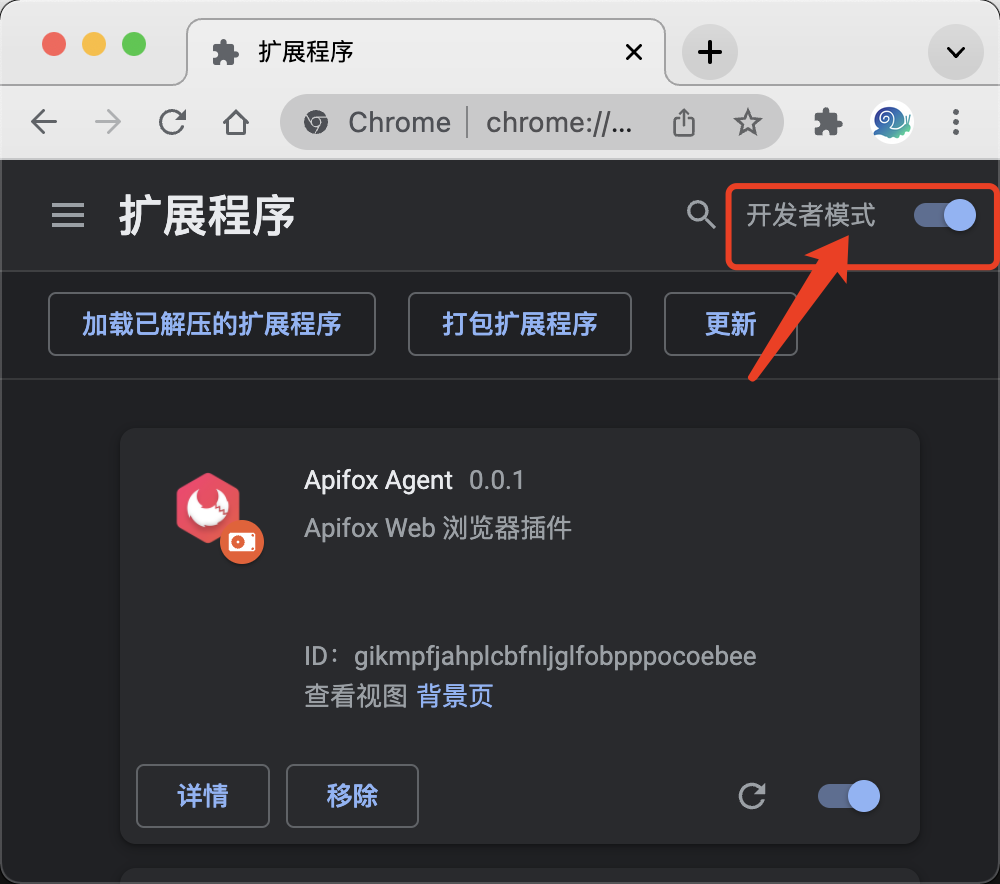
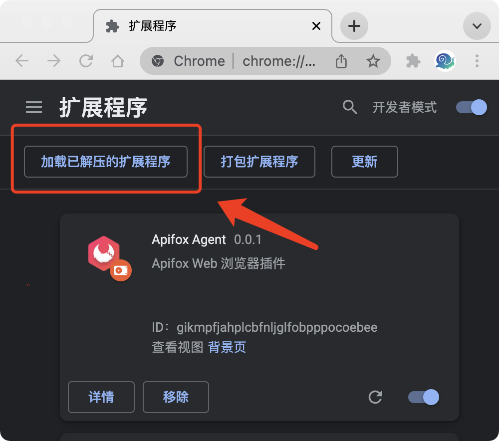
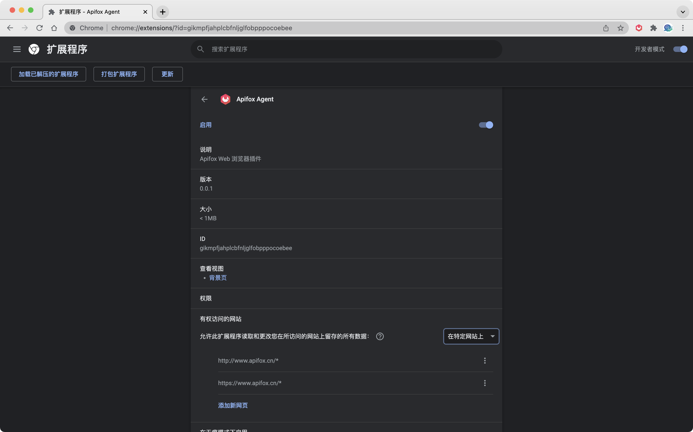
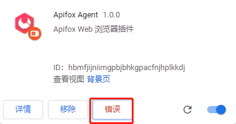

# 浏览器扩展

Apifox 浏览器扩展用于 Web 版接口调试，须使用 Chrome 浏览器，暂只能使用本地安装的方式。

:::tip 下载地址
- [下载地址](https://apifox-generic.pkg.coding.net/apifox/apifox-desktop/Apifox-browser-extension.zip)（需要先下载，然后添加到 Chrome 扩展程序中）
- [Chrome 应用商店](https://chrome.google.com/webstore/detail/apifox-agent/eggdlmopfankeonchoflhfoglaakobma?hl=zh-CN)（需要国际互联网才能打开）
- [Edge 应用商店](https://microsoftedge.microsoft.com/addons/detail/apifox-browser-extension/haklpcemfcccpoeaibpbgacinnbfafbl)

:::

:::tip 限制

- 受浏览器安全性限制，使用 Chrome 插件发送请求时，如接口有设置 `Cookie`、`Host`、`Origin`、`Content-Length` 等浏览器禁止修改的 Header，将会被忽略。在 MDN Web 文档的 [禁止修改 Header](https://developer.mozilla.org/zh-CN/docs/Glossary/Forbidden_header_name) 中可查看完整的保留 Header 列表。

:::

## 安装方法

1. 扩展 zip 后解压
2. 浏览器打开 chrome://extensions

> 必须开启开发者模式

3. 然后点击加载已解压的扩展程序，加载后需要刷新访问中的 Apifox Web 网页，Agent 才能生效

4. 部分浏览器版本，需要手动修改赋予权限，否则会请求失败

## FAQ

1. 为什么我安装不成功?

检测是否在 chrome://extensions 开启了开发者模式。

2. Web 版调试不支持调用数据库、执行本地代码？

这是浏览器限制，目前版本若需要则建议使用 [桌面版](https://apifox.cn)。

3. Web 版调试不支持 get、head 方法请求中带 body ？

这是浏览器限制，目前版本调试发起请求会去除 Get、Head 方法请求的 body，若需要调试此类型接口建议使用 [桌面版](https://apifox.cn)。

4. 如安装 Apifox Agent 插件后显示错误，请忽略，不影响正常使用。

