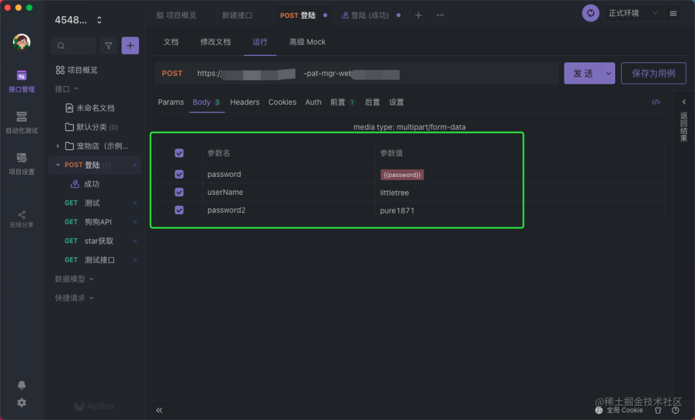
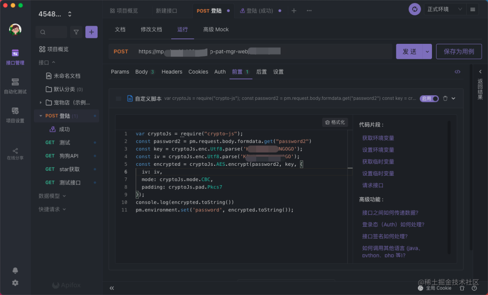
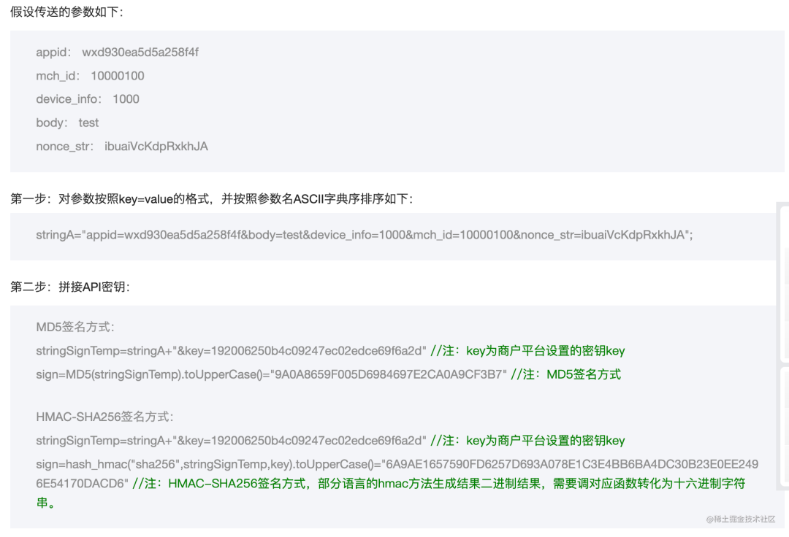
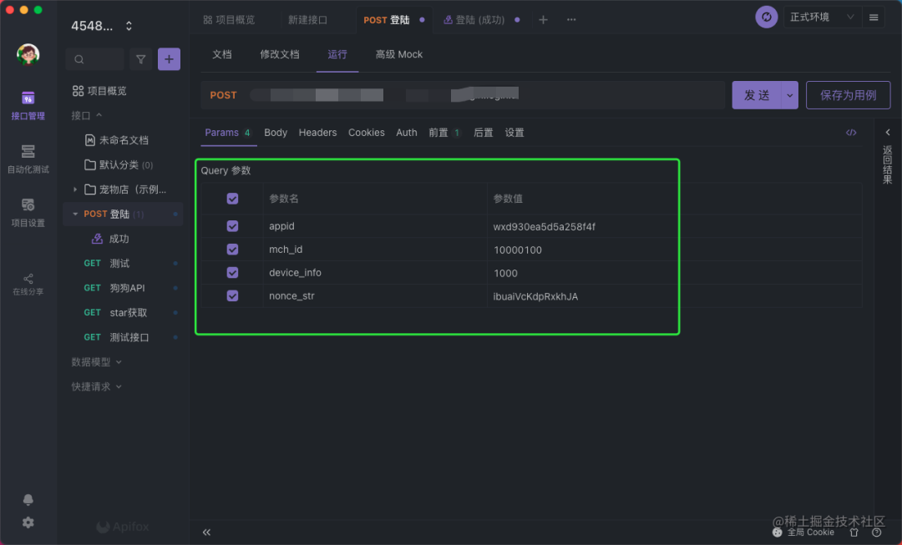
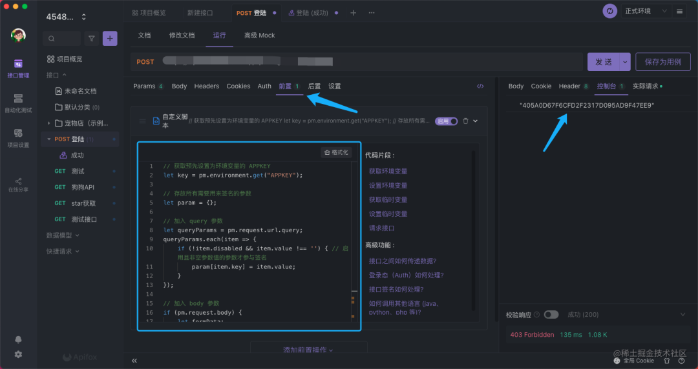
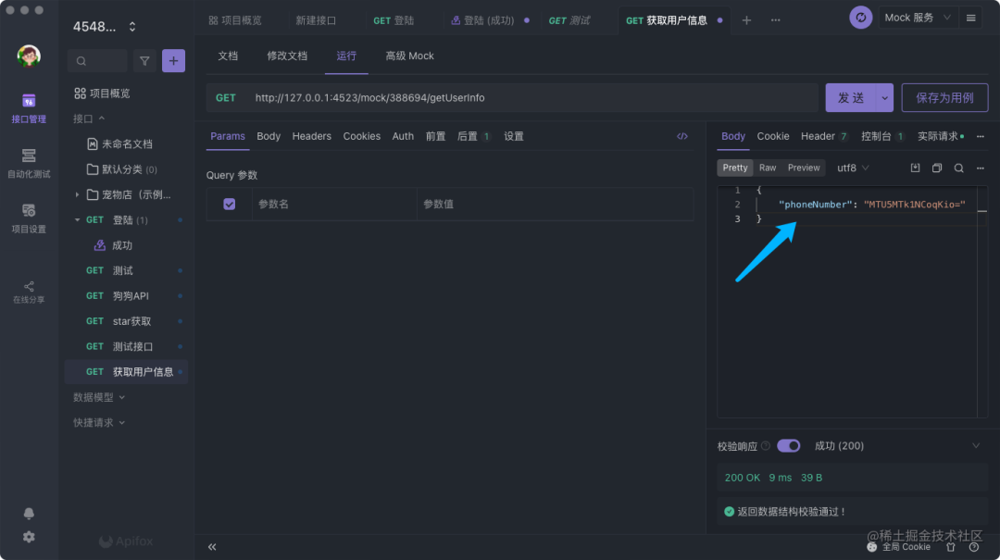
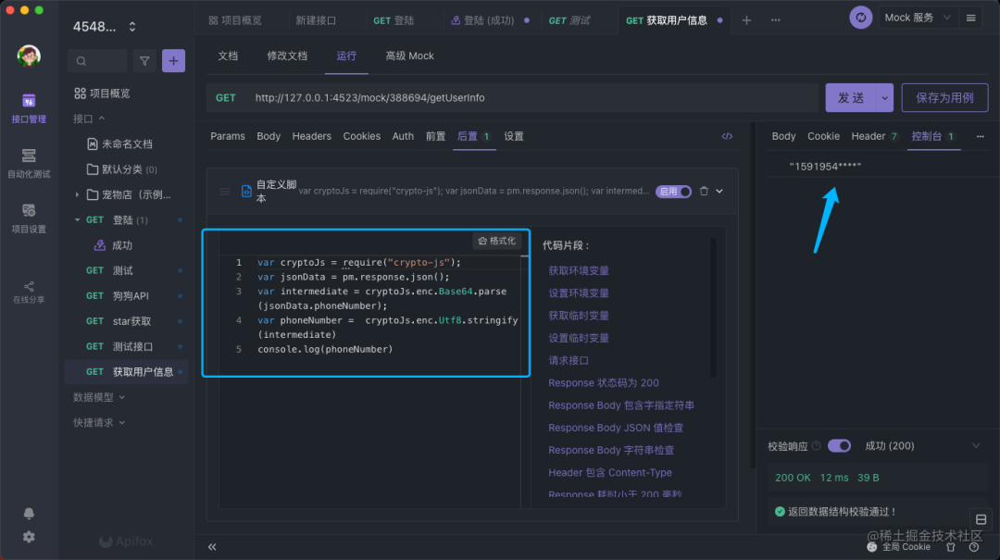

# 带你玩转接口管理工具加解密

## 前言

哈喽，我是树酱。在平时开发过程中，你有没有遇到过跟后端对线的时候，后端说：

- “切图仔，这个接口的数据需要加密”
- “切图仔，这个接口返回数据需要解密”

那么到底哪些场景需要加对接口数据进行加密或解密？

## 场景一：登陆

> 在数据安全背景下，大部分的登陆接口都需要客户端将用户的用户名、密码等信息进行加密。

举个场景：为了安全起见，后端告知前端调登陆接口的时候，需要先对用户的登陆信息进行`AES`加密。

我们用接口管理工具 Apifox 验证一下

Apifox 是一款国产热度 🔥 很高的接口管神器，支持前置操作、后置操作，一般情况下，在发送请求前需要对接口的数据做进一步处理，我们可以通过在前置操作中添加脚本对用户登陆数据进行加密处理

> 那如何通过 Apifox 的前置操作对密码进行加密？🤔️

首先，在调试接口的 body 中定义以下字段

- `password`：存储加密后的数据，并设置变量 {{password}}
- `password2`：定义加密前的原始数据



接下来我们在前置操作面板中，编写前置脚本。同时 **Apifox** 内置了`crypto-js`库，基本可以实现各种加密、解密算法。本次使用的是`AES算法` 步骤如下：👇

- 1.引入`crypto-js`内置库
- 2.通过`pm.request.body.formdata` 获取 password2 参数
- 3.对数据进行加密



```
var cryptoJs = require("crypto-js");
const password2 = pm.request.body.formdata.get("password2")
const key = cryptoJs.enc.Utf8.parse('******');
const iv = cryptoJs.enc.Utf8.parse('******');
const encrypted = cryptoJs.AES.encrypt(password2, key, {
   iv: iv,
   mode: cryptoJs.mode.CBC,
   padding: cryptoJs.pad.Pkcs7
});
```

完成以上步骤，即可对数据进行加密处理

### 场景二：接口签名

> 接口签名是接口请求的一种常见的场景，那为什么需要对接口进行签名？通常为了防止参数被篡改

接口签名，一般操作步骤是：

- `拼接成字符串`: 按照请求参数名的字母升序排列非空请求参数，使用 URL 键值对的格式（即 key1=value1&key2=value2…）拼接成字符串 stringA；
- `拼接Secretkey`：在 stringA 最后拼接上 Secretkey 得到字符串 stringSignTemp
- `MD5加密`: 对 stringSignTemp 进行 MD5 运算
- `得到sign值`:并将得到的字符串所有字符转换为大写，得到 sign 值。

这里以微信支付签名为例子 🌰：



> 🤔️ 那在 Apifox 这个接口工具如何调试需要接口签名的接口，我们可以怎么做？

以上面微信支付官方签名 demo，我们先定义好`Query参数` 👇



然同样在前置脚本中，编辑`签名脚本` 👇 , 编写完成后点击发送可以看出右侧的控制台输出了最终签名的数据



上图中的脚本完整版如下 👇

```
// 获取预先设置为环境变量的 APPKEY
let key = pm.environment.get("APPKEY");

// 存放所有需要用来签名的参数
let param = {};

// 加入 query 参数
let queryParams = pm.request.url.query;
queryParams.each(item => {
    if (!item.disabled && item.value !== '') { // 启用且非空参数值的参数才参与签名
        param[item.key] = item.value;
    }
});

// 加入 body 参数
if (pm.request.body) {
    let formData;
    switch (pm.request.body.mode) {
        case 'formdata':
            formData = pm.request.body.formdata;
            break;
        default:
            break;
    }
    if (formData) {
        formData.each(item => {
            if (!item.disabled && item.value !== '') { // 启用且非空参数值的参数才参与签名
                param[item.key] = item.value;
            }
        });
    }
}


// 取 key
let keys = [];
for (let key in param) {
    // 注意这里，要剔除掉 sign 参数本身
    if (key !== 'sign') {
        keys.push(key);
    }
}

// 参数名 ASCII 码从小到大排序（字典序）
keys.sort();

// 转成键值对
let paramPair = [];
for (let i = 0, len = keys.length; i < len; i++) {
    let k = keys[i];
    paramPair.push(k + '=' + encodeURIComponent(param[k])) // urlencode 编码
}

// 最后加上 key
paramPair.push("key=" + key);

// 拼接
let stringSignTemp = paramPair.join('&');
// console.log(stringSignTemp);

let sign = CryptoJS.MD5(stringSignTemp).toString().toUpperCase();
// console.log(sign);

// 方案一：直接修改接口请求的 query 参数，注入 sign，无需使用环境变量。
// 参考文档：https://www.apifox.cn/help/app/scripts/examples/request-handle/
queryParams.upsert({
    key: 'sign',
    value: sign,
});

// 方案二：写入环境变量，此方案需要在接口里设置参数引用环境变量
// pm.environment.set("SIGN", sign);
```

更详细的操作可以参考官方文档：Apifox 使用文档 - 接口签名

### 场景三：解密返回数据

> 当下抓包工具方便开发排查问题的同时，也带来一些新的隐患。数据明文暴露容易，接口内容返回数据加密成为一种基本的使用场景

举个例子：对我个人手机号码进行`base64加密`, 这里用的是 👇

```
const phoneNumber = '1591954****'
const wordArray = CryptoJS.enc.Utf8.parse(phoneNumber);
const base64 = CryptoJS.enc.Base64.stringify(wordArray);
//  MTU5MTk1NCoqKio=
```

你会得到一个字符串信息

> 🤔️ 同样我们在接口管理工具 Apifox 中可以对我上文加密后的个人信息进行解密吗？

可以的，这个时候我们使用的就不再是前文提到的前置脚本，而是`后置脚本`了

这里我通过`Apifox`的 Mock 服务去返回上述的 base64 数据



并且在后置操作定义脚本，对该数据进行 base64 解密，脚本代码实现如下 👇



### 最后

Apifox 是 API 开发测试全流程集成工具，除了满足上文提及的 API 调试、加密、解密、签名等场景之外，还有很多功能包括：

- 支持数据模型的可视化 API 文档管理
- API 自动化测试
- 零配置的 API 数据 Mock
- 支持代码自动生成、CI 持续集成等等
