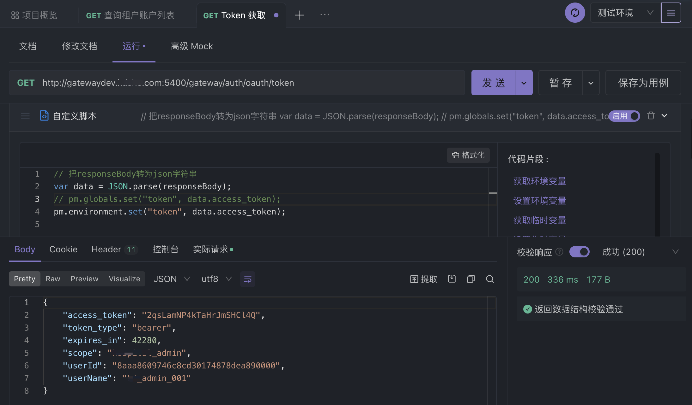
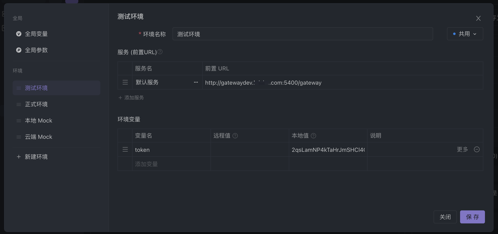
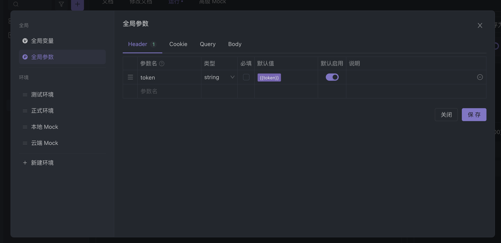
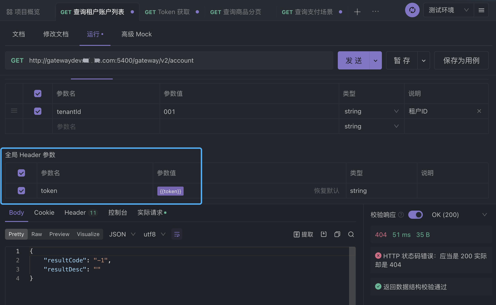

# 多个接口如何使用同一个变量？

> 通常当我们用Apifox调试接口的时候，可能内部涉及多个接口均需依赖token做Auth认证，如果每个接口都单独去固定写死一个Token参数。而当Token失效时，我们又需要重新挨个去更新，整个过程不仅费时且还机械化。

我们可以将Token定义为一个`环境变量`。

并通过在Auth认证服务接口增加`后置操作-自定义脚本`，将返回的token内容写入环境变量。




```
var data = JSON.parse(responseBody);
pm.environment.set("token", data.access_token);
```
我们验证下环境变量是否写入正常，打开`管理 环境变量\全局变量\全局参数` 发现该变量已经更新。




接下来我们将写好的环境变量token，设置为全局header参数（注意使用中括号包裹如：`{{token}}`），这样做的目的是减少重复性配置，不用每个接口都再去配置一次变量。



完成上图操作之后我们会发现，每个接口的下方都会出现一列全局Header参数，其中就包含了token环境变量的引用。



完成上述流程，你就可以在多个接口中使用同一个变量。

>你可以能会问：“为什么是设置为环境变量，而不是全局变量呢？”

具体设置为哪种形态的变量，与该变量使用场景有关，上文提到的token认证，因为内部不同环境依赖的token不同，所以使用环境变量更好。

#### 关于变量

Apifox包含有四种场景的变量：环境变量、临时变量、全局变量、测试数据变量。

- 环境变量：环境变量是需要引用当前环境才可使用；
- 临时变量：仅在单次运行接口用例过程中有效，不会持久化保存；
- 全局变量：全局变量不会跟随环境切换而改变，多个环境之间可以共享；
- 测试数据变量：只能自动化测试过程中使用；

不同形态的变量通过脚本读写的 API，也不同。如下图所示:

```
// 环境变量读写
pm.environment.set("variable_key", "variable_value");
pm.environment.get("variable_key");

// 临时变量读写
pm.variables.set("variable_key", "variable_value");
pm.variables.get("variable_key");

// 全局变量读写
pm.globals.set("variable_key", "variable_value");
pm.globals.get("variable_key");

// 测试数据变量（测试数据是单独管理的，暂不支持在脚本中直接设置测试数据变量）
pm.iterationData.get("variable_key");
```

特别注意的事，变量也是有优先级的。

> 临时变量 > 测试数据变量 > 环境变量 > 全局变量

举个例子：上文我们设置的是环境变量，同时我又在其中一个接口中添加一个key值一样的临时变量，并没有进行赋值操作，此时因为Apifox变量优先级的关系，你这个接口会优先读取临时变量的值，而不是环境变量的值。


