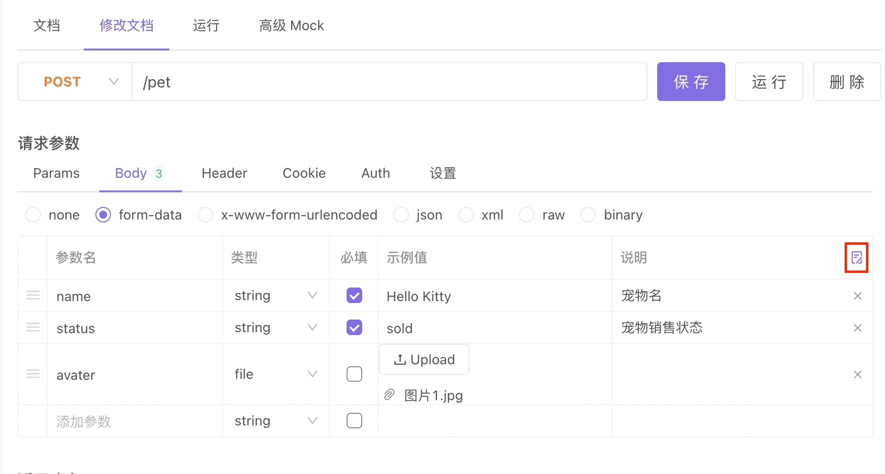
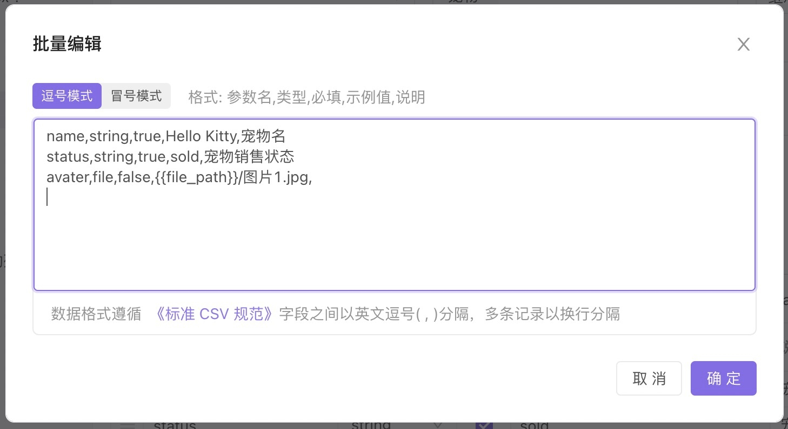

# Apifox CLI 命令行运行

Apifox CLI 主要用来以命令行方式运行 Apifox 的 `测试用例`或`测试套件`。

## 开始

Apifox CLI 依赖于 Node.js >= v10。使用前请先[安装 Node.js](https://nodejs.org/en/download/package-manager/).

### 安装

使用以下命令安装 Apifox CLI

```console
$ npm install -g apifox-cli
```

### 实时运行在线数据

在 Apifox 的`测试用例`和`测试套件`选择`持续集成`，生成如下命令


点击即复制命令，运行即可

```
apifox run http://xxx/api/v1/api-test/ci-config/xxxx/detail?token=xxxx -r html,cli 
```


### 运行测试用例或测试套件

```console
$ apifox run examples/sample.apifox-cli.json -r cli,html,json
```

运行完成后测试报告会保存在当前目录下的 `apifox-reports` 目录里。

- 如果想要自定义报告，可以通过 json 文件的结果集来定制自己想要的报告

### 结合 Jenkins 做持续集成
[Jenkins 集成 Apifox](./jenkins/)


### CLI 如何实现文件参数传递

1. 首先要回到 `接口文档-修改文档` 的请求参数处，通过批量编辑，把上传文件的路径改为变量。





2. 保存为接口用例后，再在 `自动化测试` 中导入 `接口/接口用例` 。

3. 最后，去对应的应用中(比如 jenkins）运行时，修改这个路径变量的实际值。

## 命令选项

### `apifox [options]`

- `-h`, `--help`<br />
  使用帮助

- `-v`, `--version`<br />
  显示版本号

### `apifox run <file-source> [options]`

`file-source` 为从 Apifox 导出的`测试用例`或`测试套件`数据文件存放路径。

::: tip 提示

`--verbose` 在生成的测试报告中显示所有接口实际请求和响应

:::

更多选项：

```
  -r, --reporters [reporters]           指定测试报告类型, 支持 cli,html,json (default: ["cli"])
  -n, --iteration-count <n>             设置循环次数
  -d, --iteration-data <path>           设置用例循环的数据 (JSON 或 CSV)
  --external-program-path <path>        指定 [外部程序] 的所处文件路径，默认值为命令当前执行目录
  --out-dir <outDir>                    输出测试报告目录，默认为当前目录下的 ./apifox-reports
  --out-file <outFile>                  输出测试报告文件名，不需要添加后缀，默认格式为 apifox-report-{当前时间戳}-0
  --database-connection <path>          指定 [数据库配置] 的所处文件路径，使用 URL 测试的时候必须指定
  --ignore-redirects                    阻止 Apifox 自动重定向返回 3XX 状态码的请求
  --silent                              阻止 Apifox CLI 输出到控制台
  --color <value>                       开启/关闭控制台彩色输出 (auto|on|off) (default: "auto")
  --delay-request [n]                   指定请求之间停顿间隔 (default: 0)
  --timeout-request [n]                 指定接口请求超时时间 (default: 0)
  --timeout-script [n]                  指定脚本预执行/后执行接口运行超时时间 (default: 0)
  -k, --insecure                        关闭 SSL 校验
  --ssl-client-cert-list <path>         指定客户端证书配置路径 (JSON)
  --ssl-client-cert <path>              指定客户端证书路径 (PEM)
  --ssl-client-key <path>               指定客户端证书私钥路径
  --ssl-client-passphrase <passphrase>  指定客户端证书密码 (for protected key)
  --ssl-extra-ca-certs <path>           指定额外受信任的 CA 证书 (PEM)
  --verbose                             显示所有接口请求的详细信息
  -h, --help                            display help for command
```

### SSL

#### 客户端证书

Apifox CLI 支持传入客户端证书

#### 使用单个 SSL 客户端证书

- `--ssl-client-cert`<br/>
  公共客户端证书文件的路径

- `--ssl-client-key`<br/>
  私有客户端密钥的路径（可选）

- `--ssl-client-passphrase`<br/>
  用于保护私有客户端密钥的密码（可选）

#### 使用 SSL 客户端证书 配置文件（支持多个证书）

- `--ssl-client-cert-list`<br/>
  SSL 客户端证书列表配置文件的路径（JSON 格式）。示例如下 `ssl-client-cert-list.json`

```
ssl-client-cert-list.json

[
    {
        "name": "domain1",
        "matches": ["https://test.domain1.com/*", "https://www.domain1/*"],
        "key": {"src": "./client.domain1.key"},
        "cert": {"src": "./client.domain1.crt"},
        "passphrase": "changeme"
    },
    {
        "name": "domain2",
        "matches": ["https://domain2.com/*"],
        "key": {"src": "./client.domain2.key"},
        "cert": {"src": "./client.domain2.crt"},
        "passphrase": "changeme"
    }
]
```

此选项允许根据 URL 或主机名设置不同的 SSL 客户端证书。
此选项优先于 `--ssl-client-cert`, `--ssl-client-key` 和 `--ssl-client-passphrase` 选项。如果列表中的 URL 没有匹配项，这些选项将用作后备选项。

## 升级版本

使用以下命令升级 Apifox CLI

```console
$ npm install apifox-cli@latest -g
```

