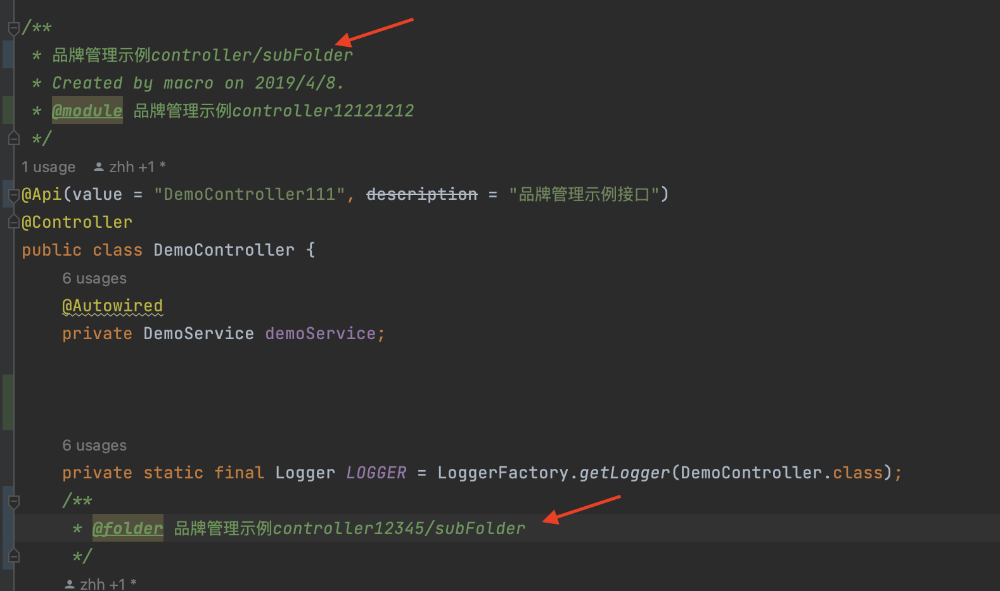

# 常见问题 FAQ
_**此插件配置过于灵活, 以下均为示例, 需根据实际情况做合适的处理。**_

___

## 如何添加配置文件

-   see [local-file-config](https://easyyapi.com/setting/local-file-config.html)

___

## 如何组织API到指定模块、API 分组

-   `module` 用于分类api

-   默认情况下取当前模块名(单模块项目取项目名)
-   默认推荐配置:


```
#find module from comment tag
module=#module
```

-   在类上这样注释:

```
/**
 * Mock Apis
 *
 * @module mock
 */
@RestController
@RequestMapping(value = "mock")
public class MockCtrl {
}
```

- 更多详细配置可参考[配置文档](../../setting/setting-rule/#module)
-
___

## 怎么设置接口 API 所属文件夹的名称

- 需要在配置文件里要开启这个配置，以下是 `.apifox-helper.properties` 示例

```
# read folder name from tag `folder`
folder.name=#folder
```

- 使用 `@folder` 注释


- 也可以进行多级目录注释：




- 更多详细配置可参考[配置文档](../../setting/setting-rule/#folder-name)

___
___

## 如何增加外层的公共返回响应 Response 泛型

- 需要在配置文件里要开启这个配置，以下是 `.apifox-helper.properties` 示例

```
# 假定 公共 ResponseDo 的包名为 com.xxx
method.return=groovy: "com.xxx.ResponseDo<" +  it.returnType() +">"
```

- 更多详细配置可参考[配置文档](../../setting/setting-rule/#method-return)

___

## 如何忽略API

-   增加配置:

```
#ignore class or method which has comment tag 'ignore'
ignore=#ignore
```

-   在类上注释@ignore忽略当前类

```
/**
 * Mock Apis
 *
 * @ignore
 */
@RestController
@RequestMapping(value = "mock")
public class MockCtrl {
}
```

-   在方法上注释@ignore忽略当前API

```
/**
 * Mock Apis
 */
@RestController
@RequestMapping(value = "mock")
public class MockCtrl {

     /**
      * Mock String
      * @ignore
      */
     @GetMapping("/string")
     public String mockString() {
         return Result.success("mock string");
     }

}
```

___

## 如何设置API/文件夹的名称/描述

-   一般来说:

    ```
    /**
     * 第一行注释作为文件夹的标题
     * 剩余行注释作为文件夹的描述
     */
    @RestController
    @RequestMapping(value = "mock")
    public class MockCtrl {

        /**
         * 第一行行注释作为API的标题
         * 剩余行注释作为API的描述
         */
        @GetMapping("/string")
        public String mockString() {
            return Result.success("mock string");
        }
    }
    ```

-   特殊需求参照:[class.doc](https://easyyapi.com/setting/rules/class_doc.html) | [method.doc](https://easyyapi.com/setting/rules/method_doc.html) | [api.name](https://easyyapi.com/setting/rules/api_name.html)


___

## 如何在API/文件夹的描述中说明API/文件夹被废弃了

-   默认推荐配置如下:

    ```
    method.doc[#deprecated]=groovy:"\n「deprecated」" + it.doc("deprecated")
    method.doc[@java.lang.Deprecated]=「deprecated」
    method.doc[@kotlin.Deprecated]=groovy:"\n「deprecated」" + it.ann("kotlin.Deprecated","message")

    method.doc[groovy:it.containingClass().hasDoc("deprecated")]=groovy:"\n「deprecated」" + it.containingClass().doc("deprecated")
    method.doc[groovy:it.containingClass().hasAnn("java.lang.Deprecated")]=「deprecated」
    method.doc[groovy:it.containingClass().hasAnn("kotlin.Deprecated")]=groovy:"\n「deprecated」 " + it.containingClass().ann("kotlin.Deprecated","message")

    ```

-   使用注解或者注释标记API废弃即可:

    ```
    /**
    * 可以用注解`@Deprecated`来表示api废弃
    * 也可以用注释`@deprecated`
    *
    * @deprecated 改用{@link #methodName3(String)}
    */
    @Deprecated
    @RequestMapping(value = "/pathOfApi2")
    public Result methodName2(@RequestBody MockDtoOrVo jsonModel){
        ...
    }
    ```


___

## 如何在API描述中声明API需要的权限(javax annotation security)

-   可考虑增加如下配置:

```
## security description
method.doc[@javax.annotation.security.RolesAllowed]=groovy:"require role:"+it.ann("javax.annotation.security.RolesAllowed")
```

-   示例:

```
/**
 * 第一行注释作为文件夹的标题
 * 剩余行注释作为文件夹的描述
 */
@RestController
@RequestMapping(value = "mock")
public class MockCtrl {

    /**
     * 第一行行注释作为API的标题
     * 剩余行注释作为API的描述
     */
    @GetMapping("/string")
    @RolesAllowed("admin")
    public String mockString() {
        return Result.success("mock string");
    }
}

```

___

## 如何在API描述中声明API需要的权限(spring security)

-   可考虑增加如下配置:

````
## security description
doc.method[@org.springframework.security.access.prepost.PreAuthorize]=groovy:```
   def preAuthorize = it.ann("org.springframework.security.access.prepost.PreAuthorize")
   if(tool.nullOrBlank(preAuthorize)){
        return
   }
   def role = regex.getGroup1("hasRole\\('(.*?)'\\)",preAuthorize)
   return "require role: $role"
```
````

-   示例:

```
/**
 * 第一行注释作为文件夹的标题
 * 剩余行注释作为文件夹的描述
 */
@RestController
@RequestMapping(value = "mock")
public class MockCtrl {

    /**
     * 第一行行注释作为API的标题
     * 剩余行注释作为API的描述
     */
    @GetMapping("/string")
    @PreAuthorize("hasRole('admin')")
    public String mockString() {
        return Result.success("mock string");
    }
}

```

___

## 如何忽略某些字段

-   使用规则:[json.rule.field.ignore](https://easyyapi.com/setting/rules/json_rule_field_ignore.md.html)

    -   忽略特定名称的字段:

    ```
    ## ignore field 'log'
    json.rule.field.ignore=log
    ```

    -   忽略特定类型的字段:

    ```
    ## ignore field 'log' typed xxx.xxx.Log
    json.rule.field.ignore=groovy:it.type().name()=="xxx.xxx.Log"
    ```

    -   忽略特定限定符的字段:

    ```
    #ignore transient field
    json.rule.field.ignore=groovy:it.hasModifier("transient")
    ```


___

## 如何将指定类型转换为另一种类型处理

-   将`java.time.LocalDateTime`作为`yyyy-mm-dd`形式字符串处理

```
#Resolve 'java.time.LocalDateTime' as 'java.lang.String'
json.rule.convert[java.time.LocalDateTime]=java.lang.String
json.rule.convert[java.time.LocalDate]=java.lang.String
```

-   将`java.time.LocalDateTime`作为`timestamp`处理

```
#Resolve 'java.time.LocalDateTime' as 'java.lang.Long'
json.rule.convert[java.time.LocalDateTime]=java.lang.Long
json.rule.convert[java.time.LocalDate]=java.lang.Long
```

## 部分接口可能有不同的返回

-   可以使用[method.doc](https://easyyapi.com/setting/rules/method_doc.html)将可能的返回放在方法备注中

_**配置如下:**_

```
method.doc[#result]=groovy: it.docs("result").collect{helper.resolveLink(it)}.grep{it!=null}.collect{"可能的返回:\n\n```json\n"+it.toJson(true)+"\n```\n\n"}.join("\n")
```

_**使用如下:**_

```
 /**
  * @result {@link UserInfo}
  * @result {@link Result<UserInfo>}
  */
 public Result mockString() {
     ...
 }
```

## 有的字段可能有不同类型的值

-   可以使用[field.doc](https://easyyapi.com/setting/rules/field_doc.html)将可能的类型值放在字段备注中

_**配置如下:**_

```
 field.doc[#maybe]=groovy:it.docs("maybe").collect{helper.resolveLink(it)}.collect{"可能是:\n\n```json\n" + it.toJson(true) +"\n```\n\n"}.join("\n")
```

_**使用如下:**_

```
 /**
  * @maybe {@link UserInfo}
  * @maybe {@link java.lang.String}
  */
 public Object target;
```

## 如何开启javax\_validation分组校验

-   参照[javax\_validation](https://easyyapi.com/framwork/javax_validation.html), 在 Preferences(Settings) > Other Settings > EasyApi >Recommend 中移除勾选`javax.validation`, 勾选`javax.validation(grouped)`

## 如何激活对com.fasterxml.jackson.annotation.JsonIgnoreProperties的支持

-   在 Preferences(Settings) > Other Settings > EasyApi >Recommend 中勾选`Jackson_JsonIgnoreProperties`

## 导出时出现`com.xxx.Xxx is to complex. Blocked cause by xxx reached xxx`, 如何处理

-   检查错误信息中的类是否不应该出现在请求体/响应中, 可尝试做如下配置:

```
# ignore field with type com.xxx.Xxx
field.ignore=groovy:it.type().name()=="com.xxx.Xxx"
```

-   如果此类确实字段繁多, 需要完全解析, 可通过配置放宽解析限制:

```
max.deep=8
max.elements=512
```