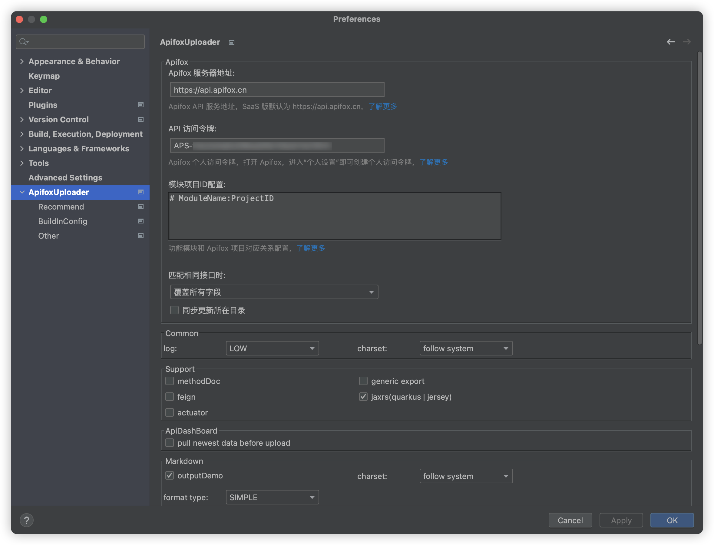
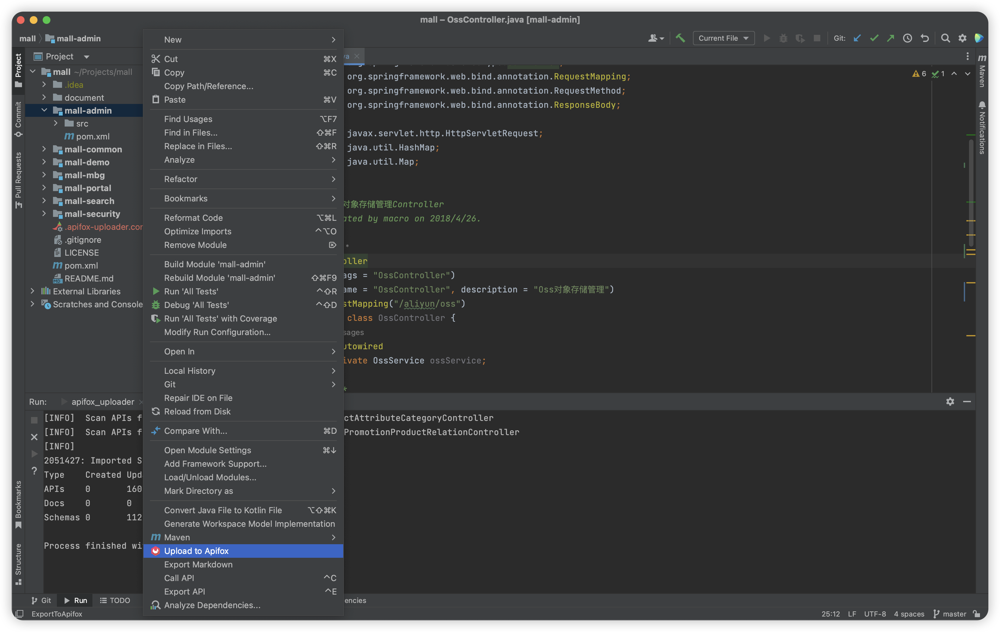
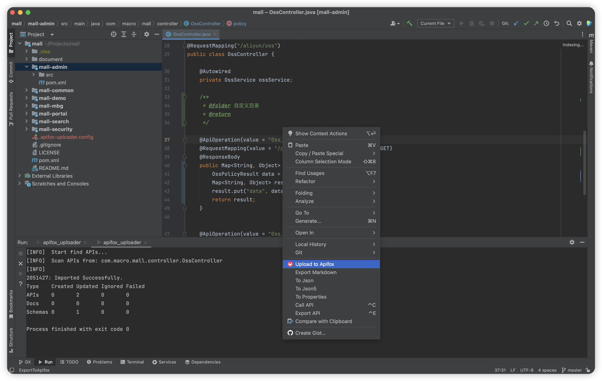
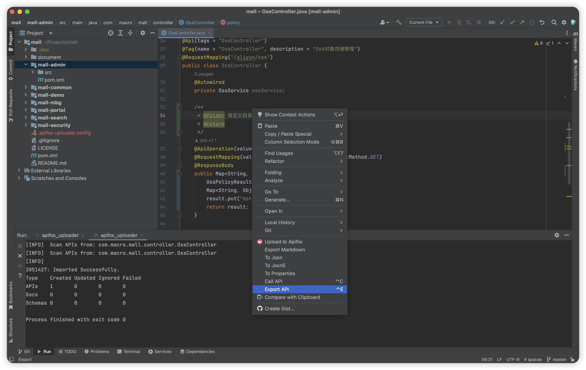
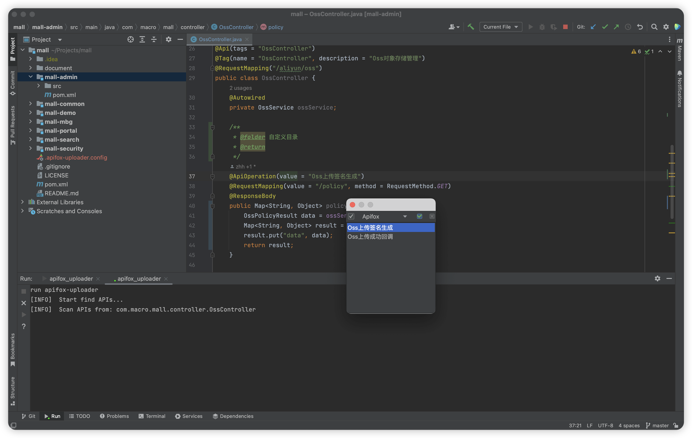

# 实战使用
## 基础配置

安装插件后，进入设置界面 Preferences(Settings) > ApifoxUploader

- Apifox 服务器地址: 填写 Apifox API 服务地址，SaaS 版默认为 https://api.apifox.cn
- Apifox 个人访问令牌：获取可参考文档[获取访问令牌](../get-access-token/)
- 模块项目 ID 配置: 代码模块名和项目 ID 的映射关系配置，其中项目 ID 的获取可参考文档[获取项目 ID](../get-project-id/)

**模块项目 ID 配置**:

每个 Module 都需指定一个项目 ID，可选指定目标目录名。

- 如下填写，表示的是 mall-admin 和 mall-search 模块都导入到项目 2051427，分别导入到 `管理后台`、`搜索`目录下。

```
mall-admin:2051427,管理后台
mall-search:2051427,搜索
```

- 多级目录用`/`分割，如下填写，表示的是 mall-admin 和 mall-search 模块都导入到项目 2051427，分别导入到`商城/后台管理`、`商城/商城搜索`目录下。

```
mall-admin:2051427,商城/后台管理
mall-search:2051427,商城/商城搜索
```

- 如下填写，表示的是 mall-admin 和 mall-search 模块都导入到项目 2051427 且都是导入到根目录。

```
mall-admin:2051427
mall-search:2051427
```


## 同步接口到 Apifox

### 同步模块内所有接口

- 在模块目录上的**右键菜单**中选择 `Upload to Apifox`



### 同步 controller 文件内所有接口

- 在代码编辑区域的**右键菜单**中选择 `Upload to Apifox`



### 同步选择部分接口

- 在模块目录上或代码编辑区域的**右键菜单**中选择 `Export API`



- 选择想要同步的单个或部分接口，回车执行同步请求



## 常见问题

- 常见的一些使用场景，如 `怎么设置接口 API 所属文件夹的名称` 、 `如何添加配置文件`、 `如何增加外层的公共返回响应 Response 泛型` ，参考[常见问题文档](../faq/)
- 自定义配置，参考[配置文档](../../setting/setting-rule/)