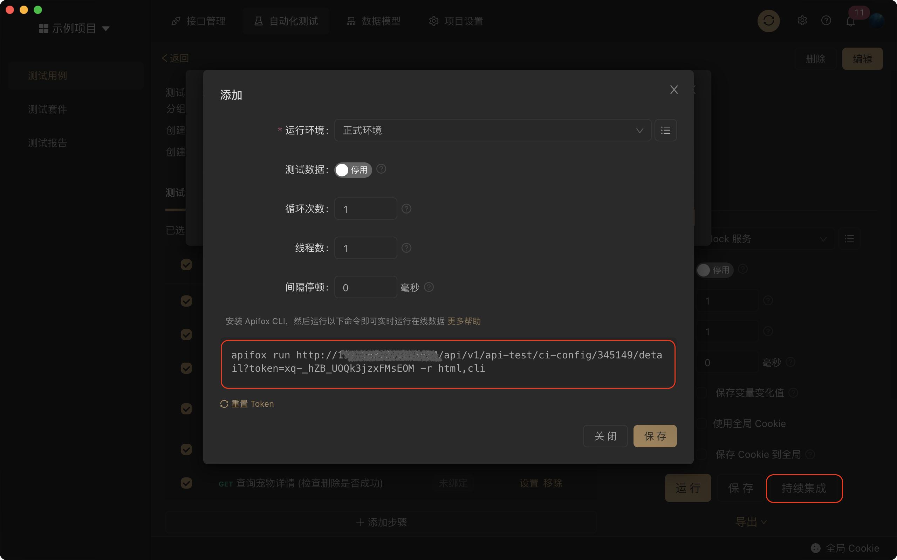
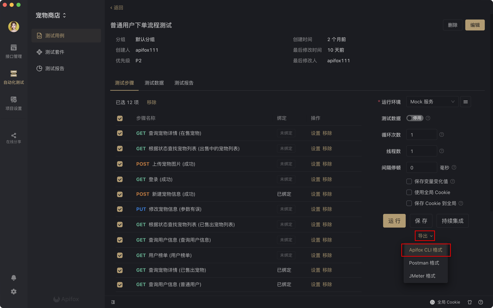

# 持续集成

Apifox 的`测试用例`和`测试套件`支持导出`Apifox CLI`、`Postman`、`Jmeter` 格式数据做持续集成。

## 一、Apifox CLI 方式

Apifox CLI 是 [Apifox](https://www.apifox.cn/) 的命令行运行工具，主要用来做持续集成。 Apifox 支持`实时运行在线数据`和`导出数据运行`2 种方式。

:::tip 注意

- Apifox 版本号大于等于 `1.0.25` 才支持导出`Apifox CLI`格式数据。
- Apifox 版本号大于等于 `1.4.3` 才支持直接实时运行在线数据。
  :::

### 安装 Apifox CLI

使用以下命令安装 Apifox CLI

```console
npm install -g apifox-cli
```

### 实时运行在线数据

在 Apifox 的`测试用例`和`测试套件`选择`持续集成`，生成如下命令



点击即复制命令，运行即可

```
apifox run http://xxx/api/v1/api-test/ci-config/xxxx/detail?token=xxxx -r html,cli
```

### 导出数据运行

在 Apifox 的`测试用例`和`测试套件`导出`Apifox CLI`格式数据



运行以下命令

```console
apifox run examples/sample.apifox-cli.json -r cli,html
```

### 测试报告

运行完成后测试报告会保存在当前目录下的`apifox-reports`目录里。

查看[Apifox CLI 使用说明](./cli/)。

## 二、Newman 方式（Postman）

使用参考教程：[Web API 持续集成：PostMan+Newman+Jenkins（图文讲解）](https://cloud.tencent.com/developer/article/1368050)

## 三、JMeter 方式

导出 JMeter 数据主要用来做性能测试，不过也可以做持续集成，参考教程：[性能测试与持续集成(JMeter+Jenkins)](https://cloud.tencent.com/developer/article/1116058)

:::tip 注意

由于 JMeter 不支持 JS 脚本，所以 Apifox 导出 JMeter 数据不包含`前置/后置脚本`。

:::
