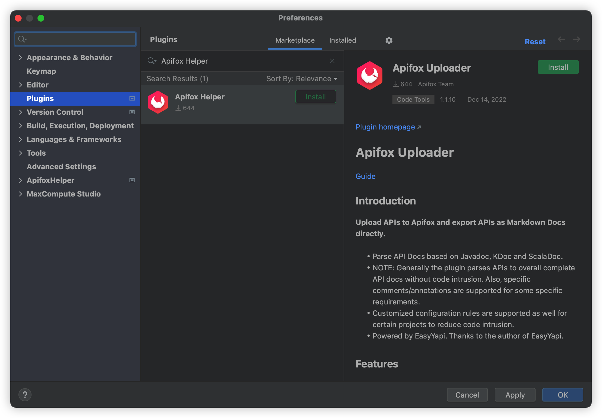

# 安装

## 支持以下 IDE

- IntelliJ IDEA 193.+(2019.3+)
- IntelliJ IDEA Community Edition 174+(2017.4+)

## 从 Jetbrains Marketplace 官网安装

<iframe width="245px" height="48px" scrolling="no" border="0" frameborder="no" framespacing="0" src="https://plugins.jetbrains.com/embeddable/install/20549"></iframe>

## 从 IDEA plugins 中搜索安装

- 打开 IDEA > Preferences(Settings) > Plugins ，搜索 Apifox Helper

## 手动下载安装

- 下载插件：[下载地址](https://plugins.jetbrains.com/plugin/20549-apifox-helper/versions)
- Preferences(Settings) > Plugins > Install plugin from disk...
- 重启 IDE
