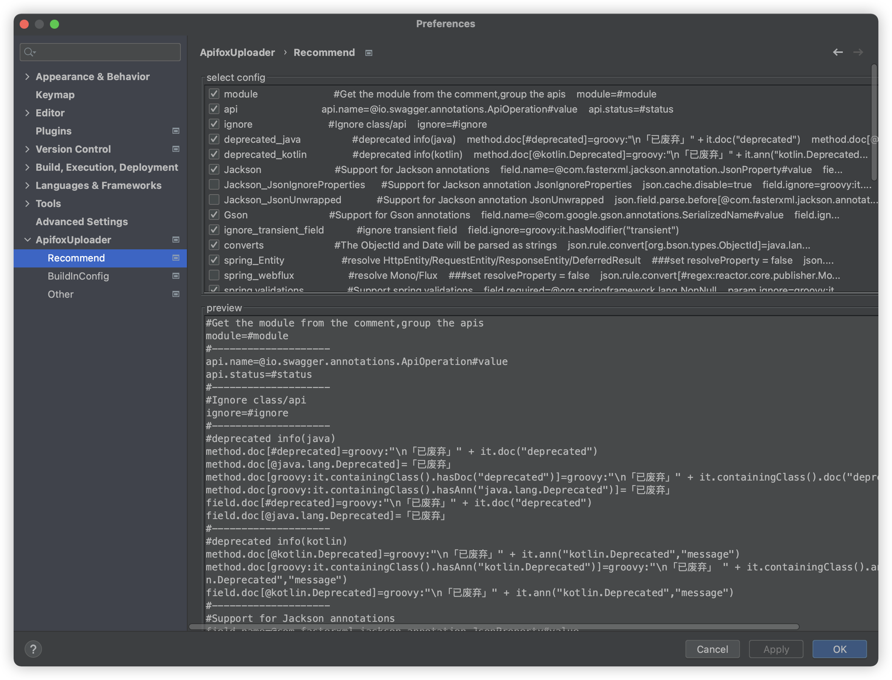

# 如何使用配置？

插件是零配置，开箱即用

- 插件安装后, 大多数情况下无需修改任何配置即可使用。
- 必要参数：一般来说, 当导出 API 的过程中需要提供某些参数, 插件将以弹框的方式提供输入，按要求填入即可。

## 额外的自定义配置

插件之所以能做到零配置，是已经内置并勾选了推荐配置，还支持自定义额外的配置，有两个方式去做额外的自定义配置：

- 【推荐】使用[项目内配置文件](../use-config-in-project/)，`配置文件（项目级）` 来开启特定功能，从而做到项目间插件配置互不影响。
- 在 IDEA 插件设置界面的 buildInConfig 进行设置，能覆盖内置推荐配置的默认行为。
  

## 内置的可选推荐配置

- 插件自带有很多内置的特性支持选项，可以通过简单勾选即可生效。

- 内置推荐配置源代码: [portal](https://github.com/tangcent/easy-yapi/blob/master/idea-plugin/src/main/resources/.recommend.easy.api.config)

## 常见问题

- 常见的一些使用场景，如 `怎么设置接口 API 所属文件夹的名称` 、 `如何添加配置文件`、 `如何增加外层的公共返回响应 Response 泛型` ，参考[常见问题文档](../../quickstart/faq/)
- 自定义配置，参考[配置文档](../../setting/setting-rule/)
