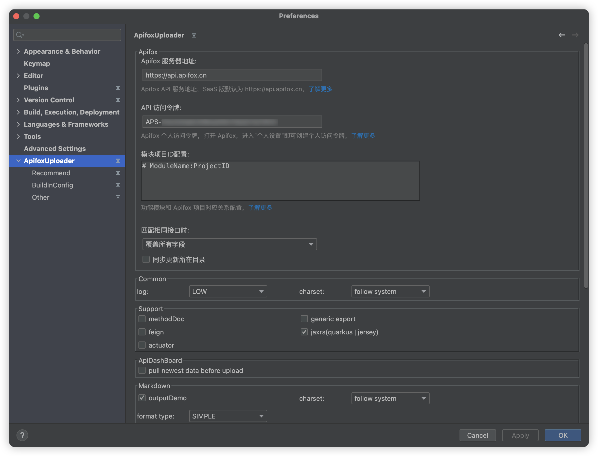

# 其他配置

- 在 IDEA 的插件设置界面里还有一些其他的设置项

#### Common:

- log: 一般来说使用一段时间后,log 可以设置为`HIGH`,减少不必要的输出当出现异常情况时,可以设置为`LOW`,获得更多信息
- charset: 字符集设置

#### Support:

- methodDoc: 勾选后, 允许导出方法文档, 亦可用于导出 rpc 相关文档支持导出到 `markdown`
- feign: [Spring Cloud OpenFiegn](https://spring.io/projects/spring-cloud-openfeign)的特性支持
- generic export: [定制自定义注解相关能力支持](https://github.com/tangcent/easy-yapi/issues/690)

#### Cache:

- global: 全局缓存
- project: 当前项目缓存