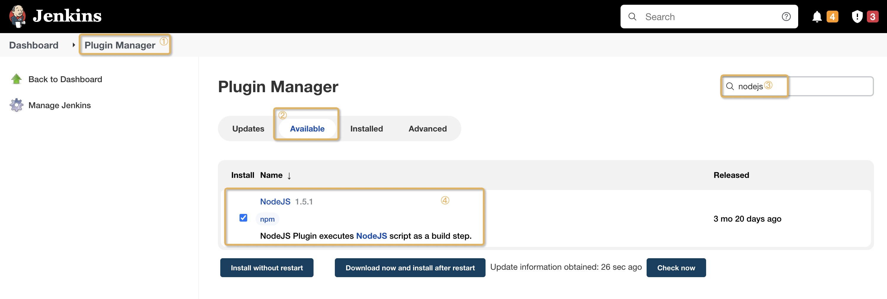
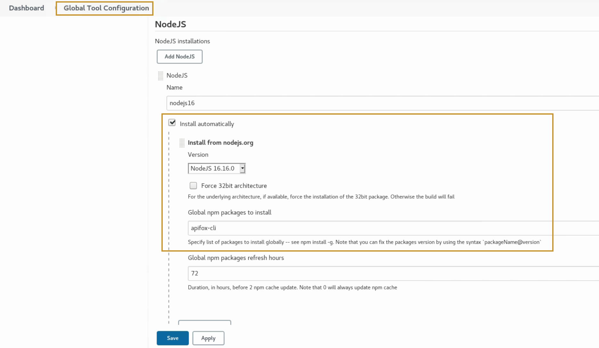
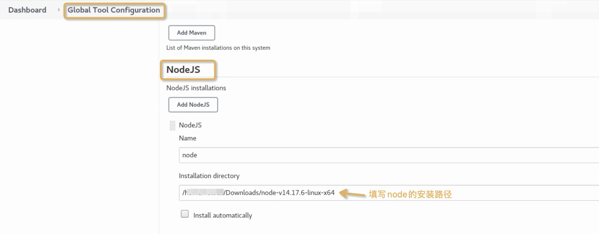
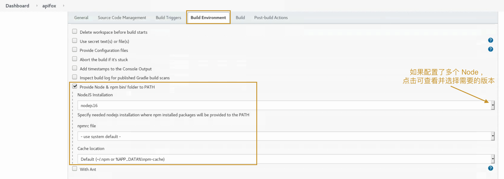
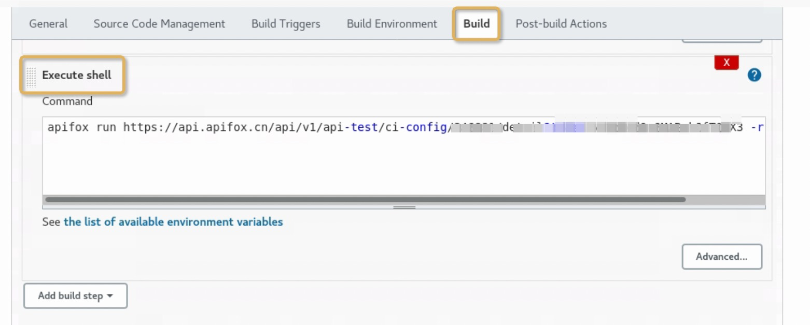
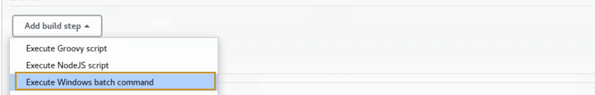
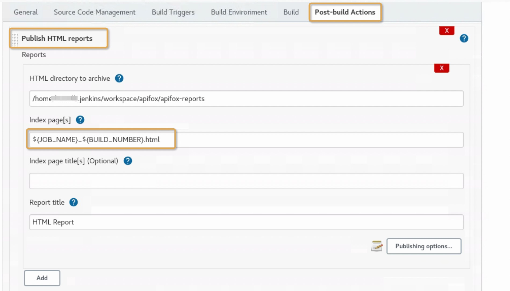

# Jenkins 集成 Apifox

## 安装 Jenkins

[查看 Jenkins 官网](https://www.jenkins.io/)

## Jenkins 配置 NodeJS 环境

1、打开 Jenkins 插件管理中找到 NodeJS 插件，安装并重启


2、在全局工具配置中新建 NodeJS,配置版本号（需 >= v10）和包名 `apifox-cli`


若 Jenkins 宿主机已经安装好 Apifox-CLI，想直接在该 Node 环境运行任务，可以按下图的 Node 配置，填写宿主机的 Node 路径。


3、新建一个任务，在 Build Environment 中设置 node 信息


4、添加构建步骤 Excute shell，将 ApifoxCli 的[命令](../index.md#实时运行在线数据)拷贝进去，保存并运行即可。


如果 Jenkins 宿主机是 Windows 系统，构建步骤换成 `Windows batch command`。


## Jenkins 报告展示

在命令中指定生成报告名 `${JOB_NAME}_${BUILD_NUMBER}`( Jenkins 内置变量)，结合` HTML Publisher` 插件方便展示报告

```shell
apifox run https://api.apifox.cn/api/v1/api-test/ci-config/XXX/detail?token=xxxxx -r html,cli --out-file ${JOB_NAME}_${BUILD_NUMBER}
```


