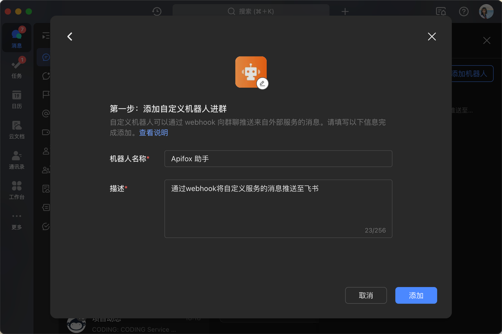
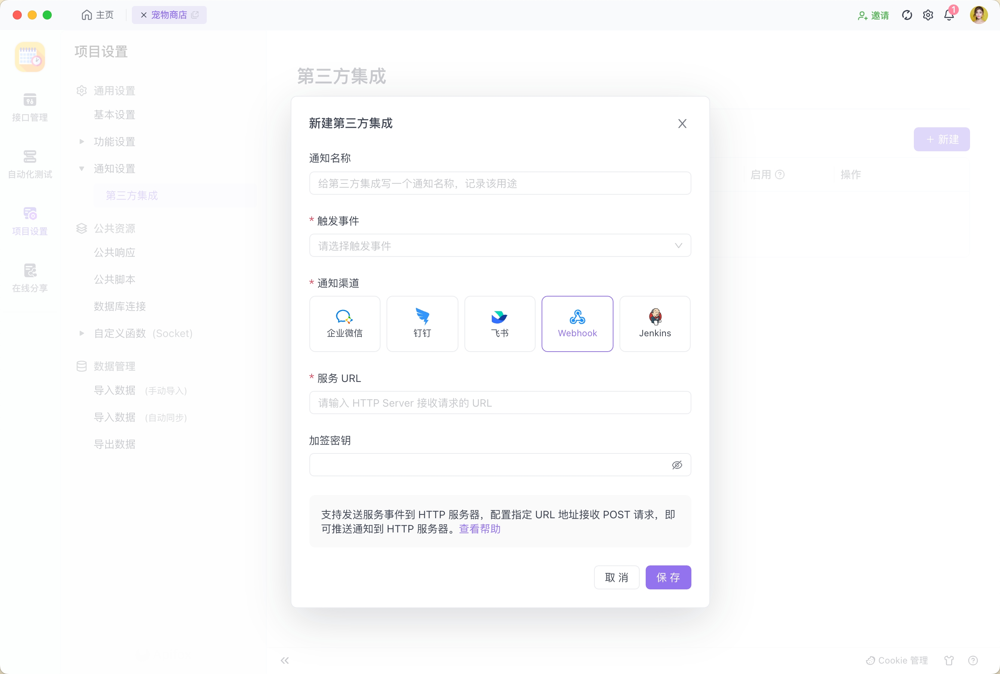

# 通知设置

## 第三方集成

在 2.2.24-alpha.1 版本之后将支持 `第三方集成` 功能，支持将通知集成到第三方应用平台。可以根据通知需求，配置不同通知渠道的通知事件，通知渠道目前支持企业微信、钉钉、飞书、Webhook、Jenkins。

### 使用场景

通过将通知集成到第三方应用平台，当项目成员触发对应的通知事件时，将通知实时发送到第三方应用平台，如飞书群聊机器人。

## 配置说明

### 配置权限

仅 `项目管理者` 可配置。

### 如何配置

每个第三方应用平台支持的通知事件有所差异，故每个第三方应用平台的通知事件的配置项有所差异。

### 企业微信

支持发送通知事件到企业微信群聊机器人，通过在企业微信中 `开启群聊机器人`，配置群聊机器人的 Webhook URL，可以将事件消息发送到企业微信群聊。

#### 配置字段说明

| **配置字段** | **是否必填** | **说明**                                                                                                                                    |
| ------------ | ------------ | ------------------------------------------------------------------------------------------------------------------------------------------- |
| **通知名称** | 否           | 给第三方集成通知写一个名称，记录该通知的用途                                                                                                |
| **触发事件** | 是           | 支持事件： 1. 接口变更 2. 数据模型变更 3. 文档变更 4. 导入数据 5. 自动化测试 以上事件发生时，将触发实时通知。 |
| **服务 URL** | 是           | 企业微信群聊机器人中的 Webhook URL                                                                                                          |

#### 绑定企业微信群聊机器人

项目管理员可使用第三方集成功能，将企业微信群聊机器人与 Apifox 中的项目通知事件关联，以实现在企业微信群聊中推送相关的接口变更、文档变更、自动化测试完成等通知。

**1. 在群聊中添加机器人**

在电脑端-企业微信应用的群聊的聊天信息设置中，点击 `添加群机器人`。

复制 `Webhook` 地址：

**2. 新建通知事件**

在 `项目设置-第三方集成` ，点击新建：

1. 填写通知名称
2. 选择触发事件
3. 渠道选择 `企业微信`
4. 将在群机器人设置中获取的 Webhook URL 粘贴在 `服务 URL` 中

  

点击保存后，即完成绑定。当选择的事件被触发时，将在企业微信群聊中收到通知

### 钉钉

支持发送通知事件到钉钉群聊机器人，通过在钉钉中 `开启群聊机器人`，配置群聊机器人的 Webhook URL，可以将事件消息发送到钉钉群聊。

#### 配置字段说明

| **配置字段** | **是否必填** | **说明**                                                                                                                                    |
| ------------ | ------------ | ------------------------------------------------------------------------------------------------------------------------------------------- |
| **通知名称** | 否           | 给第三方集成通知写一个名称，记录该通知的用途                                                                                                |
| **触发事件** | 是           | 支持事件： 1. 接口变更 2. 数据模型变更 3. 文档变更 4. 导入数据 5. 自动化测试 以上事件发生时，将触发实时通知。 |
| **服务 URL** | 是           | 钉钉群聊机器人中的 Webhook URL                                                                                                              |
| **加签密钥** | 否           | 创建钉钉群聊机器人时，可自动生成机器人的签名，若开启签名，请输入签名内容                                                                    |

#### 绑定钉钉群聊机器人

项目管理员可使用第三方集成功能，将钉钉群聊机器人与 Apifox 中的项目通知事件关联，以实现在钉钉群聊中推送相关的接口变更、文档变更、自动化测试完成等通知。

**1. 在群聊中添加机器人**
在电脑端-钉钉应用的群设置中，点击智能群助手，并添加 `自定义机器人`。

配置 `安全设置`，如加签：

完成后，设置 Webhook：

**2. 新建通知事件**

在 `项目设置-第三方集成`，点击新建：

1. 填写通知名称
2. 选择触发事件
3. 渠道选择 `钉钉`
4. 将在群机器人设置中获取的 Webhook URL 粘贴在 `服务 URL` 中
5. 若群机器人开启了安全设置中的 `加签`，将密钥复制并粘贴在 `加签密钥` 中

  

点击保存后，即完成绑定。当选择的事件被触发时，将在钉钉群聊中收到通知：

### 飞书

支持发送通知事件到飞书群聊机器人，通过在飞书中 `开启群聊机器人`，配置群聊机器人的 Webhook URL，可以将事件消息发送到飞书群聊。

#### 配置字段说明

| **配置字段** | **是否必填** | **说明**                                                                                                                                    |
| ------------ | ------------ | ------------------------------------------------------------------------------------------------------------------------------------------- |
| **通知名称** | 否           | 给第三方集成通知写一个名称，记录该通知的用途                                                                                                |
| **触发事件** | 是           | 支持事件： 1. 接口变更 2. 数据模型变更 3. 文档变更 4. 导入数据 5. 自动化测试 以上事件发生时，将触发实时通知。 |
| **服务 URL** | 是           | 飞书群聊机器人中的 Webhook URL                                                                                                              |
| **加签密钥** | 否           | 创建飞书群聊机器人时，可自动生成机器人的签名，若开启签名，请输入签名内容                                                                    |

#### 绑定飞书群聊机器人

项目管理员可使用第三方集成功能，将飞书群聊机器人与 Apifox 中的项目通知事件关联，以实现在飞书群聊中推送相关的接口变更、文档变更、自动化测试完成等通知。

**1. 在群聊中添加机器人**

在电脑端-飞书应用的群聊设置中，点击 `群机器人`，并点击 `添加机器人`。

选择 `自定义机器人` 并添加。

复制 `Webhook 地址`：

若启用了签名校验，复制 `签名`：

**2. 新建通知事件**

在 `项目设置-第三方集成`，点击新建：

1. 填写通知名称
2. 选择触发事件
3. 渠道选择 `飞书`
4. 将在群机器人设置中获取的 Webhook URL 粘贴在 `服务 URL` 中
5. 若群机器人开启了签名校验，将密钥复制并粘贴在 `加签密钥` 中

  

点击保存后，即完成绑定。当选择的事件被触发时，将在飞书群聊中收到通知：

### Webhook

支持发送通知事件到 HTTP Server，通过指定 URL 地址接收 POST 请求，可以将事件消息发送到 HTTP Server。

#### 配置字段说明

| **配置字段** | **是否必填** | **说明**                                                                                                                                                                               |
| ------------ | ------------ | -------------------------------------------------------------------------------------------------------------------------------------------------------------------------------------- |
| **通知名称** | 否           | 给第三方集成通知写一个名称，记录该通知的用途                                                                                                                                           |
| **触发事件** | 是           | 支持事件： 1. 接口变更 2. 数据模型变更 3. 文档变更 4. 导入数据 5. 自动化测试 以上事件发生时，将触发实时通知。                                            |
| **服务 URL** | 是           | HTTP Server 的接收请求的 URL 地址                                                                                                                                                      |
| **签名令牌** | 否           | 通过 [HMAC SHA1](https://en.wikipedia.org/wiki/Hash-based_message_authentication_code) 加密算法、使用令牌作为 KEY 将发送内容加密后的值以十六进制显示（需要配置令牌），并包含前缀 sha1= |

#### 绑定自搭的 HTTP Server

项目管理员可使用第三方集成功能，将自搭的 HTTP Server 与 Apifox 中的项目通知事件关联，以实现在 HTTP Server 中接收相关的接口变更、文档变更、自动化测试完成等通知。

**新建通知事件**

在 `项目设置-第三方集成`，点击新建：

1. 填写通知名称
2. 选择触发事件
3. 渠道选择 `Webhook`
4. 将自搭的 HTTP Sever 的 URL 粘贴在 `服务 URL` 中
5. 若开启了加签校验，将密钥复制并粘贴在 `加签密钥` 中

  

点击保存后，即完成绑定。当选择的事件被触发时，将在 HTTP Server 中收到通知：

### Jenkins

支持发送通知事件到 Jenkins 服务，通过配置 Jenkins 的 Webhook URL，可以将事件消息发送到 Jenkins。

#### 配置字段说明

| **配置字段** | **是否必填** | **说明**                                                                                                                         |
| ------------ | ------------ | -------------------------------------------------------------------------------------------------------------------------------- |
| **通知名称** | 否           | 给第三方集成通知写一个名称，记录该通知的用途                                                                                     |
| **触发事件** | 是           | 支持事件： 1. 接口变更 2. 数据模型变更 3. 导入数据 4. 自动化测试 以上事件发生时，将触发实时通知。       |
| **服务 URL** | 是           | Jenkins [Generic Webhook Trigger](https://plugins.jenkins.io/generic-webhook-trigger/) 插件中配置的 URL                          |
| **签名令牌** | 否           | 将通过请求头 Authorization Bearer 方式发送给 [Generic Webhook Trigger](https://plugins.jenkins.io/generic-webhook-trigger/) 插件 |

#### 绑定 Jenkins 服务

项目管理员可使用第三方集成功能，将 Jenkins [Generic Webhook Trigger](https://plugins.jenkins.io/generic-webhook-trigger/) 插件中配置的 Webhook URL 与 Apifox 中的项目通知事件关联，以实现接口变更、文档变更、自动化测试完成等事件被触发时，自动触发 Jenkins 发起一次构建行为，并在构建历史记录中查看消息。

**1. 在 Jenkins [Generic Webhook Trigger](https://plugins.jenkins.io/generic-webhook-trigger/) 插件中配置的 Webhook URL**

在 Jenkins-Dashboard 中新建一个视图：

点击进入上一步创建的视图，进入 `Configure`-`Build Triggers`，选择 `Generic Webhook Trigger`。Webhook URL 即 `"http://"+"您的服务器地址"+"/generic-webhook-trigger/invoke"`

支持自定义 Token：

**2. 新建通知事件**

在 `项目设置-第三方集成`，点击新建：

1. 填写通知名称
2. 选择触发事件
3. 渠道选择 `Jenkins`
4. 将在 Jenkins Generic Webhook Trigger 插件中配置的 Webhook URL 粘贴在 `服务 URL` 中
5. 若自定义了 Token，将 `Token` 复制并粘贴在签名令牌中

  

点击保存后，即完成绑定。当选择的事件被触发时，将自动触发 Jenkins 发起一次构建行为，并在构建历史记录中查看消息：

