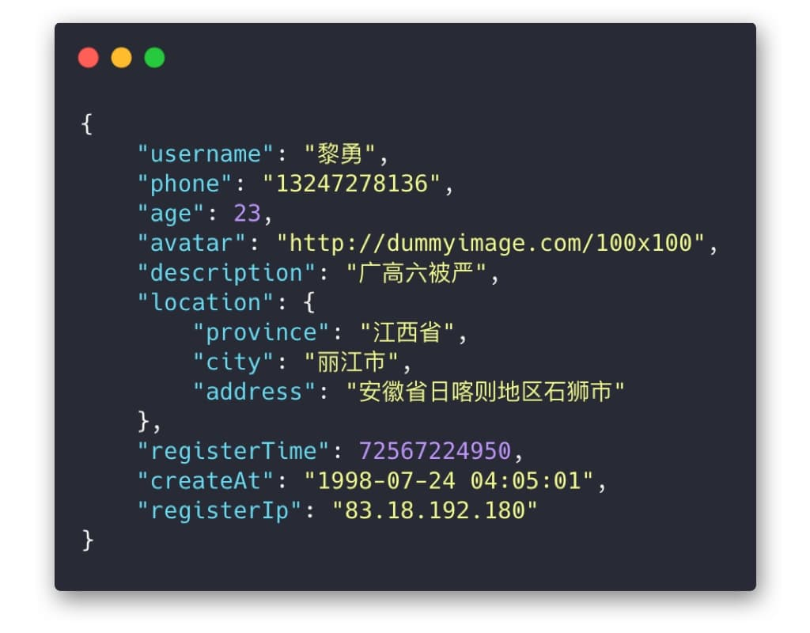
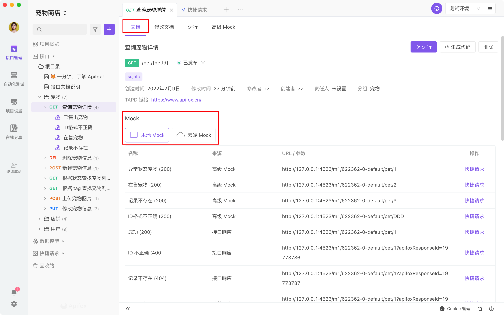
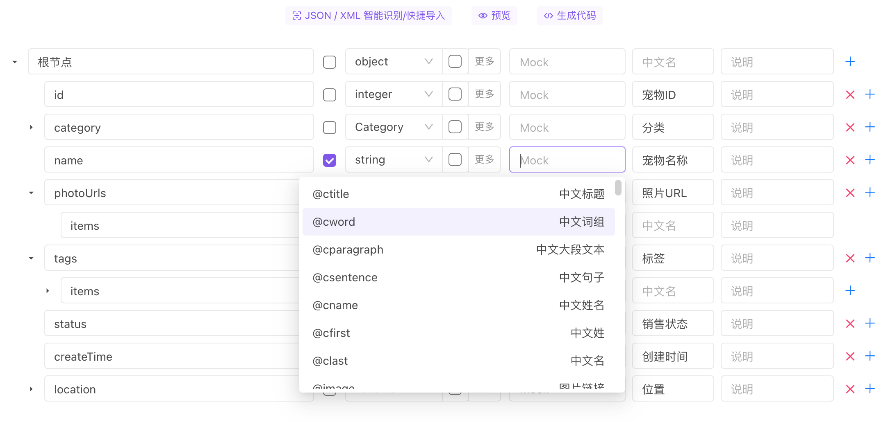
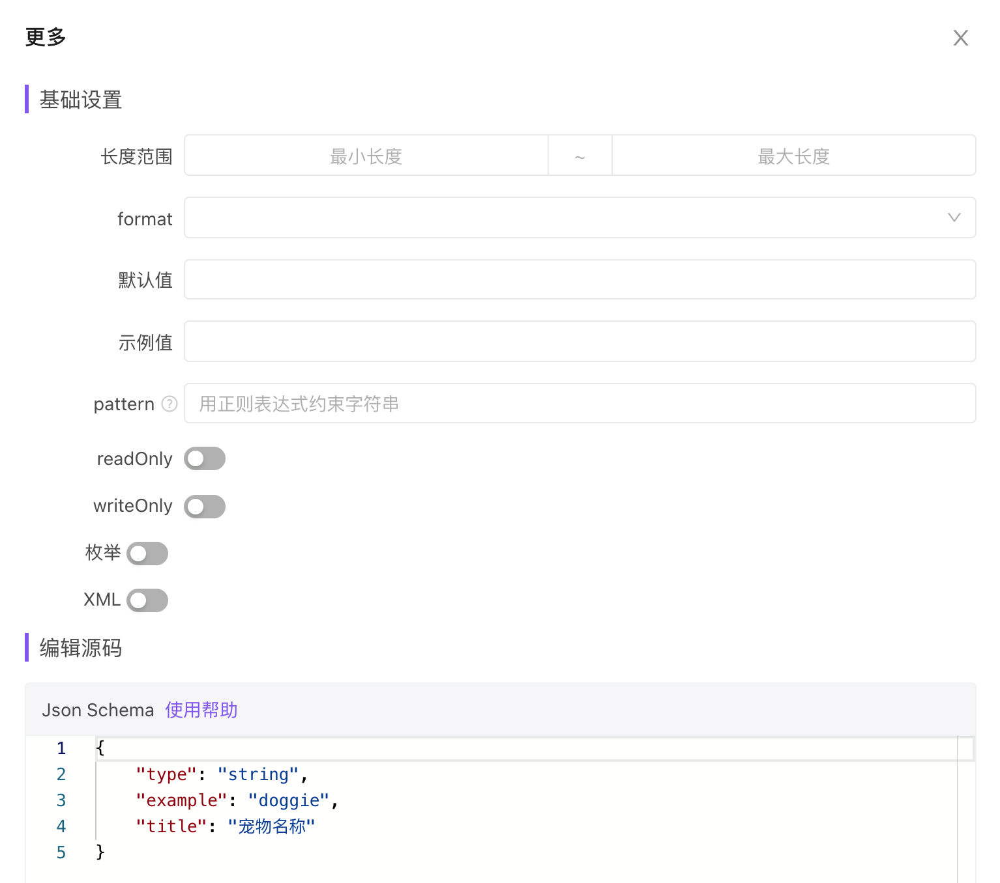

# Mock 功能说明

前端开发往往依赖于后端数据接口，在后端接口就绪之前，前端通常很难开工。Mock 功能就是用来解决这个问题的。有了 Mock 工具之后，前后端可以同步进入开发，后端接口出来之前，前端可以通过 Mock 功能来制造假数据接口来进行开发和调试。

<iframe src="//player.bilibili.com/player.html?aid=382574576&bvid=BV1BZ4y1B7tD&cid=558386197&page=1&high_quality=1&danmaku=0 " scrolling="no" border="0" frameborder="no" framespacing="0" width="100%" height="550" allowfullscreen="true"> </iframe>

## 一、功能说明

Mock 功能可以根据`接口/数据结构定义`、`Mock规则配置`、`Mock 期望配置`，自动生成模拟数据，且使用者可以根据需要灵活构造各种结构的接口数据。

通常情况 Apifox `零配置`即可生成非常人性化的 mock 数据：

1. Apifox 根据接口定义里的数据结构、数据类型，自动生成 mock 规则。
2. Apifox 内置 [智能 Mock](./intelligent-mock/) 功能，根据字段名、字段数据类型，智能优化自动生成的 mock 规则。如：名称包含字符串`image`的`string`类型字段，自动 mock 出一个图片地址 URL；包含字符串`time`的`string`类型字段，自动 mock 出一个时间字符串；包含字符串`city`的`string`类型字段，自动 mock 出一个城市名。
3. Apifox 根据内置规则（可关闭），可自动识别出图片、头像、用户名、手机号、网址、日期、时间、时间戳、邮箱、省份、城市、地址、IP 等字段，从而 Mock 出非常人性化的数据。
4. 除了内置 mock 规则，用户还可以自定义规则库，满足各种个性化需求。支持使用 `正则表达式`、`通配符` 来匹配字段名自定义 mock 规则。

Apifox `零配置` mock 出来的数据效果：



### 本地 mock 服务与云端 mock 服务的区别：

当你在运行 Apifox 客户端软件时，可以使用本地 mock 服务

当你在运行 Apifox web 端时，可以使用云端 mock 服务

## 二、Mock 请求 URL

请求`method`与接口定义的`method`保持一致。

如你项目 ID 为`18600`，需要 mock 的接口 ID 为`89343`，路径为`/users/123`，请求`method`为`POST`，则实际 Mock URL 为：

```
// 本地 Mock 地址
POST http://127.0.0.1:4523/m1/18600-0-default/users/123
或
POST http://127.0.0.1:4523/m2/18600-0-default/89343


// 云端 Mock 地址
POST https://mock.apifox.cn/m1/18600-0-default/users/123
或
POST https://mock.apifox.cn/m2/18600-0-default/89343
```

默认情况下，定义好`接口/数据结构`后，无需做任何额外的配置，就可以通过上面的 URL 访问到自动 Mock 出来的数据接口了。

### Mock URL 说明

**本地 Mock**：

- **路径模式** `http://127.0.0.1:4523/m1/{项目ID}-{版本编号}-{服务编号}/{接口路径}`
- 示例：http://127.0.0.1:4523/m1/18600-0-0/users/123
- **ID 模式** `http://127.0.0.1:4523/m2/{项目ID}-{版本编号}-{服务编号}/{接口ID}`
- 示例：http://127.0.0.1:4523/m2/18600-0-0/84924

**云端 Mock**

- **路径模式** `https://mock.apifox.cn/m1/{项目ID}-{版本编号}-{服务编号}/{接口路径}`
- 示例：https://mock.apifox.cn/m1/18600-0-0/users/123
- **ID 模式** `https://mock.apifox.cn/m2/{项目ID}-{版本编号}-{服务编号}/{接口ID}`
- 示例：https://mock.apifox.cn/m2/18600-0-0/84924

**其他说明**

- **项目 ID**：打开 Apifox，进入“项目设置”查看
- **版本编号**：默认版本编号为“0”，表示主版本。（目前 Apifox 多版本功能还未上线，填“0”即可）
- **服务编号**：仅在项目使用了`多个服务`的时候才特殊指定，“default”表示默认服务（推荐，默认服务下不存在该接口时自动查询其他服务下同路径接口）。

:::tip 注意

1. Mock 服务是在本地启动的，所以 URL 里的 ip 地址为`127.0.0.1`，如有其他设备需要访问 mock 数据，只需将`127.0.0.1`改成本机的内网 ip 即可。如果还是访问不了，请检查是否防火墙等限制了 mock 所用的`4523`端口。
2. 如一个项目内，有多个接口拥有相同的`method + path路径`，可使用如下 2 种方式指定接口，否则在会产生路径冲突。
   1. **接口路径模式**：需额外添加 Query 参数 `?apifoxApiId={接口ID}`.
   2. **接口 ID 模式**：无需任何处理
3. 如接口路径不是以`/`起始的，则只能使用 **接口 ID 模式**，不能使用 **接口路径模式**。
4. 打开 Apifox 就会默认启动 mock 服务，无需额外操作。
5. Mock 服务的 `前置 URL` 是固定的，不能修改。

:::

#### 旧版本地 Mock（目前依然兼容，后续将废弃）

- **路径模式** `http://127.0.0.1:4523/mock/{项目ID}/{接口路径}`
- 示例：http://127.0.0.1:4523/mock/18600/users/123
- **ID 模式** `http://127.0.0.1:4523/mock2/{项目ID}/{接口ID}`
- 示例：http://127.0.0.1:4523/mock2/18600/84924

#### 获取接口 mock URL

打开`接口详情`-`查看`页面的`Mock`模块，即可获取对应接口的 mock URLs



## 三、自定义 Mock 规则

Apifox 支持非常灵活的 mock 规则定义，满足各种业务需求。

### 1. 数据结构定义 mock 规则

定义数据结构的时候，可手动设置 mock 规则，支持 [Mock.js](http://mockjs.com/) `数据占位符定义`方式书写 Mock 规则， [查看 Mock.js 语法](http://mockjs.com/examples.html#DPD)



### 2. 数据字段高级设置

数据字段`更多`里设置的`长度范围`、`枚举值`、`Partten`、`format`，也会作为 Mock 规则使用：



### 3. 高级 Mock

高级 mock 的是最灵活的 mock 方式，可实现灵活的自定义数据结构（不受接口数据结构限制），且可以根据不同的请求参数值返回不同的数据。[查看高级 Mock 说明文档](./mock-custom-scripts/)

### 4. 智能 Mock

当接口设计的返回 Response (或数据模型) 里的字段未配置 mock 规则时，系统会自动使用智能 Mock 规则生成数据，以实现使用时`零配置`即可 mock 出非常人性化的数据。[查看智能 Mock 说明文档](./intelligent-mock/)

## 四、Mock 规则优先级

数据字段在自动 Mock 数据时，实际执行的 Mock 规则优先级顺序如下：

1. 接口详情`高级 Mock` 里设置的`期望`（根据接口参数匹配）。
2. 数据结构的字段里设置的`Mock`规则。
3. 数据结构的字段`高级设置`里设置的`最大值`、`最小值`、`枚举值`、`Partten`。
4. `项目设置`-`智能 Mock 设置`的`自定义规则`。
5. `项目设置`-`智能 Mock 设置`的`内置规则`。
6. 数据结构里字段的`数据类型`。

## 五、其他说明

1. 默认情况下，系统会默认 mock 接口定义里的第一个`Response`的数据结构，如需 mock 其他`Response`，可在`接口详情`-`查看`页面的`Mock`模块获取其他 `Response`的 mock URL。
