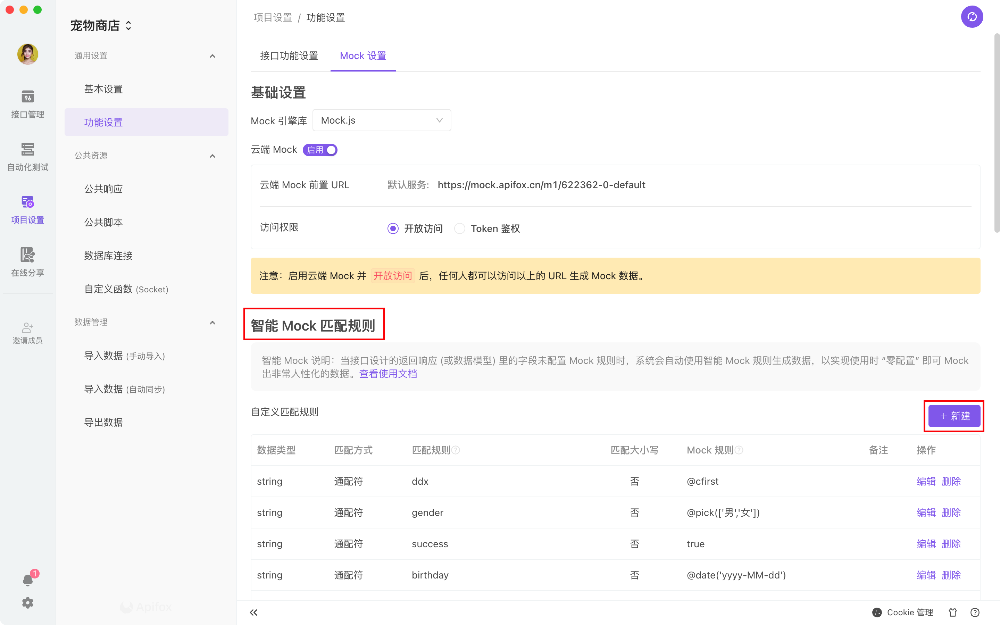

# 智能 Mock

当接口设计的返回 Response (或数据模型) 里的字段未配置 mock 规则时，系统会自动使用智能 Mock 规则来生成数据，以实现使用时`零配置`即可 mock 出非常人性化的数据。

### 智能 Mock 规则配置

设置位置：`项目设置`-`Mock 设置`-`智能 Mock 匹配规则`的`自定义规则`及`内置规则`。

1. 自定义规则：用户可新建自定义规则，满足各种个性化需求。支持使用 `正则表达式`、`通配符` 来匹配字段名自定义 mock 规则。
2. 内置规则：系统内置常用 mock 规则库，可自由决定是否开启内置规则。
3. 优先级：`自定义规则`优先级高于`内置规则`，可添加自定义规则来覆盖系统内置规则。

