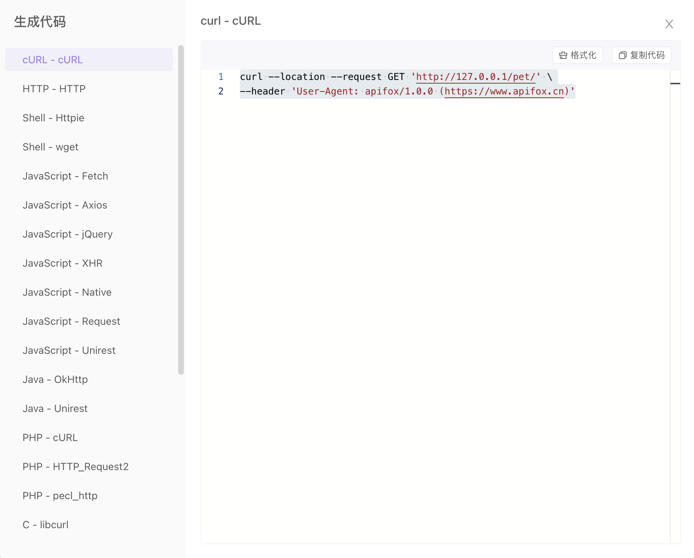
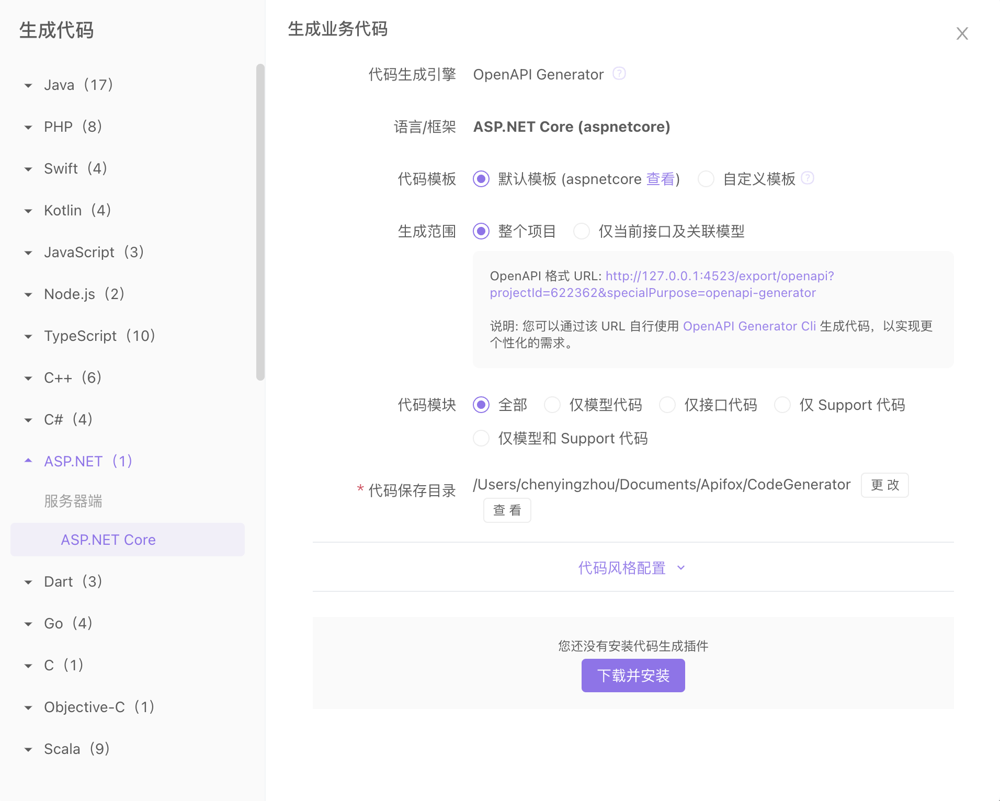
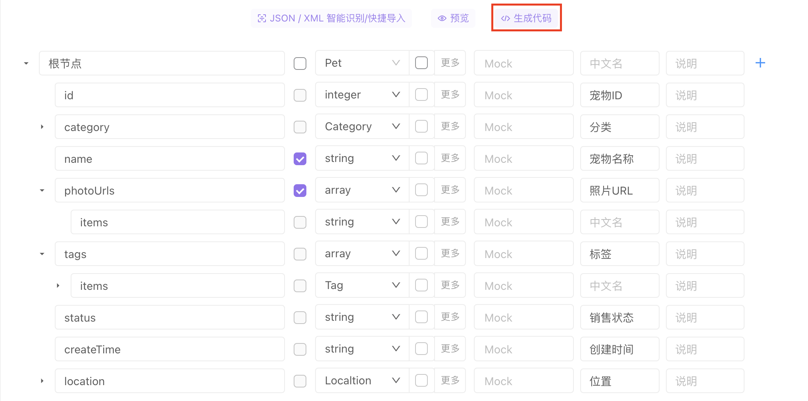
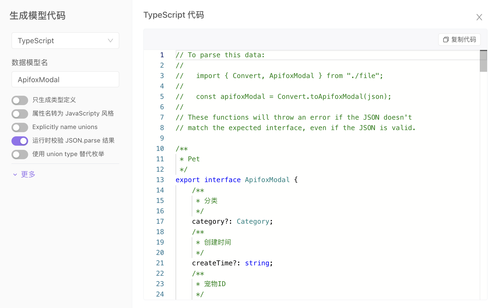
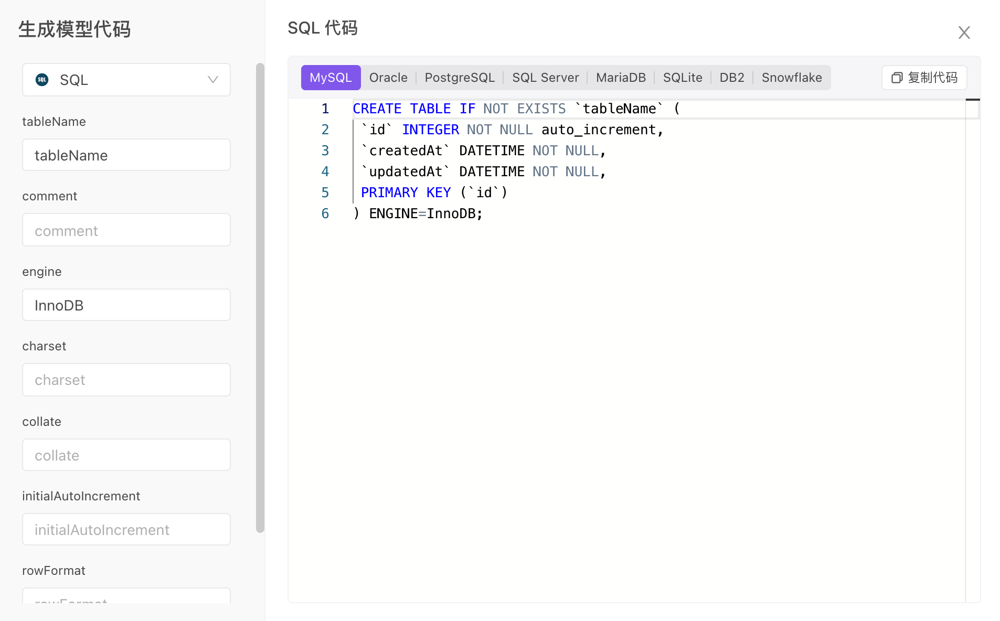

# 生成代码

## 功能说明
根据接口模型定义，自动生成各种语言/框架（如 TypeScript、Java、Go、Swift、ObjectiveC、Kotlin、Dart、C++、C#、Rust 等 130 种语言及框架）的业务代码（如 Model、Controller、单元测试代码等）和接口请求代码。目前 Apifox 支持 130 种语言及框架的代码自动生成。

更重要的是：你可以通过`自定义代码模板`来生成符合自己团队的架构规范的代码，满足各种个性化的需求。

## 安装插件

打开`生成代码`面板，点击`安装插件`即可自动下载并安装。

## 安装 Java 环境

运行代码生成插件需要 Java 环境。请查看 [安装 Java 环境](../../reference/install-java/)。

## 接口文档的代码生成

可以在接口文档-文档页，接口文档-运行页、接口用例，根据需要选择 `生成接口请求代码`、`生成完整项目代码`。

**接口文档-文档页**

**接口文档-运行页**

**接口用例**

### 生成接口请求代码

如果需要生成 cURL ，可以选择下图。

### 生成完整项目代码

## 数据模型的代码生成

### 数据模型的生成 SQL 建表语句

在 2.1.39 版本之后，数据模型的代码生成支持 SQL 建表语句

