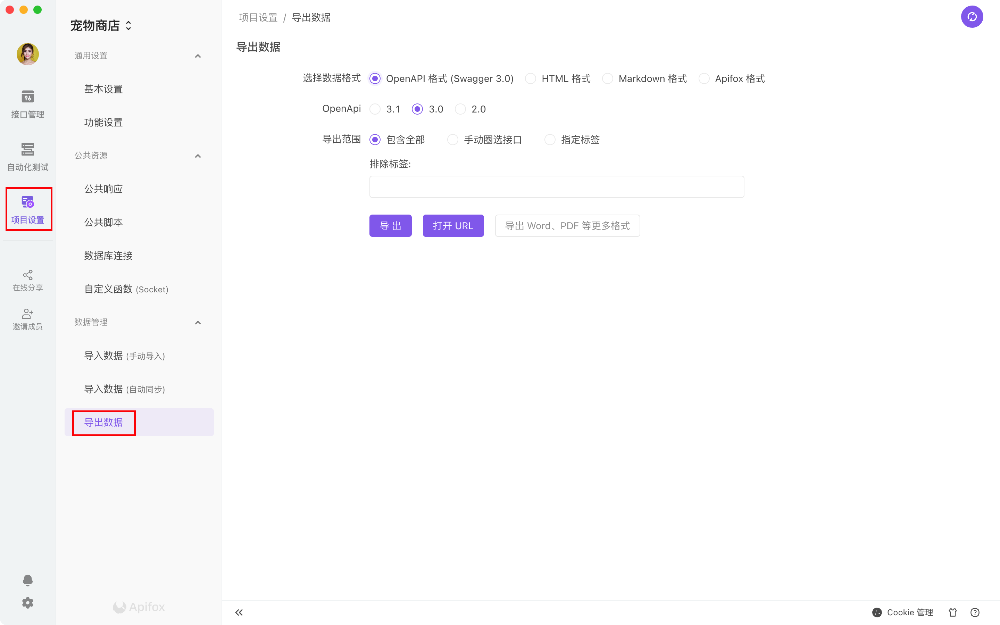
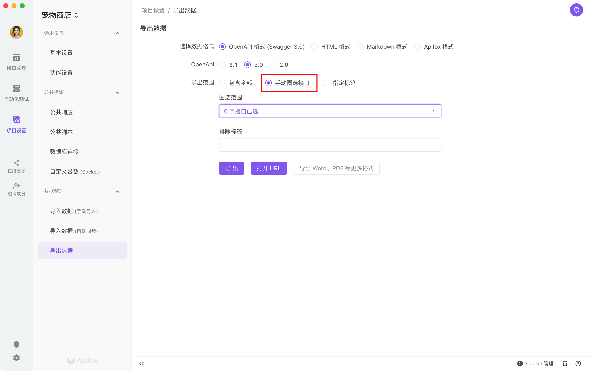
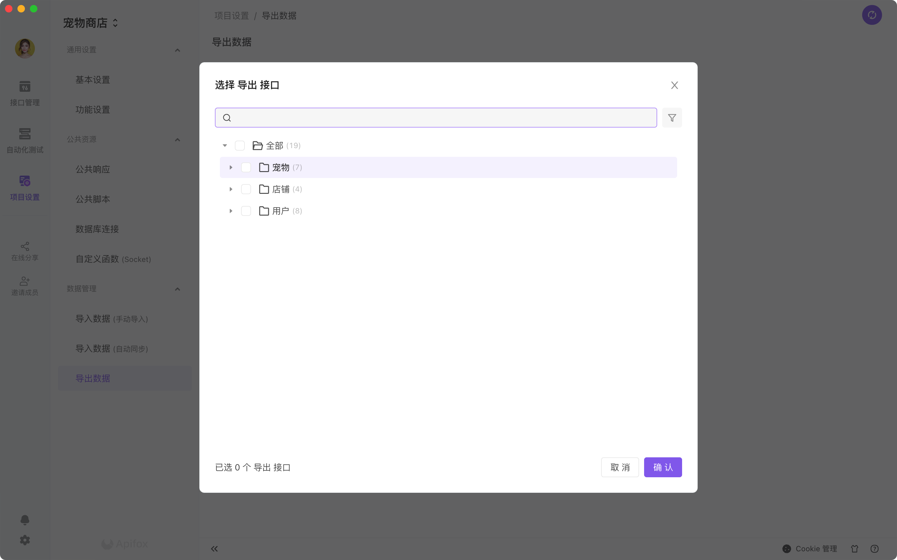
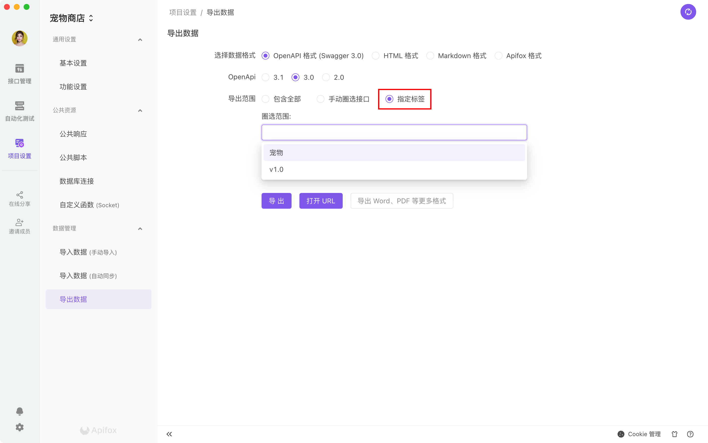

# 导出数据

## 功能说明

1. 支持直接导出 `OpenAPI (原Swagger)`、`HTML`、`Markdown`、`Apifox`等数据格式。

2. `OpenAPI (Swagger)` 支持导出 `3.1`、`3.0`、`2.0` 版本。

3. `OpenAPI (Swagger)` 支持导出离线文件，或直接打开 URL。

:::tip 导出 PDF 方法

目前还不支持直接导出 `PDF`、`Word` 等其他格式数据，但可使用外部工具将`Markdown`转为对应格式。

如使用 [Mdnice](https://mdnice.com) 即可将 `Markdown` 导出为 `PDF`格式。

:::

::: tip 常见问题

- **导出 Markdown、HTML 格式时接口顺序为什么乱了？**
1. Swagger 规范里是没有顺序的概念的，也没有分组的概念，规范本身不支持，所以导出 Swagger 格式是错乱的。
2. html 和 markdown 都是用 swagger 转制的，同样存在问题。
3. 如果需要顺序的话，建议选择 apifox 格式导出

- **多个同 URL 接口，导出后只有一个？** **导出的接口数量为什么变少了？**
1. 请检查是否有多个接口都是使用相同的方法和路径。
2. OpenAPI 规范是不支持不同接口使用相同方法和路径的。
3. 目前导出`HTML`、`Markdown`是通过 OpenAPI 数据转译的。同样存在问题。

:::

## 快速上手

打开`项目设置`面板，点击`导出`即可使用导出数据功能。

支持导出全部，也可以导出部分接口，如图，可以根据需要选择对应的接口，并支持搜索与筛选。

支持根据标签来导出对应的接口

