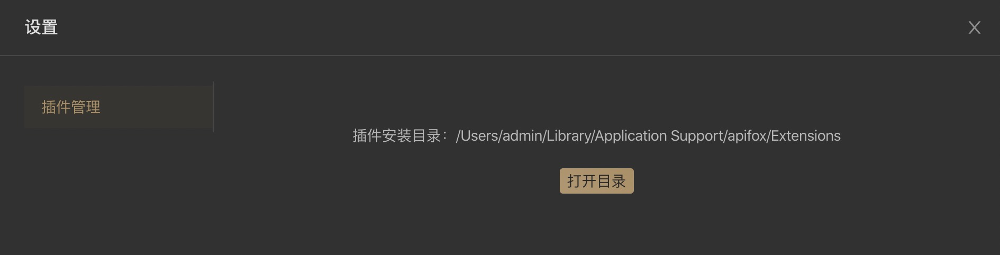

# Socket 解包插件

## 一、选择一个插件ID

每一个插件都需要一个唯一的`插件 ID`，该 ID 需要使用倒置的域名作为前缀，如`cn.apifox.ApifoxExtensions.DemoSocketUnpacker`。

## 二、创建插件目录和插件文件

打开插件安装目录，点击软件右上角`设置`形状的 icon ，选择`插件管理`，即可查看插件安装目录。



1. 创建一个名为`插件 ID`的目录
2. 该目录下，创建一个 `.js` 文件，该文件名必须为`插件ID`最后一个`.`后面部分，如`DemoSocketUnpacker.js`。
3. 如果插件需要调用`jar`文件，需将`jar`存到到插件目录里。

创建后的插件目录如下：

```
Extensions/
		cn.apifox.ApifoxExtensions.DemoSocketUnpacker/
				DemoSocketUnpacker.js
```

## 三、JavaScript  类结构

javascript 支持 **ES6** 语法，**CommonJS** 模块化

#### 静态属性：

- `id` **必须**: 插件 ID
- `title` **必须**: 插件展示名称
- `type` **必须**: 插件类型，填`socketUnpacker`
- `dataType` **必须**: 输入数据的类型，`text`或 `json`
- `inputs` *可选*: 使用插件时插件用户输入项
- `help` *可选*: 插件的使用文档 URL
- `hint` *可选*: 插件的提示语

#### 方法：

- `onData(chunk, options, context)` **必须**: 当接收到数据时触发该事件，用来处理解包逻辑。触发时机同 node.js 里 net.Socket 的 'data' 事件，参考：http://nodejs.cn/api/net.html#net_event_data
  - **chunk**  Buffer 或 String。建议使用 Buffer.from(chunk) 封装后使用
  - **options** 对象。options.inputs 可读取用户输入项
  - **context** 对象。context.executeJar 可调用 jar 文件

#### 示例：

```js
/**
 * Apifox Socket 解包插件示例
 * 解析 JSON 格式包数据
 *
 * @class DemoSocketUnpacker
 */
class DemoSocketUnpacker {
  // 插件 ID，取 ID 要避免和其他插件冲突
  static id = 'cn.apifox.ApifoxExtensions.DemoSocketUnpacker';
  // 插件展示名称
  static title = '解包插件示例';
  // 插件使用帮助链接，可选
  static help = 'https://www.apifox.cn/help/app/extensions/socket-unpacker/';
  // 插件类型 Socket 解包插件：'socketUnpacker'
  static type = 'socketUnpacker';
  // 插件版本号
  static version = '1.0.0';
  // 前端用户输入项设置
  static inputs = [
    ['eol', '包尾分隔符', 'Input', {
      defaultValue: '\\r\\n'
    }]
  ];
  // 解包后的 message 数据类型，可选 'json' 和 'string'
  static dataType = 'json';

  // 等待处理的数据
  _bufferedData = null;

  /**
   * 当接收到数据时触发该事件。
   * 触发时机同 node.js 里 net.Socket 的 'data' 事件，参考：http://nodejs.cn/api/net.html#net_event_data
   *
   * @param {*} chunk  Buffer 或 String。建议使用 Buffer.from(chunk) 封装后使用
   * @param {*} options 对象。options.inputs 可读取用户输入项
   * @param {*} context 对象。context.executeJar 可调用 jar 文件
   * @returns
   * @memberof DemoSocketUnpacker
   */
  onData(chunk, options, context) {
    // chunk 参数是一个 Buffer 或 String。建议使用 Buffer.from(chunk) 封装后使用
    let data = Buffer.from(chunk);

    if (this._bufferedData) {
      data = Buffer.concat([this._bufferedData, data]);
    }

    // 包尾结束符
    let eof;
    if (options.inputs['eol']) {
      // 处理需要转义的字符
      eof = options.inputs['eol']
        .replace(/\\n/g, '\n') // 换行: \n
        .replace(/\\r/g, '\r') // 回车: \r
        .replace(/\\t/g, '\t') // tab(制表符): \t
        .replace(/\\r/g, '\b') // 退格符: \b
        .replace(/\\r/g, '\f') // 换页符: \f
        .replace(/\\\\/g, '\\'); // 反斜杠: \\
    }

    /**
     * 解包后返回的数据，注意：一次可以返回多个包，所以使用数组
     */
    let packets = [];

    // 匹配行尾结束符，如果匹配到则退出，否则一直等待
    if (eof) {
      let stringData = data.toString();
      let index = stringData.indexOf(eof);
      while (index !== -1) {
        let packetString = stringData.substring(0, index);
        // 解包后的信息：人性化展示的内容，方便理解内容，一般为 JSON 格式
        let message;
        // 解包异常错误
        let error;
        try {
          // 将字符串解析为 JSON
          message = JSON.parse(packetString);
        } catch (e) {
          error = new Error(`返回的数据不是正确的 JSON 格式: ${e.message}`);
        }

        /**
         * 注意 packet 格式，packet 为数组。
         * 格式： [原始报文, 解包后的信息(用来前端展示，String 或 JSON，可选), 解包异常错误(可选)]
         */
        const packet = [Buffer.from(packetString + eof), message, error];

        packets.push(packet);
        stringData = stringData.substr(index + eof.length);
        index = stringData.indexOf(eof);
      }
      this._bufferedData = stringData ? Buffer.from(stringData) : null;
    } else {
      this._bufferedData = data;
    }

    /**
     * 注意返回的格式：[packets, 等待处理的数据]，packets 为数组，可包含多个包
     * packets 为 packet 数组
     * this._bufferedData 为剩余还未解包的 Buffer 数据
     */
    return [packets, this._bufferedData];
  }
}

module.exports = DemoSocketUnpacker;
```


#### 下载示例代码

github 地址：[cn.apifox.ApifoxExtensions.DemoSocketUnpacker](https://github.com/apifox/apifox-extensions/tree/master/packages/cn.apifox.ApifoxExtensions.DemoSocketUnpacker)

gitee 地址：[cn.apifox.ApifoxExtensions.DemoSocketUnpacker](https://gitee.com/apifox/apifox-extensions/tree/master/packages/cn.apifox.ApifoxExtensions.DemoSocketUnpacker)


## 四、插件调用 jar 包示例

#### 调用方式：

`onData(chunk, options, context)`第三个参数`context`包含`executeJar`方法，可以调用 `jar`包。

#### 示例：

1. 将`cn.apifox.Base64EncodeDemo.jar`包放入插件目录，目录结构如下：

    ```
    Extensions/
        cn.apifox.ApifoxExtensions.DemoExecuteJarSocketUnpacker/
            DemoExecuteJarSocketUnpacker.js
            cn.apifox.Base64EncodeDemo.jar
    ```

2. DemoExecuteJarSocketUnpacker.js 代码

    ```js
    /**
     * Apifox Socket 解包插件示例 (含调用 Jar)
     * 解析 JSON 格式包数据，并调用 jar 计算 Base64
     *
     * @class DemoExecuteJarSocketUnpacker
     */
    class DemoExecuteJarSocketUnpacker {
      // 插件 ID，取 ID 要避免和其他插件冲突
      static id = 'cn.apifox.ApifoxExtensions.DemoExecuteJarSocketUnpacker';
      // 插件展示名称
      static title = '解包插件示例 (含调用 Jar)';
      // 插件使用帮助链接，可选
      static help = 'https://www.apifox.cn/help/app/extensions/socket-unpacker/';
      // 插件类型 Socket 解包插件：'socketUnpacker'
      static type = 'socketUnpacker';
      // 插件版本号
      static version = '1.0.0';
      // 前端用户输入项设置
      static inputs = [
        ['eol', '包尾分隔符', 'Input', {
          defaultValue: '\\r\\n'
        }]
      ];
      // 解包后的 message 数据类型，可选 'json' 和 'string'
      static dataType = 'json';

      // 等待处理的数据
      _bufferedData = null;

      /**
       * 当接收到数据时触发该事件。
       * 触发时机同 node.js 里 net.Socket 的 'data' 事件，参考：http://nodejs.cn/api/net.html#net_event_data
       *
       * @param {*} chunk  Buffer 或 String。建议使用 Buffer.from(chunk) 封装后使用
       * @param {*} options 对象。options.inputs 可读取用户输入项
       * @param {*} context 对象。context.executeJar 可调用 jar 文件
       * @returns
       * @memberof DemoExecuteJarSocketUnpacker
       */
      onData(chunk, options, context) {
        // chunk 参数是一个 Buffer 或 String。建议使用 Buffer.from(chunk) 封装后使用
        let data = Buffer.from(chunk);

        if (this._bufferedData) {
          data = Buffer.concat([this._bufferedData, data]);
        }

        // 包尾结束符
        let eof;
        if (options.inputs['eol']) {
          // 处理需要转义的字符
          eof = options.inputs['eol']
            .replace(/\\n/g, '\n') // 换行: \n
            .replace(/\\r/g, '\r') // 回车: \r
            .replace(/\\t/g, '\t') // tab(制表符): \t
            .replace(/\\r/g, '\b') // 退格符: \b
            .replace(/\\r/g, '\f') // 换页符: \f
            .replace(/\\\\/g, '\\'); // 反斜杠: \\
        }

        /**
         * 解包后返回的数据，注意：一次可以返回多个包，所以使用数组
         */
        let packets = [];

        // 匹配行尾结束符，如果匹配到则退出，否则一直等待
        if (eof) {
          let stringData = data.toString();
          let index = stringData.indexOf(eof);
          while (index !== -1) {
            let packetString = stringData.substring(0, index);
            // 解包后的信息：人性化展示的内容，方便理解内容，一般为 JSON 格式
            let message;
            // 解包异常错误
            let error;
            try {
              // 将字符串解析为 JSON
              message = JSON.parse(packetString);
            } catch (e) {
              error = new Error(`返回的数据不是正确的 JSON 格式: ${e.message}`);
            }

            /**
             * 调用 jar 示例。如果不需调用 jar 可以忽略这段代码
             * 给 message 增加一个字段 base64Data，值为 packetString 的 MD5。
             * 注意：jar 文件 cn.apifox.Base64EncodeDemo.jar 需存放在当前 js 相同目录下
             */
            try {
              if (message) {
                /**
                 * context.executeJar 用法说明
                 * context.executeJar(jarFileName: string, args?: string[])
                 * @param {*} jarFileName String jar 文件名。注意：jar 文件需存放在当前 js 相同目录下。
                 * @param {*} args Array<String> 运行参数，为字符串数组
                 */
                message.base64Data = context.executeJar('cn.apifox.Base64EncodeDemo.jar', [packetString]);
              }
            } catch (e) {
              error = new Error(`调用 jar 出错: ${e.message}`);
            }

            /**
             * 注意 packet 格式，packet 为数组。
             * 格式： [原始报文, 解包后的信息(用来前端展示，String 或 JSON，可选), 解包异常错误(可选)]
             */
            const packet = [Buffer.from(packetString + eof), message, error];

            packets.push(packet);
            stringData = stringData.substr(index + eof.length);
            index = stringData.indexOf(eof);
          }
          this._bufferedData = stringData ? Buffer.from(stringData) : null;
        } else {
          this._bufferedData = data;
        }

        /**
         * 注意返回的格式：[packets, 等待处理的数据]，packets 为数组，可包含多个包
         * packets 为 packet 数组
         * this._bufferedData 为剩余还未解包的 Buffer 数据
         */
        return [packets, this._bufferedData];
      }
    }

    module.exports = DemoExecuteJarSocketUnpacker;
    ```

3. cn.apifox.Base64EncodeDemo.jar 对应的 java 源码

   ```java
   import java.io.UnsupportedEncodingException;
   import java.util.Base64;
   
   public class Base64Encode {
       public static void main(String[] args) throws UnsupportedEncodingException {
           if(args!=null&&args.length == 1){
               System.out.print(toParse(args[0]));
           }else{
               System.out.print("参数错误");
           }
       }
       static String toParse(String str){
           return Base64.getUrlEncoder().encodeToString(str.getBytes());
       }
   }
   ```

   

#### 下载示例代码

github 地址：[cn.apifox.ApifoxExtensions.DemoExecuteJarSocketUnpacker](https://github.com/apifox/apifox-extensions/tree/master/packages/cn.apifox.ApifoxExtensions.DemoExecuteJarSocketUnpacker)

gitee 地址：[cn.apifox.ApifoxExtensions.DemoExecuteJarSocketUnpacker](https://gitee.com/apifox/apifox-extensions/tree/master/packages/cn.apifox.ApifoxExtensions.DemoExecuteJarSocketUnpacker)


## 五、插件脚本使用`npm`包

参考：[插件中使用 npm 包](../use-npm/)