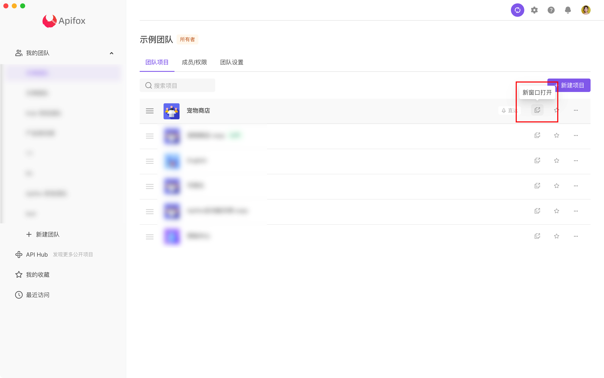
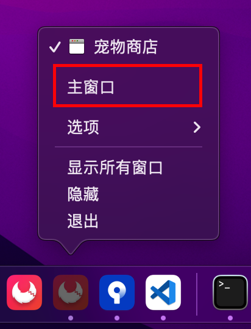

# 常见问题

### 1. Apifox 是否收费？

[Apifox](https://www.apifox.cn/) 公网版 (SaaS版) 免费，私有化部署版收费。

### 2. 登录（Auth）态如何实现？

请参考文档：[登录态（Auth）如何处理](../best-practices/auth/)

### 3. 接口发送请求前需要调用登录接口获取 token 放在 header，如何实现？

请参考文档：[登录态（Auth）如何处理](../best-practices/auth/)

### 4. B 接口请求参数依赖于 A 接口返回的数据，如何实现？

请参考文档：[接口之间如何传递数据](../best-practices/api-relations/)

### 5. 同项目下有不同域名的接口，如何处理？

**方案一**：在环境里新增多个服务，分别设置不同的前置 URL ,接口分组和接口维度可以指定对应的前置 URL。**推荐本方案！**

**方案二**：把域名设置成环境变量如`DOMAIN_1`，接口路径这样填写：`https://{{DOMAIN_1}}/users`。接口路径是以`http://`或`https://`起始的，系统会自动忽略里环境里前置 URL。

**方案三**：给不同域名接口设置不同环境，通过切换环境来运行不同域名下的接口。**不推荐本方案！**

### 6. 脚本如何读取或修改接口请求信息？

请参考文档：[ 脚本读取/修改接口请求信息](../scripts/examples/request-handle/)

### 7. 是否支持查询数据库字段作为参数传给接口？

支持，请参考文档：[数据库操作](../processor/database/)

### 8. 数据是存储在本地还是云端？可否离线使用？可否私有化部署？

目前 Apifox 有 `Saas 版` 和`私有化部署版` 。

 `Saas 版` 是免费的，数据都是存在云端的，需要联网才能使用。

`私有化部署版` 是收费的，数据存在使用者企业内部，不连外网也可以使用。

::: tip 注意

环境变量/全局变量里的 **本地值** 仅存放在本地，不会同步到云端，团队成员之间也不会相互同步，适合存放`token`、`账号`、`密码`之类的敏感数据。

:::

### 9. 使用 Postman 调用接口返回正常，而 Apifox 返回错误

解决方法：对比 postman 和 apifox 实际发出的请求内容（url、参数、body、header）是否完全一样。

查看实际请求内容方法：

1. Apifox：返回内容下的`实际请求` tab 里查看
2. Postman：点击底部状态栏里的`Console`查看

### 10. 为什么修改了环境变量（或全局变量）值，而引用的地方没有生效？

1. 请检查`环境变量`、`全局变量`、`临时变量`里是不是有多个地方定义了`相同名称`的变量，如果有，系统会根据优先级来取值。优先级顺序如下：`临时变量`>`环境变量`>`全局变量`。
2. 请检查修改的是否是`本地值`，环境变量（或全局变量）仅读取`本地值`，而不会读取`远程值`。

### 11. 如何打开多个项目？

 1. 在团队页面可以打开新窗口

 2. Mac 客户端可以在 Dock 栏右键 `打开主窗口`

