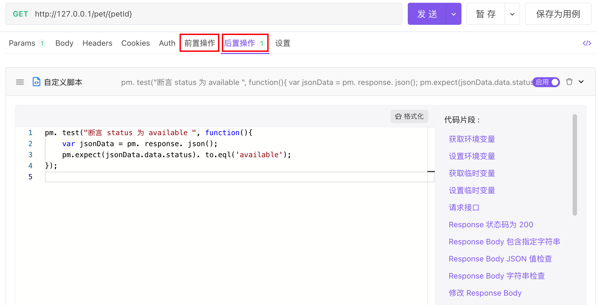

# 脚本介绍

[Apifox](https://www.apifox.cn/) 包含一个基于`Javascript`的脚本引擎，通过脚本（`JavaScript`代码片段）可实现在接口请求或集合测试时添加动态行为。

**脚本可实现的功能**

1. 测试（断言）请求返回结果的正确性（[后置脚本](./after-request-script/)）。
2. 动态修改接口请求参数，如增加接口签名参数等（[前置脚本](./pre-request-script/)）。
3. 接口请求之间传递数据（[使用脚本操作变量](./examples/variables/)）。
4. 脚本可以直接 [调用其他语言编写的程序](./api-references/external-programs/)，支持`java(.jar)`、`python`、`php`、`js`、`BeanShell`、`go`、`shell`、`ruby`、`Lua` 等语言编写的外部程序。
5. 其他。

:::tip 注意

1. Apifox 脚本语法`100%`兼容 `Postman`脚本语法，Postman 脚本可以无缝迁移到 Apifox。

:::

## 使用方式

以下两个环节可添加脚本：

1. 在将请求发送到服务器之前，使用 [前置脚本](./pre-request-script/)。
2. 收到响应后，使用 [后置脚本(断言测试)](./after-request-script/)。



全局脚本和分组脚本：

1. 支持`全局`设置（在`项目概览`里设置）前置操作、后置操作，设置后项目里的所有接口运行时都会生效。

2. 支持`分组`里设置前置操作、后置操作，设置后分组里的所有接口运行时都会生效。

接口请求的执行流程如下：

```
[全局前置脚本] -> [分组前置脚本] -> [接口前置脚本] -> [发送接口请求] -> [返回接口结果] -> [全局后置脚本] -> [分组后置脚本] -> [接口后置脚本]
```

## 调试脚本

调试脚本可以在 **前置脚本** 和 **后置脚本** 里编写，使用`console.log('hello')`方式将调试信息写入控制台，打开 **控制台** 即可查看。
