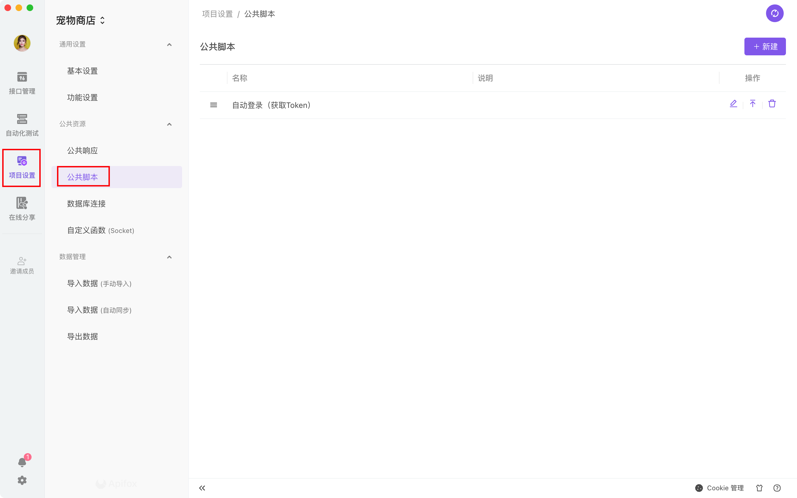
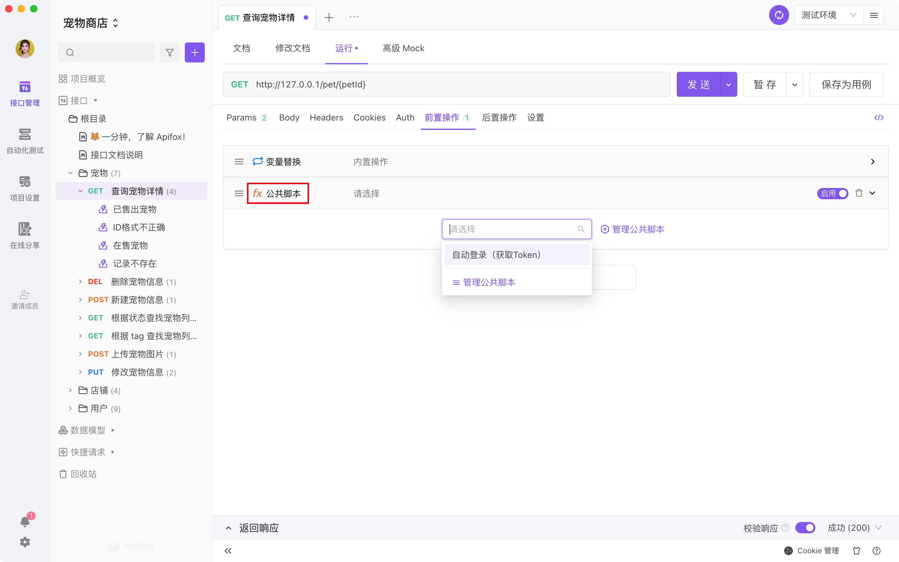

# 公共脚本

公共脚本主要用途是实现`脚本复用`，避免多处重复编写`相同功能的脚本`。

您可以将多处都会用到的`相同功能的脚本`或者`通用的类、方法`，放到公共脚本里，然后所有接口直接引用公共脚本即可使用。

## 使用方式

### 管理公共脚本

打开`项目设置`->`公共脚本`，在这里管理公共脚本。




### 引用公共脚本

接口`运行`界面或`接口用例`界面的`前置操作`和`后置操作`，可直接引用公共脚本。



::: tip 注意

- `公共脚本`是在`普通脚本`之前执行的。
- 多个`公共脚本`执行顺序和添加的顺序保持一致。

:::

## 普通脚本调用公共脚本

脚本之间是可以做到相互调用的，使用场景：

- `普通脚本`需要调用`公共脚本`里的`变量`或者`方法`，注意这种跨脚本调用的方法不要使用 `pm.sendRequest` 和 `pm.environments.set` 等设置类型的 API，会失效，建议写纯函数，通过 return 返回。
- `公共脚本`之间相互调用。
- `后置脚本`和调用`前置脚本`。

为了避免脚本之间的变量冲突，所有脚本执行的时候都是在各自的作用域（通过闭包包裹）下运行的，而使用`var`、`let`、`const`、`function` 声明的变量或者方法都是 `局部变量`或`局部方法`，所以是不能被其他脚本调用的。如果想要变量或方法被其他脚本调用，需要改成`全局变量`或`全局方法`。

**变量示例：**

```js
// 声明局部变量，无法被其他脚本调用
var my_var = "hello"；
```

要改成

```js
// 声明全局变量，可以被其他脚本调用
my_var = "hello";
```

**方法示例：**

```js
// 声明局部方法，无法被其他脚本调用
function my_fun(name) {
  console.log("hello" + name);
}
```

要改成

```js
// 声明全局方法，可以被其他脚本调用
my_fun = function (name) {
  console.log("hello" + name);
};
```

改成`全局变量`或者`全局方法`后即可被其他脚本之间调用。

::: tip 注意

- 请务必注意确保不同脚本之间`全局变量`或者`全局方法`命名没有冲突。
- 接口用例，需要在`前置脚本`或`后置脚本`里添加了`公共脚本`才能能调用`公共脚本`。
- 调用脚本需要注意脚本执行顺序，只有后置的脚本可以调用先执行的脚本。

:::
