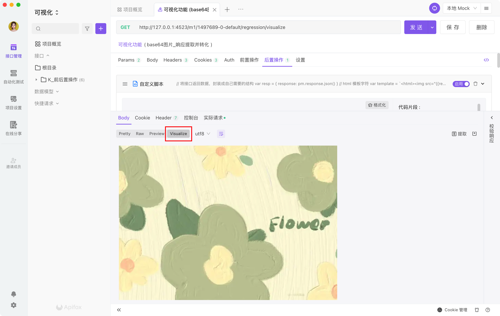

# Visualize 可视化数据

Apifox 提供了一种可编程的方式来可视化地表示返回响应，你可以通过易于理解的方式呈现响应数据。团队成员也可以通过 `可视化响应` 更清晰的了解当前的接口文档。



## 添加 `pm.visualizer.set()`

在 `前后置操作-自定义脚本` 中，使用 `pm.visualizer.set()` 方式，可视化代码将显示在响应 body 的 `Visualize` tab 中。

## 使用注意

### `pm.visualizer.set()` 方式

该方法接受 3 个参数

1. `template` 必填参数, 第一个参数是 [Handlebars](https://handlebarsjs.com/) 接收的 HTML 模版字符串, 这个字符串最终会被渲染在 `<body>` 下面, 你可以在 `template` 里面写 `<link>` 来加载外部 css 样式表, 或者通过 `<script>` 来加载第三方库

2. `data` 选填参数, 接收一个对象, 该对象用于 [Handlebars](https://handlebarsjs.com/) 的模版字符串变量替换

   ```JavaScript
   const template = `<div>{{name}}</div>`;
   pm.visualizer.set(template, {
       name: 'Apifox'
   })
   // 渲染出来的结果为 <div>Apifox</div>
   ```

3. `options` 选填参数, 和 `Handlebars.compile()` 方法接收的 options 参数一样, 用于配制 Handlebars 如何编译第一个参数传进来的模版字符串

### pm.getData(cb: (err, data) => void)

该方法接收的参数是一个函数, 可以让你在 `pm.visualizer.set()` 中传入的模版字符串中获取你传入的第二个参数的数据

1. `error` 错误信息

2. `data` 通过 `pm.visualizer.set()` 第二个参数传进来的数据

```JavaScript
const template = `
    <div>{{name}}</div>
    <script>
        pm.getData(function(err, data){
            // 在回调函数中根据传入的数据做相应的操作
            console.log(data.name)
            // Apifox
        })
    </script>
`
pm.visualizer.set(template, {
    name: 'Apifox'
})
```

⚠️ 注意! 在模版字符串中你是无法调用 `window` 对象中的 `Worker` 和 `indexedDB`

## 示例说明

### base64 图片-后置脚本

```javascript
// 将接口返回数据，封装成自己需要的结构
var resp = {
  response: pm.response.json(),
};
// html 模板字符
var template = `<html></html>`;

// 设置 visualizer 数据。传模板、解析对象。
pm.visualizer.set(template, resp);
```

其他示例请看 [可视化响应示例](https://www.apifox.cn/web/project/1094012/apis/api-36279364-run)
