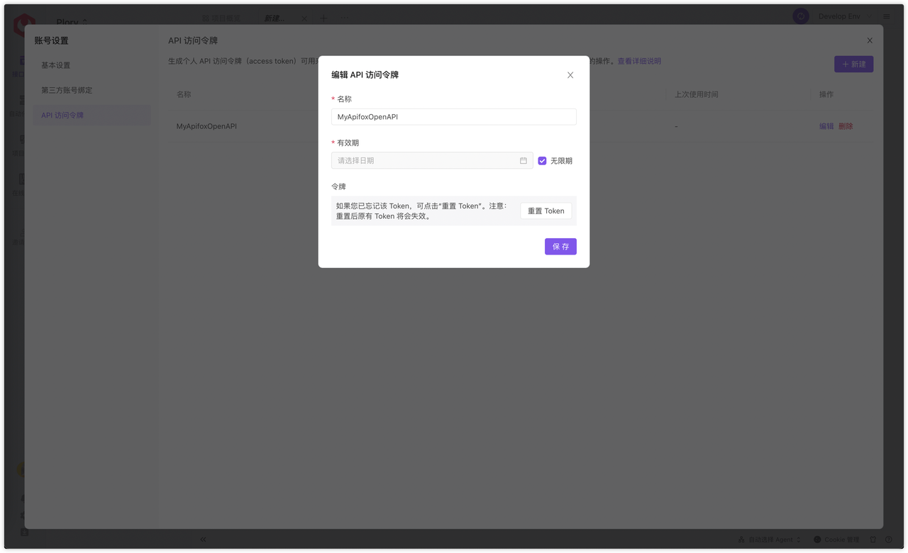

# Apifox 开放 API 

在 2.2.8-alpha.3 版本之后，Apifox 支持开放 API。

通过调用 Apifox 开放 API 来对 [Apifox](https://www.apifox.cn/) 中的各类数据进行查看、修改、使用。[点击此处](https://apifox-openapi.apifox.cn)可以查看 Apifox 已经开放的 API 文档。

## 一、生成开放 API 访问令牌

需要生成一个可用的 `访问令牌（Access Token）`，将此令牌用作开放 API 的 Auth Token，才可对开放 API 进行调用。

### 个人 API 访问令牌

专属于你 Apifox 账号的访问令牌。该令牌跟你在 Apifox 中拥有的全部团队、项目的功能与数据权限完全一致。通过个人访问令牌调用开放 API 执行的各类操作等同于你账号在产品中执行的各类操作。

功能路径：你的头像-账号设置- API 访问令牌。

#### 新建令牌

点击新建令牌，新建一个个人令牌。

填写完成名称和选择完有效期后，点击“保存并生成令牌”，会生成一个仅此刻可见的令牌，需要点击复制并保存好。退出此页面后在 Apifox 中不能再看到此令牌。

#### 编辑/重置令牌

当你需要修改一个已存在令牌的名称，或者修改令牌的时效性，可以对令牌进行编辑。对需要修改信息的令牌点击编辑，即可进行修改。

注意：仅修改名称或有效期，不会重新生成令牌。

当你忘记/遗失了令牌，可以在该令牌的编辑弹窗中，点击 “重置 Token” 重新生成一个令牌。生成后这次可要复制并保管好了。

注意：重置并生成了新的令牌之后，原有的旧令牌即刻失效，不可再用旧令牌调用开放 API 了。

## 二、使用令牌调用开放 API

在调用开放 API 之前，你需要提前准备的必填请求参数有：第一步生成的 `Token（authorization）` 和 想要操作项目的 `项目ID（projectId）`。
项目ID获取方法：项目设置-基本设置-基本信息-项目ID-复制ID。

准备好以上参数值后，进入 [Apifox 开放 API 项目](https://www.apifox.cn/web/project/1397178)中。

如果使用的是客户端，也可在 `API Hub` 中，找到Apifox 开放 API ，点击进入项目。

进入项目后，在 `环境管理-正式环境` 中，填写之前已准备好的访问令牌，以及需要操作的项目ID到指定环境变量的 `本地值` 中，进行保存。

完成后，即可进入具体的开放 API，根据 API 文档说明，进行参数值的填写与请求。

你也可直接在 [Apifox 开放 API 文档](https://apifox-openapi.apifox.cn)中，进行调试与请求。但是在项目中进行请求体验更佳，我们会更推荐你在项目中调用开放 API。

